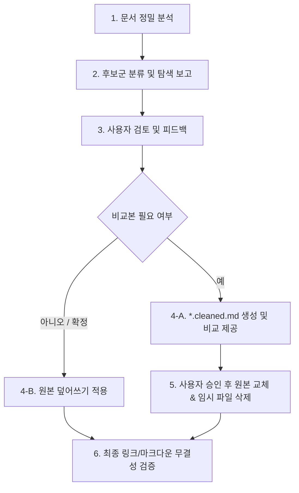

# Document Cleansing Skill (`doc-cleanse`)

협업 세션(Brainstorming, Planning, Ideation 등)을 거치며 기술 문서에 유입된 **대화의 흔적, 세션 결정 메타 태그, 구호형 슬로건, 방어적 논쟁 잔재, 취소선 표기, 작업 인수인계용 체크리스트**를 체계적으로 탐색하고 정제하여, 읽기 쉽고 권위 있는 단일 진실 공급원(Single Source of Truth) 기술 명세로 전환하는 절차를 정의합니다.

---

## 1. 정제 대상 5대 카테고리 (Taxonomy)

문서 검토 시 아래 5개 영역을 기준으로 정제 대상 후보군을 식별합니다.

```
┌─────────────────────────────────────────────────────────────────────────┐
│                    Document Cleansing Taxonomy                         │
├────────────────────────────────┬────────────────────────────────────────┤
│ 1. 세션 메타 태그 / 결정 이력    │ session-settled, user-approved 등      │
│ 2. 구호형 슬로건 / 구어체 문구  │ Slogan-style ADRs, 비유적/방어적 표현  │
│ 3. 과거 논쟁 / 외부 비교 에세이 │ 폐기된 구버전 용어, 타 프레임워크 비교 │
│ 4. 취소선 표기 / 작업 메모     │ ~~Q3~~ 종결, 상위 문서 반영 체크리스트 │
│ 5. 문체 / 어조 불일치          │ 경어체(~합니다)와 평어체(~다) 혼용     │
└────────────────────────────────┴────────────────────────────────────────┘
```

### Category 1: 세션 메타 태그 및 작성 경위 서술
- **특징**: AI 협업 프롬프트 템플릿 산출물이나 회의/대화 확정 기록이 괄호, 뱃지, 작성 경위 서술 형태로 문서에 남아 있는 경우.
- **예시**:
  - `(session-settled: user-directed — chosen Redis over Memcached for PubSub capability)`
  - `> 상태: 설계 초안 (v0.2 — 세션 피드백 및 요구사항 확정 결정 반영)`
  - `기존 기획이 초안인 점을 고려해 데이터 파이프라인 구성을 원점에서 재도출했습니다. 여기서 확정된 내용은 이후 상위 문서에 역반영됩니다.`
- **정제 원칙**: 세션 메타 래퍼를 제거하고, 핵심 설계 결정 이유(Rationale)와 기술적 이점만 간결한 본문 명세로 서술.

### Category 2: 구호형 슬로건, 구어체 및 방어적 설명
- **특징**: 대화 중 강조를 위해 사용된 축약 구호, 구어적 비유, 질문에 답하는 과정에서 삽입된 자기 방어적 해명 문구.
- **예시**:
  - `- **ADR-03 (One Queue = One Worker, Kafka is Overkill)**` → 슬로건형 표기
  - `이것이 시스템 전체의 가장 핵심 루프다.` → 주관적 강조
  - `이 모듈에서 상속은 완전히 쥐약이다.`, `사람도 이전 상태를 기억하지 못한다.` → 구어체 서술
  - `직접 조회를 공짜로 만드는 장치다.`, `클라이언트 몰래 백그라운드로...` → 구어적 비유
  - `> 주의: "NoSQL 도입"은 RDB를 버린다는 뜻이 아니라 캐시 계층을 보강한다는 뜻입니다(대화 중 오해 방지)...` → 대화 질의응답 방어
- **정제 원칙**: 정확한 기술 용어(예: `Sequential Processing Worker Architecture`, `저비용 캐시 선검사 메커니즘`, `외부 변경 감지 정책`)로 전환하고 객관적 서술로 통일.

### Category 3: 과거 초안 비교 및 외부 시스템 비교 에세이
- **특징**: 폐기된 이전 버전 문서의 용어 언급, 타 외부 프레임워크나 도구와의 장문 사변적 비교 에세이.
- **예시**:
  - `용어 정의: Tenant (구버전 초안의 "Account" 또는 "Organization"에 해당)`
  - `"Workspace"라고 부르지 않는다 — 타 프레임워크와 개념이 충돌하므로...`
  - `Netflix Eureka나 Consul이 복잡한 가십 프로토콜을 쓰는 것과 달리, 우리 시스템은 단순하므로...`
  - `REST 대신 GraphQL을 검토했으나 세션 논의 끝에 복잡도를 이유로 기각함...`
- **정제 원칙**: 과거 드래프트나 외부 도구와의 불필요한 비교를 배제하고, 해당 시스템의 고유한 요구사항과 표준 스펙 준수 근거 위주로 압축.

### Category 4: 취소선 종결 항목 및 동기화 작업 체크리스트
- **특징**: 결정 완료되어 취소선 처리된 질문 항목, 문서 간 싱크를 맞추기 위해 작성된 작업 TODO 리스트.
- **예시**:
  - `~~Q3~~ | ~~MongoDB를 샤딩할 것인가?~~ | **종결.** 단일 레플리카셋으로 확정(ADR-05 참조).`
  - `상위 아키텍처 문서 갱신 시 반영할 항목: ... (R19/R20 신설 검토 등)`
- **정제 원칙**: 취소선 행은 표에서 제거하여 현재 유효한 Open Questions만 남기고, 이미 상위 문서에 반영 완료된 작업 메모 블록은 완전 삭제.

### Category 5: 문체 및 어조 불일치 (Tone Inconsistency)
- **특징**: 문서 내에서 경어체(`~합니다`, `~였습니다`)와 기술 문서 표준 평어체(`~다`, `~한다`)가 혼용된 경우.
- **정제 원칙**: 공식 기술 명세 표준인 평어체(`-다 / -한다`, 개조식 명사형 종결)로 전면 일원화.

---

## 2. 정제 표준 절차 (Step-by-Step SOP)



### Step 1: 대상 문서 정밀 분석
- 대상 파일들을 `view_file`로 정독하며 5대 카테고리에 해당하는 문구와 라인 번호를 추출합니다.

### Step 2: 후보군 탐색 보고 (Inspection Report)
- 사용자에게 즉시 수정하지 않고, **식별된 후보군 목록과 제안 정제 방향**을 구조화하여 먼저 보고합니다.
- 각 후보군에 대해 **현재 문구(Before)**와 **정제 방향/수정안(After)**을 명확히 제시합니다.

### Step 3: 사용자 승인 및 반영 방식 결정
- 사용자가 직접 덮어쓰기를 원하는지, 비교를 위해 별도 파일(`*.cleaned.md`) 생성을 원하는지 확인합니다.
- 비교본 생성 요청 시:
  1. `write_to_file`로 정제된 임시 파일 생성 (`docs/.../filename-cleaned.md`).
  2. 사용자에게 원본과 비교본의 차이점을 안내.
  3. 사용자 승인 후 원본 파일에 덮어쓰고 임시 파일 삭제.

### Step 4: 무결성 검증 (Verification)
- 정제 후 문서 간 상호 링크(`[link](../path/file.md)`), 테이블 렌더링, 코드 블록 문법이 깨지지 않았는지 확인합니다.
- `git diff` 등을 통해 의도치 않은 기술적 사양 누락이 없는지 최종 점검합니다.

---

## 3. Best Practices & 주의사항

1. **설계 의도와 기술적 근거(Rationale)는 보존**:
   - `(session-settled: ...)` 태그 자체는 제거하되, 그 안에 담긴 핵심 이유("100% testable core without network mocks", "prevents schema drift" 등)는 본문 명세 문장으로 녹여내야 합니다.
2. **단독 결정에 의한 내용 삭제 금지**:
   - 아직 결론이 나지 않은 실제 Open Question이나 유효한 제약 사항을 '대화 흔적'으로 오판하여 삭제하지 않도록 주의합니다.
3. **용어집/개념 정의의 명확성 유지**:
   - 과거 논쟁 흔적을 지울 때는, 용어 충돌을 방지하기 위한 정당한 엔지니어링 주의사항(예: "외부 도구 생태계와의 명칭 충돌 방지")으로 정제하여 본질적인 의미를 지킵니다.
