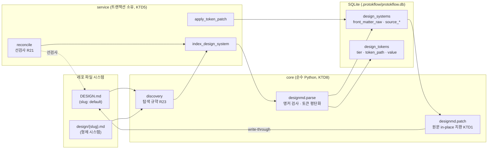
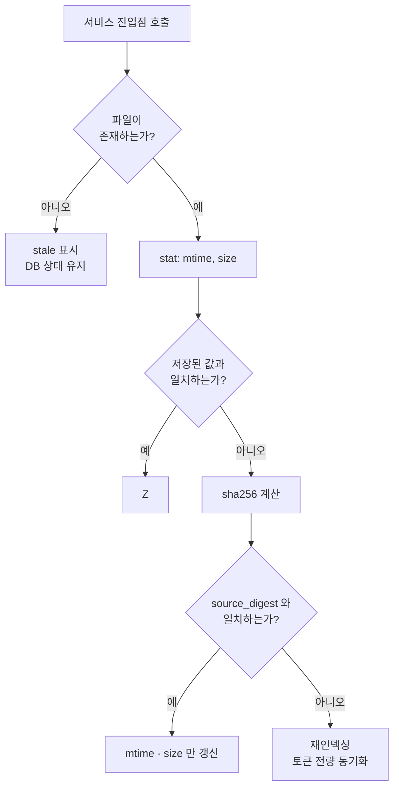

# DESIGN.md Storage Layer - Plan

> 관련 문서: [Protokflow 서버 플랜](./2026-08-20-protokflow-server-plan.md) · [데이터베이스 스키마 설계](../concepts/database-schema.md) · [디자인 토큰 아키텍처](../concepts/token-3tier-architecture.md)

## Goal Capsule

### Objective
레포의 `DESIGN.md` 파일들이 SQLite 저장소에 인덱싱되고, 저장소를 통한 편집이 원문 서식을 유지한 채 파일로 되돌아가며, 외부에서 파일이 바뀌면 다음 호출이 자동으로 따라잡는다. DB를 삭제해도 파일로부터 완전히 복원된다.

### Means
라운드트립 YAML 파서로 Front Matter 원문을 보존하고 대상 토큰만 in-place 치환하는 write-through (KTD1).

### Product Authority
이 플랜은 서버 플랜의 저장소 계층 요구사항(R16, R17, R20, R21, R23)만 규정한다. 토큰 캐스케이드 해석(R1), 레이아웃 렌더링(R2), MCP·ASGI 어댑터(R4~R11), 코드 추출(R14, R15), 관리 UI(R18), 파생 시스템(R22)은 범위 밖이며 후속 플랜이 소유한다.

### Stop Conditions
- 렌더링 엔진, 어댑터, 프리뷰, 코드 추출에 코드를 추가하지 않는다.
- `promote_tokens`의 fork/capture/merge 시맨틱을 구현하지 않는다.
- 저장소 계층이 노출하는 유일한 인간용 진입점은 CLI다. HTTP 라우트를 추가하지 않는다.

### Open Blockers
None.

---

## Product Contract

### Summary
Protokflow의 저장소 계층을 파일↔DB 양방향 루프로 완성한다. 레포 루트의 `DESIGN.md`와 `design/{slug}.md`를 탐색해 정규화된 토큰 트리로 인덱싱하고, Front Matter 원문을 보존해 편집 시 대상 토큰만 치환하는 write-through를 제공하며, 매 진입점에서 `(mtime, size)` 선검사로 외부 변경을 감지해 재인덱싱한다. 기존 8개 테이블 모델 위에 repository·service 계층과 CLI 진입점을 얹고, 프로토타입이 검증한 파서/직렬화기를 제품 트리로 이식한다.

### Problem Frame
저장소 모델 8개 테이블과 부트 경로는 이미 존재하지만 이를 읽고 쓰는 계층이 없다. `backend/app/protokflow/schema/`와 `api/v1/`은 비어 있고 `crud/`·`service/`는 존재하지 않아, 인덱싱된 디자인 시스템이 하나도 없는 상태다. 스키마 버전 부트 체크(`create_tables`)를 담은 `register_init` 수명주기가 `FastAPI(...)`에 연결되지 않아 발화하지 않는다. 테스트 설정이 전무해 회귀를 잡을 수단도 없다.

공식 스펙(`@google/design.md` 0.4.0) 기반 라운드트립 전략, 앵커 처리, 토큰 컬럼 규격 및 `front_matter_raw` 스키마가 검증 완료되었으며, 본 플랜은 이를 프로덕션 저장소 계층으로 구현하는 것을 목표로 한다.

### Key Decisions
- **in-place 패치 write-through** — 정규화된 토큰 행에서 Front Matter를 재생성하지 않고 보존된 원문을 치환한다. `Governs R16` (see origin: `docs/plans/2026-08-20-protokflow-server-plan.md` KD7)
- **YAML 앵커 거부** — 스펙 밖 문법이며 in-place 패치 시 참조 무결성이 조용히 훼손된다. `Governs R16`
- **자기완결 형제 문서** — 디자인 시스템 간 상속·오버라이드가 없다. 인덱싱은 레포 루트 `DESIGN.md`와 `design/{slug}.md`로 한정하며, 그 밖의 하위 디렉토리 `DESIGN.md`는 무시한다. `Governs R23` (see origin: KD8)
- **파일 기반 복구 및 소멸 가능 데이터베이스** — 파일 시스템을 단일 복구 원본(Source of Truth)으로 취급하며, 별도 마이그레이션 도구 없이 `create_all` 및 버전 검증으로 운영한다. `Governs R17, R20`

### Requirements

#### 직렬화 및 파일 계약
- R16. `DESIGN.md`(YAML Front Matter + Markdown)를 파싱해 정규화된 토큰 트리로 변환하고 역으로 내보내는 양방향 직렬화기를 구현해야 한다. 왕복은 바이트 수준으로 무손실이어야 한다 — `omitted`, 린터가 침묵하는 커스텀 확장 키, 주석, 빈 줄, 따옴표 스타일, 키 순서를 모두 보존해야 하며, 방출된 파일은 vendored `@google/design.md` 0.4.0 린트를 새 경고 없이 통과해야 한다. Front Matter에 YAML 앵커(`&name`) 또는 별칭(`*name`)이 존재하면 인덱싱 시점에 명시적 오류로 거부해야 한다.
- R23. 파일 탐색은 레포 루트의 `DESIGN.md`(= `default`)와 `design/{slug}.md`로 한정해야 한다. 두 경로 밖의 하위 디렉토리 `DESIGN.md`는 인덱싱 대상이 아니며 무시한다 — 부분 오버라이드 개념은 존재하지 않는다.

#### 저장소 및 동기화
- R17. 8개 테이블 SQLite 저장소를 실제로 읽고 쓰는 계층을 제공해야 한다. 디자인 시스템 조회·생성·갱신과 토큰 전량 동기화가 단일 트랜잭션으로 완결되어야 한다. 상세 스키마는 [데이터베이스 스키마 설계](../concepts/database-schema.md)를 단일 소스로 한다.
- R20. 부팅 시 `schema_meta.schema_version`을 검사해 코드가 기대하는 버전과 비교하고, 불일치 시 명확한 오류와 복구 안내를 제공해야 한다. DB 삭제 후 `DESIGN.md`로부터의 재인덱싱이 항상 유효한 복구 경로여야 한다.
- R21. 저장소 진입점마다 대응 `DESIGN.md` 파일의 `(mtime, size)`를 선검사하고, 불일치할 때만 sha256을 계산해 재인덱싱 여부를 판정해야 한다. `git pull`, 브랜치 전환, fresh clone, 파일 직접 편집을 모두 감지해야 한다.

### Acceptance Examples

#### AE6: 무손실 라운드트립과 린터 적합성
- **Covers**: R16, R17
- **Given**: 사용자의 `DESIGN.md`에 `omitted: [spacing]`, 커스텀 확장 키, 사람이 작성한 관리 주석과 토큰 옆 인라인 주석이 포함되어 있음.
- **When**: 파일을 인덱싱한 뒤 저장소를 통해 색상 토큰 하나를 수정하여 write-through가 발생.
- **Then**: `git diff`가 해당 토큰 1줄만 보여주고, `omitted` 선언·커스텀 키·주석·따옴표 스타일·키 순서가 그대로 남아 있으며, vendored `@google/design.md` 0.4.0 린터가 새로운 경고 없이 통과함.

#### AE7: 인덱싱 시 YAML 앵커 거부
- **Covers**: R16
- **Given**: `DESIGN.md`의 Front Matter가 `primary: &ink "#0B0E14"`와 `overlay: *ink`를 사용함.
- **When**: 해당 파일을 인덱싱함.
- **Then**: 인덱싱이 명시적 오류로 거부되고 스펙 참조 문법(`{colors.primary}`)으로 변환하라는 안내가 제시됨. 손상된 상태로 DB에 적재되거나 write-through가 수행되지 않음.

#### AE8: `git pull` 이후 재조정
- **Covers**: R21
- **Given**: 디자인 시스템이 인덱싱된 상태에서 동료가 `DESIGN.md`의 `colors.primary`를 변경해 푸시함.
- **When**: 사용자가 `git pull` 후 저장소 조회를 수행.
- **Then**: 선검사가 변경을 감지해 재인덱싱이 선행되고 조회 결과가 갱신된 토큰을 반영함.

#### AE9: DB 삭제 후 완전 복구
- **Covers**: R17, R20
- **Given**: 레포에 `DESIGN.md`와 `design/admin-dark.md`가 있고 둘 다 인덱싱된 상태.
- **When**: `.protokflow/protokflow.db`를 삭제하고 인덱싱을 다시 실행.
- **Then**: 두 디자인 시스템과 전체 토큰이 삭제 전과 동일하게 복원되고, 스키마 버전 행이 재생성됨.

### Scope Boundaries

#### In-Scope
- `DESIGN.md` 파서/직렬화기 및 앵커 감지 (R16)
- 파일 탐색 규약 (R23)
- 디자인 시스템·토큰 repository 및 인덱싱 서비스 (R17)
- in-place 패치 write-through (R16, R17)
- `(mtime, size)` 선검사 기반 재조정 (R21)
- 수명주기 배선 및 스키마 버전 부트 체크 발화 (R20)
- CLI 진입점 — 인덱싱과 상태 조회
- 공식 린터 기반 회귀 테스트 스위트 및 pytest 하니스

#### Deferred for Later
- 파생 디자인 시스템 및 `promote_tokens`의 fork/capture/merge 시맨틱 (R22) — 승격 시맨틱 및 독립적 설계 요구에 따른 후속 과제 분리.
- `/admin` 관리 UI 및 파생 대비 diff 표시 (R18)
- 런 보존 정책 및 `protokflow prune` (R19)
- 토큰 캐스케이드 해석과 Jinja2 렌더링 (R1, R2)
- MCP·ASGI 어댑터, 프리뷰, 핫리로드, 코드 추출 (R4~R15)

#### Deferred to Follow-Up Work
- `backend/core/conf.py`의 `DATABASE_HOST`/`PORT`/`USER`/`PASSWORD`/`SCHEMA`는 필수 설정이지만 `backend/database/db.py`가 무시한다. 레포 격리 SQLite에는 무의미하며 `.env` 존재를 강제해 `uvx protokflow` 즉시 실행(SC4)을 위협한다. 어댑터 플랜에서 정리한다.
- `backend/common/`의 미사용 스캐폴드 잔재(i18n locale, user-agents 파싱 등) 정리.

#### Outside Product Identity
- 파일 간 계층적 상속 및 부분 오버라이드 체계.
- 멀티 테넌시 및 행 단위 소유권 모델.
- Git DAG 기반 3-way rebase 트랜잭션 관리.

### Success Criteria
- SC2 (무결성): write-through로 방출된 `DESIGN.md`가 공식 린터에서 신규 경고 0건. 단일 토큰 변경 시 `git diff` 1줄.
- SC6 (복구성): `.protokflow/protokflow.db` 삭제 후 재인덱싱으로 모든 디자인 시스템과 토큰이 완전 복원.
- 재조정 선검사가 `stat` 2회 호출로 완결되어 변경 없는 경로에서 해시 계산이 발생하지 않음.

---

## Planning Contract

### Key Technical Decisions

- KTD1. **in-place 패치 기반 단일 write-through 경로 적용** — 보존된 Front Matter 원문을 라운드트립 파서로 읽어 대상 토큰만 치환하고 재출력한다. 정규화된 토큰 행에서 Front Matter를 재생성하는 방식은 토큰 시맨틱은 보존되나 주석·빈 줄·따옴표 스타일·키 순서가 손실되어 매 저장마다 대규모 diff(29~85줄)가 발생하는 반면, in-place 패치는 수정된 대상 토큰 1줄 diff만 발생시켜 원문 서식을 무손실 보존한다. `Governs R16`

- KTD2. **`ruamel.yaml`을 런타임 의존성으로 승격한다.** 현재 `pyproject.toml`은 `pyyaml`만 선언하며 `ruamel-yaml`은 `pre-commit-hooks`를 통한 개발 도구 전이 의존성으로만 lock에 존재한다. PyYAML은 주석·따옴표 스타일·키 순서를 보존하지 못해 KTD1을 구현할 수 없다. `Governs R16`

- KTD3. **인덱싱 시점 YAML 앵커/별칭 거부** — Front Matter 내 YAML 앵커(`&name`) 또는 별칭(`*name`) 감지 시 명시적 예외를 발생시키고 스펙 참조 문법(`{colors.primary}`)으로의 변환을 안내한다. 앵커 파일 전용 재생성 폴백 경로를 추가로 유지하는 대신, 인덱싱 시점 검사를 통해 참조 무결성 훼손을 차단하고 직렬화 파이프라인을 KTD1 단일 경로로 단순화한다. `Governs R16`

- KTD4. **단일 `sa.Text` 컬럼 기반 토큰 값 저장** — YAML 숫자(`fontWeight: 600`, `lineHeight: 1.1` 등)를 문자열로 저장한다. 스펙상 bare number와 quoted string의 의미적 동등성이 보장되므로(`fontWeight`: "both are equivalent"), 불필요한 `value_kind` 타입 판별 컬럼을 추가하지 않는다. 재출력 시 인용은 패치로 값이 수정된 토큰에만 적용하며, 무편집 왕복 시에는 원문의 스칼라 표기(bare 숫자 포함)를 그대로 보존한다. `Governs R17`

- KTD5. **repository / service 2계층을 도입한다.** `crud/`는 SQLAlchemy 문장만 소유하고 트랜잭션과 파일 I/O는 `service/`가 소유한다. 스캐폴드가 `api/v1/`·`schema/`·`model/`를 이미 배치했으므로 같은 규약을 따른다. 쓰기 트랜잭션 소유권을 서비스에 일원화하는 스키마 문서 §6 규정과 일치한다. `Governs R17`

- KTD6. **재조정은 서비스 진입점의 선검사로 구현한다.** 파일 워처 데몬을 두지 않는다. 조회·패치 진입점마다 `(mtime, size)`를 검사하고 불일치 시에만 sha256을 계산한다. `Governs R21`

- KTD7. **회귀 테스트가 vendored 공식 린터를 호출한다.** `@google/design.md` 0.4.0 tarball을 레포에 vendoring하고 `node`로 `lint`·`diff`를 실행해 AE6·AE7을 검증한다. Node가 없으면 해당 테스트만 skip 처리한다. `Governs R16`

- KTD8. **파서는 전송·저장 계층에 의존하지 않는 순수 모듈이다.** `backend/app/protokflow/core/`에 두고 SQLAlchemy·FastAPI를 import 하지 않는다. 서버 플랜 KD1의 헤드리스 코어 원칙을 저장소 슬라이스에서 미리 지킨다. `Governs R16`

- KTD9. **write-through는 파일을 먼저 쓰고 DB 트랜잭션을 나중에 커밋한다.** DB와 파일은 하나의 트랜잭션으로 묶을 수 없으므로 실패 지점에 따라 두 가지 결과만 남게 설계한다. 파일 쓰기가 실패하면 DB 트랜잭션이 롤백되어 아무것도 바뀌지 않는다. 파일 쓰기 성공 후 DB 커밋이 실패하면 파일이 DB보다 앞서지만, 다음 진입점의 선검사(R21)가 digest 불일치를 감지해 파일로부터 재인덱싱한다. 파일이 복구 원본이라는 저장소 위상 불변식이 이 방향을 강제한다 — 반대 순서는 DB가 앞서고 파일이 뒤처지는 상태를 만들며, 선검사가 이를 되돌릴 방법이 없다. `Governs R16, R17`

### High-Level Technical Design

#### 파일 ↔ DB 루프

파싱과 직렬화는 DB를 모른다. 서비스가 파일 I/O와 트랜잭션 경계를 모두 소유한다.

#### 재조정 선검사 판정

해시 계산은 `stat` 불일치 시에만 발생한다. 터치만 되고 내용이 같은 파일은 메타데이터만 갱신하고 재파싱하지 않는다.

### Assumptions
- 프로토타입 검증 아티팩트(`.context/compound-engineering/ce-prototype/2026-08-24-designmd-roundtrip/`)의 테스트 픽스처 및 검증 드라이버를 U2 이식 단계에서 참조한다.
- `node`는 개발 환경에 존재하지만 CI 보장은 없다. KTD7의 skip 경로가 이 가정을 흡수한다.
- 인덱싱 대상 레포는 단일 사용자 로컬 환경이다. 동시 쓰기는 SQLite WAL과 `busy_timeout`으로 충분히 처리된다.

### Sequencing
U1이 모든 것의 선행 조건이다. U2는 U1 이후 독립적으로 진행 가능하다. U3는 U1 이후 진행 가능하다. U4~U6은 U2·U3 및 이전 유닛에 순차적으로 의존한다. U7·U8은 U6 이후 병렬 가능하다.

### System-Wide Impact
- **앱 기동 실패 조건이 새로 생긴다.** U7이 수명주기를 배선하면 스키마 버전 불일치 시 애플리케이션이 기동하지 않는다. 손상된 스키마 기반 작업으로 인한 데이터 비정합성을 방지하기 위해, 스키마 버전 불일치 시 기동이 즉시 중단되는 fail-fast 정책이 적용된다.
- **런타임 의존성 표면이 넓어진다.** `ruamel.yaml`이 `uvx protokflow` 설치 경로에 추가된다. 순수 Python 휠이라 빌드 부담은 없다.
- **CLI가 제품의 공개 표면이 된다.** `protokflow index`/`status`는 이후 `serve`·`mcp`·`prune`이 붙을 자리다. 서브커맨드 이름과 출력 형태가 사실상 계약이 된다.
- **`.protokflow/` 디렉토리가 처음으로 실제 내용을 갖는다.** 지금까지 비어 있었다. 이 플랜이 `.gitignore`에 `.protokflow/` 규칙을 추가하고, 인덱싱 후 DB와 SQLite sidecar 파일이 무시됨을 검증한다.

### Risks & Dependencies
- **vendored 린터의 노후화.** `@google/design.md` 0.4.0은 pre-1.0이며 2026-07-27 배포다. 스펙이 바뀌면 픽스처 기대값과 파서 매핑이 함께 틀어진다. 완화: vendoring 버전을 README에 고정 기록하고, 갱신은 픽스처 재검증과 함께 수행한다. 린터를 자동 업그레이드하지 않는다.
- **`ruamel.yaml` 0.19.x의 라운드트립 동작 의존.** 주석 위치 보존과 패치 후 재출력 형태가 마이너 버전 간 달라질 수 있다. 프로토타입은 0.19.1에서 검증했다. 완화: 버전을 정확히 핀하고, U2의 바이트 동일 왕복 테스트가 회귀 감지기 역할을 한다.
- **원자적 파일 쓰기의 정확성.** 임시 파일 생성 후 교체는 같은 파일 시스템 안에서만 원자적이다. 완화: 임시 파일을 대상과 같은 디렉토리에 만든다.
- **선검사의 mtime 해상도.** 파일 시스템에 따라 mtime 해상도가 1초일 수 있어, 1초 안에 두 번 바뀐 파일을 크기가 같으면 놓칠 수 있다. 실사용(사람의 편집, `git pull`)에서는 현실적 위험이 아니지만 테스트에서는 인위적 시간 조작이 필요하다. 완화: 테스트가 mtime을 명시적으로 설정한다.
- **의존 유닛의 직렬성.** U2→U4→U5→U6이 사슬이므로 U2가 지연되면 전체가 밀린다. U2의 입력(프로토타입 스파이크와 픽스처)이 이미 검증된 상태라는 점이 이 위험을 낮춘다.

### Sources & Research
- 프로토타입 결정 캡슐: `.context/compound-engineering/ce-prototype/2026-08-24-designmd-roundtrip/decisions.md` — 라운드트립 전략 비교 결과, 21개 클레임 검증 기록, 반려된 대안.
- 검증된 파서/직렬화기 스파이크: 같은 디렉토리의 `01-designmd-lossless-roundtrip/designmd.py`, 드라이버 `verify_roundtrip.py`·`verify_text_column.py`, 픽스처 4종.
- 정본 스펙: `@google/design.md` 0.4.0 패키지 동봉 `dist/spec.md`(377줄), `dist/spec-config.yaml`(167줄).
- 기존 저장소 모델: `backend/app/protokflow/model/` 8개 파일, 커스텀 타입 `types.py`.
- 부트 경로 및 세션 팩토리 프록시: `backend/database/db.py` — `_set_factory_for_testing` 훅이 테스트 격리의 기반이다.
- 스캐폴드 규약: `backend/core/registrar.py`(수명주기 미배선), `backend/common/model.py`(`Base` 감사 컬럼), `backend/cli.py`(cappa 스텁).

---

## Implementation Units

### U1. 런타임 의존성과 테스트 하니스

**Goal**: `ruamel.yaml`을 선언된 런타임 의존성으로 올리고, 테스트가 격리된 DB에서 async로 실행되는 기반을 만든다.

**Requirements**: KTD2를 충족한다. 이후 모든 유닛의 테스트 실행 조건이다.

**Dependencies**: 없음.

**Files**:
- `pyproject.toml` — `[project.dependencies]`에 `ruamel.yaml` 추가, `[tool.pytest.ini_options]` 신설
- `uv.lock`, `requirements.txt` — 재생성
- `tests/conftest.py` — async 엔진·세션 픽스처
- `tests/app/protokflow/__init__.py` 등 패키지 초기화

**Approach**:
1. `ruamel.yaml`을 런타임 의존성으로 추가하고 lock·requirements를 재생성한다.
2. `[tool.pytest.ini_options]`에 `asyncio_mode = "auto"`와 `testpaths`를 설정한다. `pytest-asyncio`는 이미 dev 의존성에 있다.
3. `conftest.py`에서 `create_database_url(unittest=True)`로 테스트 전용 DB를 만들고, `db._set_factory_for_testing`으로 세션 팩토리를 교체한다. 이 훅은 import 시점에 심볼을 바인딩한 소비자까지 리다이렉트하도록 설계되어 있다.
4. 테스트마다 테이블을 생성·삭제해 격리한다.

**Patterns to follow**: `backend/database/db.py`의 `_SessionFactoryProxy`와 `_set_factory_for_testing` docstring이 의도된 사용법을 명시한다.

**Test scenarios**:
- async 테스트가 세션을 열고 8개 테이블이 모두 존재함을 확인한다.
- 한 테스트가 쓴 행이 다음 테스트에서 보이지 않는다(격리 검증).
- `ruamel.yaml`이 런타임 import 경로에서 사용 가능하다.
- 부트가 `schema_meta.schema_version`을 `'1'`로 시드하고, 재실행 시 중복 삽입하지 않는다.

**Verification**: `uv sync`가 통과하고 `pytest`가 수집·실행된다. `pyproject.toml`에 `ruamel` 문자열이 존재한다.

---

### U2. DESIGN.md 파서 및 직렬화기

**Goal**: Front Matter/본문 분리, 정규화된 토큰 추출, 앵커 감지, in-place 패치 직렬화를 순수 Python 모듈로 제공한다.

**Requirements**: R16. KTD1, KTD3, KTD8을 구현한다. AE6·AE7의 코어.

**Dependencies**: U1.

**Files**:
- `backend/app/protokflow/core/__init__.py`
- `backend/app/protokflow/core/designmd.py`
- `backend/app/protokflow/core/errors.py` — 앵커 거부 예외
- `tests/app/protokflow/core/test_designmd.py`
- `tests/fixtures/design_md/` — 픽스처 4종

**Approach**:
1. 검증된 파서 로직(`01-designmd-lossless-roundtrip/designmd.py`)을 이식한다. KTD1 단일 직렬화 정책에 따라 in-place 패치 경로만 구현한다.
2. Front Matter는 `ruamel.yaml`의 `typ="rt"` 모드로 로드하고 `preserve_quotes=True`, 넓은 `width`를 설정한다.
3. 토큰 평탄화: `colors`/`typography`/`rounded`/`spacing`을 `foundation` tier로, `components`를 `component` tier로 매핑한다. `token_path`는 점 표기이며 깊이는 2 또는 3이다.
4. 모델링된 스칼라(`version` → `spec_version`, `name` → `title`, `description`)를 분리하고, 나머지 최상위 키(`omitted`, 미지 키)를 `front_matter_extras`로 모은다.
5. 앵커 감지는 노드의 `yaml_anchor`를 순회해 하나라도 발견되면 예외를 던진다. 앵커 지점과 별칭 지점을 구분할 필요는 없다 — 거부 게이트는 "이 문서가 앵커를 쓰는가"만 알면 된다.
6. 패치 직렬화는 보존된 원문을 로드해 대상 `token_path`만 치환하고 재출력한다.

**Patterns to follow**: 모델의 tier CHECK 제약(`backend/app/protokflow/model/design_token.py`)이 평탄화 결과의 유효 범위를 정의한다.

**Execution note**: 테스트 픽스처(`tests/fixtures/`)를 선행 배치하고, TDD 방식으로 바이트 단위 왕복 검증 테스트를 통과하도록 모듈을 구현한다.

**Test scenarios**:
- Front Matter가 없는 파일을 파싱하면 본문 전체가 `guide_markdown`이 되고 토큰이 0개다.
- 닫히지 않은 Front Matter 펜스는 파싱 오류를 낸다.
- 평탄화된 모든 토큰의 tier가 `foundation` 또는 `component`다.
- `typography.body-md.fontSize` 같은 깊이 3 경로가 정확히 추출된다.
- YAML 숫자(`fontWeight: 600`, `lineHeight: 1.1`)가 문자열로 추출된다(KTD4).
- `omitted`와 미지의 최상위 키가 `front_matter_extras`에 원문 그대로 보존된다.
- 편집 없이 파싱→직렬화하면 원문과 바이트 동일하다(주석·빈 줄·따옴표 스타일·키 순서 포함).
- 토큰 1개를 패치하면 출력이 원문과 정확히 1줄만 다르다.
- 앵커(`&ink`)를 포함한 Front Matter는 인덱싱 예외를 던진다. 예외 메시지가 스펙 참조 문법으로의 변환을 안내한다.
- 별칭(`*ink`)만 있고 앵커 정의가 다른 그룹에 있는 경우에도 거부된다.
- 접힌 스칼라(`>-`)와 인용 스타일 혼용이 왕복에서 보존된다.

**Verification**: 4종 픽스처 전부가 바이트 동일 왕복을 통과하고, 앵커 픽스처가 거부된다.

---

### U3. 디자인 시스템 및 토큰 repository

**Goal**: 디자인 시스템과 토큰을 조회·upsert하는 SQLAlchemy 계층을 제공한다.

**Requirements**: R17. KTD5의 `crud/` 절반.

**Dependencies**: U1.

**Files**:
- `backend/app/protokflow/crud/__init__.py`
- `backend/app/protokflow/crud/crud_design_system.py`
- `backend/app/protokflow/crud/crud_design_token.py`
- `tests/app/protokflow/crud/test_crud_design_system.py`
- `tests/app/protokflow/crud/test_crud_design_token.py`

**Approach**:
1. `crud/`는 SQLAlchemy 2.0 async 문장만 소유한다. 커밋하지 않고 세션을 받아 쓴다 — 트랜잭션 경계는 U5의 서비스가 소유한다.
2. 디자인 시스템은 `slug`로 조회·upsert한다. `slug`에 UNIQUE 제약이 있다.
3. 토큰 동기화는 해당 디자인 시스템의 기존 행을 전량 삭제하고 새로 삽입한다. `UNIQUE(design_system_id, token_path)` 제약과 재인덱싱의 "토큰 전량 동기화" 규정에 맞는 가장 단순한 형태다.
4. 모델은 `MappedAsDataclass`이므로 `init=False` 컬럼(PK, 감사 컬럼)은 생성자 인자로 전달할 수 없다.

**Patterns to follow**: `backend/app/protokflow/model/`의 dataclass 필드 순서 규칙 — 필수 필드가 기본값 필드보다 앞선다.

**Test scenarios**:
- 신규 slug upsert가 행을 생성하고 ULID PK를 부여한다.
- 기존 slug upsert가 행을 갱신하고 `id`를 유지한다.
- 중복 slug 삽입이 UNIQUE 제약 위반을 낸다.
- 토큰 전량 동기화가 이전 토큰을 남기지 않는다.
- 디자인 시스템 삭제가 토큰을 CASCADE로 제거한다.
- `derived_from_id`가 가리키던 시스템이 삭제되면 `SET NULL`로 처리되고 자식 행은 살아남는다.
- `front_matter_raw`가 주석과 빈 줄을 포함해 바이트 동일하게 왕복한다.

**Verification**: CRUD 테스트가 통과하고 제약 위반 케이스가 기대한 예외를 낸다.

---

### U4. 파일 탐색과 인덱싱 서비스

**Goal**: 레포에서 `DESIGN.md`를 찾아 파싱하고 DB에 영속화한다.

**Requirements**: R23, R17. KTD5의 `service/` 절반.

**Dependencies**: U2, U3.

**Files**:
- `backend/app/protokflow/core/discovery.py`
- `backend/app/protokflow/service/__init__.py`
- `backend/app/protokflow/service/design_system_service.py`
- `tests/app/protokflow/core/test_discovery.py`
- `tests/app/protokflow/service/test_indexing.py`

**Approach**:
1. 탐색은 레포 루트의 `DESIGN.md`(slug `default`)와 `design/*.md`(파일 stem = slug)로 한정한다. 재귀 탐색하지 않는다.
2. 하위 디렉토리에서 발견된 `DESIGN.md`는 탐색 범위 밖이므로 무시한다. R23이 형제 취급을 규정하지만, 탐색 경로가 두 곳으로 한정되므로 하위 디렉토리 파일은 애초에 인덱싱 대상이 아니다.
3. 인덱싱은 단일 트랜잭션이다 — 디자인 시스템 upsert와 토큰 전량 동기화가 함께 커밋되거나 함께 롤백된다.
4. 인덱싱 시 `source_path`, `source_digest`, `source_mtime`, `source_size`, `synced_at`을 채운다.
5. 앵커 거부 예외는 트랜잭션 시작 전에 발생해야 한다. 파싱을 먼저 완료한 뒤 DB에 쓴다.

**Test scenarios**:
- 루트 `DESIGN.md`가 slug `default`로 인덱싱된다.
- `design/admin-dark.md`가 slug `admin-dark`로 인덱싱된다.
- 하위 디렉토리(`src/DESIGN.md`)는 탐색되지 않는다.
- `design/` 디렉토리가 없어도 탐색이 실패하지 않는다.
- 파일이 하나도 없으면 빈 결과를 반환하고 예외를 던지지 않는다.
- 인덱싱 후 `source_digest`가 파일의 실제 sha256과 일치한다.
- 앵커를 포함한 파일 인덱싱이 거부되고 DB에 부분 상태가 남지 않는다.
- 같은 파일을 두 번 인덱싱해도 토큰이 중복되지 않는다.
- Covers AE9. DB 삭제 후 재인덱싱이 디자인 시스템과 토큰을 완전 복원한다.

**Verification**: 두 개의 디자인 시스템을 가진 임시 레포를 인덱싱하고 토큰 수와 `source_*` 메타데이터를 확인한다.

---

### U5. in-place 패치 write-through

**Goal**: 저장소를 통한 토큰 변경이 원문 서식을 유지한 채 파일로 되돌아간다.

**Requirements**: R16, R17. KTD1을 구현한다. AE6의 후반부.

**Dependencies**: U4.

**Files**:
- `backend/app/protokflow/service/design_system_service.py` — write-through 경로 추가
- `tests/app/protokflow/service/test_write_through.py`

**Approach**:
1. 토큰 패치는 DB의 `design_tokens` 행과 `front_matter_raw`를 함께 갱신한다.
2. 이 슬라이스의 모든 디자인 시스템은 탐색된 `DESIGN.md` 파일 기반이므로 토큰 패치는 항상 파일을 쓴다. DB 전용 시스템 분기는 만들지 않는다 — 파일 원본이 없는 시스템은 지연된 파생 시스템(R22) 설계에서 정의한다.
3. 파일 쓰기 후 `source_digest`, `source_mtime`, `source_size`, `synced_at`을 갱신한다. 이 갱신을 빠뜨리면 다음 진입점의 선검사가 자기 자신의 쓰기를 외부 변경으로 오인한다.
4. 파일 쓰기는 원자적이어야 한다 — 대상과 같은 디렉토리의 임시 파일에 쓰고 교체한다. 부분 쓰기는 사용자의 Git 추적 파일을 손상시킨다.
5. 파일 쓰기와 DB 커밋의 순서는 KTD9가 규정한다. 파일을 먼저 쓰고 DB를 나중에 커밋한다.

**Test scenarios**:
- Covers AE6. 주석이 있는 파일에서 토큰 1개를 패치하면 파일 diff가 정확히 1줄이다.
- 관리 주석과 인라인 주석이 패치 후에도 원래 위치에 남는다.
- 따옴표 스타일과 키 순서가 보존된다.
- 패치 후 `source_digest`가 새 파일 내용과 일치해 재조정이 트리거되지 않는다.
- 존재하지 않는 `token_path` 패치가 명확한 오류를 낸다.
- 쓰기 도중 실패해도 원본 파일이 손상되지 않는다.
- 파일 쓰기가 실패하면 DB 트랜잭션이 롤백되어 토큰 값이 바뀌지 않는다 (KTD9).
- 파일 쓰기 성공 후 DB 커밋이 실패한 상태에서 다음 조회를 하면, 선검사가 digest 불일치를 감지해 파일 기준으로 재인덱싱한다 (KTD9).

**Verification**: 주석이 포함된 픽스처를 인덱싱하고 토큰 하나를 패치한 뒤 `git diff` 상당의 라인 수를 센다.

---

### U6. 외부 변경 재조정

**Goal**: `git pull`, 브랜치 전환, 직접 편집으로 바뀐 파일을 다음 진입점에서 감지해 재인덱싱한다.

**Requirements**: R21. KTD6을 구현한다. AE8.

**Dependencies**: U5.

**Files**:
- `backend/app/protokflow/service/reconcile.py`
- `backend/app/protokflow/service/design_system_service.py` — 진입점에 선검사 삽입
- `tests/app/protokflow/service/test_reconcile.py`

**Approach**:
1. 선검사는 `(mtime, size)` 비교다. 저장된 값과 일치하면 즉시 반환한다.
2. 불일치 시에만 sha256을 계산해 `source_digest`와 비교한다. 해시가 같으면 `mtime`·`size`만 갱신하고 재파싱하지 않는다 — 터치만 된 파일 경로다.
3. 해시가 다르면 U4의 인덱싱을 재실행한다.
4. 파일이 사라진 경우 DB 상태를 유지하고 stale로 표시한다. 삭제하지 않는다 — 브랜치 전환 중 일시적으로 없을 수 있다.

**Test scenarios**:
- Covers AE8. 파일 내용 변경 후 조회가 갱신된 토큰을 반환한다.
- 변경 없는 파일 조회가 해시를 계산하지 않는다.
- `touch`만 된 파일(mtime 변경, 내용 동일)이 재파싱 없이 메타데이터만 갱신한다.
- 크기는 같지만 내용이 다른 변경이 감지된다.
- 파일 삭제 후 조회가 예외 없이 이전 DB 상태를 반환하고 stale로 표시한다.
- 재인덱싱이 이전 토큰을 남기지 않는다.
- 외부 편집이 앵커를 도입한 경우 재인덱싱이 거부되고 이전 DB 상태가 유지된다.

**Verification**: 인덱싱 후 파일을 외부에서 수정하고 조회했을 때 새 값이 나오는지, 그리고 수정하지 않았을 때 해시 계산이 생략되는지 확인한다.

---

### U7. 부트 배선과 스키마 버전 발화

**Goal**: 애플리케이션 시작 시 테이블 생성과 스키마 버전 검사가 실제로 실행된다.

**Requirements**: R20.

**Dependencies**: U1.

**Files**:
- `backend/core/registrar.py`
- `tests/core/test_registrar.py`

**Approach**:
1. `register_init` 수명주기를 `FastAPI(...)` 생성자의 `lifespan` 인자로 연결한다. 현재 정의만 되어 있고 배선되지 않아 `create_tables()`가 호출되지 않는다.
2. `SchemaVersionMismatch`가 부트에서 발생하면 애플리케이션이 기동을 즉시 중단해야 한다. 이는 손상된 스키마 상태에서의 도구 실행으로 인한 데이터 오염을 차단하기 위함이다.
3. 스키마 버전 시드·검증은 기동 완료 전에 명시적으로 커밋되는 트랜잭션에서 실행한다. `create_tables()`의 `ensure_schema_version()` 호출이 커밋 없는 세션 컨텍스트에 방치되면 매 부팅이 시드 행 부재로 관측해 중복 삽입을 반복하게 된다.

**Test scenarios**:
- 앱 기동이 테이블을 생성하고 `schema_meta.schema_version`을 시드한다.
- 이미 시드된 DB로 기동해도 중복 삽입이 없다.
- 버전이 다른 DB로 기동하면 `SchemaVersionMismatch`가 발생하고 메시지가 DB 경로와 복구 절차를 포함한다.

**Verification**: `TestClient` 또는 수명주기 컨텍스트로 앱을 기동해 테이블 존재를 확인한다.

---

### U8. CLI 진입점과 공식 린터 적합성 스위트

**Goal**: 인덱싱을 사람이 실행할 수 있게 하고, 방출된 파일이 공식 린터를 통과함을 회귀로 고정한다.

**Requirements**: R16, R17. KTD7을 구현한다. AE6·AE7의 최종 게이트.

**Dependencies**: U6.

**Files**:
- `backend/cli.py` — `index`, `status` 서브커맨드
- `.gitignore` — `.protokflow/` 무시 규칙 추가
- `tests/app/protokflow/test_linter_conformance.py`
- `tests/vendor/design.md/` — vendored `@google/design.md` 0.4.0
- `tests/vendor/README.md` — vendoring 근거와 갱신 절차

**Approach**:
1. CLI는 기존 `cappa` 스텁을 확장한다. `index`는 탐색·인덱싱을 실행하고 결과를 요약한다. `status`는 인덱싱된 디자인 시스템과 동기화 상태를 나열한다.
2. 린터 적합성 테스트는 `node`로 vendored 패키지의 `lint --format json`을 실행하고 원본 대비 신규 findings를 비교한다.
3. `node`가 없는 로컬 환경에서는 해당 테스트만 skip한다. 나머지 스위트는 순수 Python으로 실행 가능해야 한다. CI 검증 환경에는 Node를 설치해 린터 적합성 스위트를 필수로 실행한다 — skip은 로컬 전용이다.
4. vendoring 대상은 tarball 또는 언팩된 `dist/`다. 갱신 절차를 README에 남긴다 — 스펙 버전이 올라가면 픽스처 기대값이 바뀔 수 있다.

**Test scenarios**:
- Covers AE6. write-through로 방출된 파일이 원본 대비 린트 신규 findings 0건이다.
- Covers AE7. 앵커 픽스처가 인덱싱 단계에서 거부되어 린터에 도달하지 않는다.
- 공식 `diff`가 원본과 방출본 사이에 토큰 변경 0건, `regression: false`를 보고한다.
- `node`가 없는 환경에서 스위트가 skip으로 처리되고 실패하지 않는다.
- `protokflow index`가 두 개의 디자인 시스템을 인덱싱하고 요약을 출력한다.
- `protokflow status`가 동기화 상태를 나열한다.
- 인덱싱 대상이 없는 레포에서 `protokflow index`가 오류 없이 종료한다.
- 인덱싱 실행 후 `.protokflow/protokflow.db`와 SQLite sidecar(`-wal`·`-shm`)가 gitignore로 무시됨을 확인한다.

**Verification**: 린터 적합성 테스트가 통과하고, 임시 레포에서 CLI 왕복이 동작한다.

---

## Verification Contract

| 게이트 | 명령 | 통과 조건 |
|---|---|---|
| 의존성 동기화 | `uv sync` | 오류 없이 완료, `ruamel.yaml` 설치됨 |
| 테스트 | `uv run pytest` | 전체 통과. `node` 부재 시 린터 적합성만 skip |
| 린트 | `uv run ruff check backend/ tests/` | All checks passed |
| 포맷 | `uv run ruff format --check backend/ tests/` | 변경 없음 |
| 타입 | `uv run mypy backend/` | Success |
| 훅 | `uv run prek run --all-files` | 전체 통과 |

**AE 게이트**: AE6·AE7은 U8의 린터 적합성 테스트가, AE8은 U6의 재조정 테스트가, AE9는 U4의 복구 테스트가 증명한다. 각각 자동화된 테스트로 존재해야 하며 수동 확인으로 대체할 수 없다.

**SC2 측정**: 주석이 포함된 픽스처에서 토큰 1개 패치 후 변경된 라인 수가 1이어야 한다. 테스트가 이 수를 단언한다.

---

## Definition of Done

**전역**
- R16, R17, R20, R21, R23이 각각 하나 이상의 유닛으로 구현되고 테스트로 증명된다.
- AE6, AE7, AE8, AE9가 자동화된 테스트로 존재하고 통과한다.
- Verification Contract의 6개 게이트가 모두 통과한다.
- `.protokflow/protokflow.db`를 삭제하고 `protokflow index`를 실행하면 모든 디자인 시스템과 토큰이 복원된다.
- 프로토타입 트리는 이식 후에도 삭제하지 않는다. 제품 코드가 `.context/` 경로를 import 하지 않는다.
- 시도했다가 폐기한 접근의 코드가 diff에 남아 있지 않다. 사용하지 않는 헬퍼, 주석 처리된 실험, 죽은 분기를 제거한다.
- 범위 밖 요구사항(R1, R2, R4~R15, R18, R19, R22)에 코드가 추가되지 않았다.

**유닛별**
- 각 유닛의 Test scenarios가 전부 실제 테스트로 존재한다. 스캐폴드 유닛이 아닌 한 비어 있을 수 없다.
- 각 유닛의 Files에 나열된 테스트 파일이 존재한다.
- 새 모듈이 `backend/app/protokflow/core/` 아래에 있다면 SQLAlchemy와 FastAPI를 import 하지 않는다 (KTD8).

---

## Deferred / Open Questions

- **외부 변경 감지 보장과 선검사 최적화 정책 정합성** (`R21`)

  R21은 `git pull`·브랜치 전환·직접 편집의 전수 감지를 요구하는 반면, `(mtime, size)` 선검사 방식은 mtime 해상도(1초) 한계로 인해 동일 크기 파일의 1초 이내 연속 변경 시 해시 재계산이 생략될 수 있다. 프로덕션 환경에서의 실효적 허용 범위와 테스트 작성 시의 명시적 시간 조작 기준을 일치시킬 필요가 있다.

- **테스트 하니스의 DB 엔진 격리 경계 명확화** (`U1`, `U7`)

  세션 팩토리만 교체할 경우 기존 모듈 레벨 테이블 생성·삭제 함수(`create_tables()`, `drop_tables()`)가 실제 `.protokflow/protokflow.db`를 참조할 위험이 있다. 수명주기 연산용 엔진 주입 경계를 명시하여 테스트 세션과 테이블 DDL 격리를 일관되게 보장해야 한다.

- **Front Matter 부재 파일에 대한 인덱싱 정책 확립** (`U4`)

  Front Matter가 없는 마크다운 문서는 파싱 시 `title`을 추출할 수 없어, DB 테이블의 NOT NULL 제약과 충돌할 수 있다. 인덱싱 시점에 오류로 거부할지, 파일 slug 기반 기본 title을 자동 부여할지에 대한 정책 정의가 필요하다.
