# Test DB Isolation Harness - Plan

> 관련 문서: [DESIGN.md Storage Layer - Plan](./2026-08-24-1252-feat-designmd-storage-layer-plan.md) — 본 플랜은 그 Open Question "테스트 하니스의 DB 엔진 격리 경계 명확화"를 해소하는 독립 동반 계획이다. 원본 문서는 수정하지 않는다.

## Goal Capsule

### Objective
병렬 pytest 실행 전체 — 컨트롤러, 각 xdist 워커, 그리고 수명주기 DDL까지 — 가 프로덕션 SQLite DB(`.protokflow/protokflow.db`)에 닿지 않고, 그 격리 경계가 메타 테스트로 잠긴 프로젝트 표준 테스트 하니스를 갖춘다.

### Means
gsplay-api에서 검증된 xdist 격리 하니스 패턴(실행별 run-id 네임스페이스, 워커별 DB 접미사, addopts 고정, 격리 불변식 메타 테스트)을 SQLite 위에 이식하고, 수명주기 DDL의 엔진 주입 경계를 `backend/database/db.py`에 명시한다 (KTD1, KTD3).

### Product Authority
이 플랜은 스토리지 레이어 플랜의 open question 중 테스트 하니스 격리 경계만 소유한다. 스토리지 계층 기능 구현(파서·repository·service·CLI), Redis 격리, CI 워크플로 파일은 범위 밖이다.

### Stop Conditions
- 스토리지 레이어 기능 코드를 추가하지 않는다.
- 원본 스토리지 플랜 문서를 수정하지 않는다 (독립 동반 계획).
- CI 워크플로 파일을 만들거나 수정하지 않는다. 게이트 명세는 Verification Contract에 기록한다.

### Open Blockers
None.

---

## Product Contract

### Summary
db.py는 세션 팩토리 프록시와 run-id/워커 접미사가 붙은 테스트 DB 경로 분기까지 갖추고 있으나, pytest 설정이 전무하고 `create_tables()`/`drop_tables()`가 프로덕션 엔진에 직접 결합되어 있다. 이 플랜은 pytest 병렬 실행 기본값과 conftest 환경 주입을 확립하고, 수명주기 DDL이 활성 테스트 엔진으로 라우팅되는 주입 경계를 만들고, 그 경계를 세션 가드와 메타 테스트로 잠근다. 저장소 계층 테스트와 이후 어댑터·렌더링 플랜의 테스트가 같은 픽스처 스택 위에서 동작하는 프로젝트 표준이 된다.

### Problem Frame
`backend/database/db.py`는 gsplay-api 구조를 의도적으로 미러링하며 `_SessionFactoryProxy`·`_set_factory_for_testing` 훅과 `create_database_path(unittest=True)`의 run-id/워커 접미사 로직을 이미 갖고 있다. 그러나 두 격차가 남아 있다.

첫째, pytest 설정(`[tool.pytest.ini_options]`, 마커, addopts)이 없고 `tests/`는 빈 `conftest.py`뿐이라 이 로직을 실행할 하니스 자체가 없다.

둘째, `create_tables()`와 `drop_tables()`는 모듈 레벨 프로덕션 `async_engine`을 직접 참조한다. 세션 팩토리만 교체하는 환경에서 해당 함수 호출 시 DDL이 프로덕션 데이터베이스(`.protokflow/protokflow.db`)로 직접 발행되는 결합 문제가 발생한다. 스토리지 플랜은 이 지점을 open question으로 남겼고, 해당 플랜의 U1(테스트 하니스)과 U7(부트 배선)이 모두 이 경계에 의존한다.

이에 따라 검증된 xdist 격리 하니스 패턴(run-id 주입, 워커별 DB 접미사, `tests/fixtures/db.py`의 가드→엔진→세션 픽스처 스택, `tests/meta/test_xdist_isolation.py`의 불변식 잠금)을 SQLite 파일 기반 환경에 맞춰 적용한다.

### Key Decisions
- KD1. **gsplay-api 격리 패턴 전면 수용** — 실행별 run-id 네임스페이스, 워커별 DB 접미사, addopts 고정, 격리 불변식 메타 테스트를 도입한다. 프로젝트 전반의 안정성과 병렬 실행을 표준으로 확립하기 위해 격리 패턴 및 메타 테스트 잠금을 전면 적용한다. `Governs R1, R2, R4`
- KD2. **독립 동반 계획** — 원본 스토리지 플랜은 수정하지 않고 상호참조만 한다. 조정 관계는 Definition of Done에 명시하며, 상위 스토리지 플랜(WHAT 명세)의 불변성을 유지하고 독립적 변경 관리를 보장하기 위해 동반 계획으로 분리한다. `Governs R5`
- KD3. **프로젝트 전체 표준 하니스** — 저장소 슬라이스 테스트뿐만 아니라 이후 어댑터·렌더링 플랜의 테스트까지 수용하도록 설계한다. 후속 플랜의 테스트 중복 설계를 방지하고 공통 기반을 제공하기 위해 프로젝트 범용 하니스로 정의한다. `Governs R5`

### Requirements

#### 실행 및 격리
- R1. pytest 기본 실행이 xdist 병렬(`--dist=loadscope`)로 실행되며, opt-in 마커는 기본 선택에서 제외된다.
- R2. 모든 pytest 프로세스가 전용 테스트 DB 파일을 사용한다 — 컨트롤러와 직렬 실행(`-n 0`)은 `protokflow_test_<run-id>`, 각 xdist 워커는 `protokflow_test_<run-id>_<worker-id>`를 쓴다. 가드는 워커 접미사를 선택적으로 취급한다. 어떤 테스트 경로도 프로덕션 DB 경로(`protokflow.db`)와 겹치지 않는다.
- R3. 테스트 실행 중 `create_tables()`/`drop_tables()`를 포함한 모든 수명주기 DDL이 활성 테스트 엔진으로 라우팅된다. 세션 팩토리 교체와 DDL 엔진 격리가 하나의 경계 계약으로 db.py에 명시된다.

#### 가드와 잠금
- R4. 해석된 테스트 DB 경로가 네이밍 계약(`protokflow_test_` 접두사 + 테스트 홈 하위)을 벗어나면 세션 가드가 실행을 거부한다. addopts, DB 네이밍, 엔진 주입, 팩토리 리다이렉트 불변식이 메타 테스트로 잠긴다.

#### 범용성
- R5. 하니스 픽스처 스택이 저장소 계층 테스트(스토리지 플랜 U1·U7)와 이후 어댑터·렌더링 플랜 테스트의 공통 기반이 된다. 플랜별 로컬 conftest는 격리 메커니즘을 재정의하지 않고 픽스처를 소비한다.

### Acceptance Examples
- AE1. 워커 2개 이상 병렬 실행에서 각 워커의 테스트 DB 파일이 서로 다르고, 프로덕션 DB 경로가 실행 전후 불변한다(생성·변경 없음). **Covers**: R1, R2
- AE2. 테스트 중 `create_tables()`를 호출하면 테스트 DB 파일에만 테이블이 생기고, 같은 경계를 통과하는 임의의 수명주기 호출자(부트 `register_init` 대역 포함)가 동일한 라우팅과 스키마 버전 시드를 얻는다. 실제 부트 배선은 스토리지 플랜 U7이 소유한다. **Covers**: R3, R5
- AE3. 격리 계약을 깨는 변경 — 워커 접미사 제거, addopts에서 병렬 옵션 삭제, 테스트 훅 미경화 — 가 세션 가드 또는 메타 테스트를 실패시킨다. **Covers**: R4

### Scope Boundaries

#### In-Scope
- `[tool.pytest.ini_options]` 신설 및 마커 등록 (R1)
- conftest 환경 주입(run-id, 테스트 전용 PROTOKFLOW_HOME) (R2)
- db.py 수명주기 엔진 주입 경계 (R3)
- tests/support 픽스처 스택: 가드·엔진·세션 (R2, R3, R5)
- tests/meta 격리 잠금 스위트 (R4)

#### Deferred for Later
- 스토리지 레이어 기능 구현과 도메인 픽스처 — 원본 스토리지 플랜이 소유한다.
- 어댑터·렌더링 플랜의 도메인 픽스처 — 각 후속 플랜이 이 하니스 위에 얹는다.
- CI 워크플로 파일에 tooling 게이트 추가 — 명세만 Verification Contract에 기록한다.

#### Outside Product Identity
- Redis 격리 — protokflow에 Redis 표면이 없다.
- PostgreSQL 템플릿 DB 클론 메커니즘 — SQLite 파일 단위 격리를 통해 리소스 오버헤드 없이 동등한 격리 보장을 달성한다 (KTD4).
- 경로 기반 자동 마커 taxonomy — 마커 수가 적은 현재 규모에서는 과잉이다.

### Success Criteria
- 기본 `pytest` 실행이 xdist로 병렬 실행되고, 테스트 실행이 프로덕션 DB 경로에 파일을 생성하거나 변경하지 않는다 — 실행 전후 존재 여부와 mtime 불변 (메타 테스트가 증명).
- 병렬 실행에서 워커 간 DB 파일이 독립적이어서 교착·간섭이 없다.
- 스토리지 플랜 U1이 이 하니스 위에서 의존성 추가와 8-테이블 시나리오만 담당하면 된다.

---

## Planning Contract

### Key Technical Decisions
- KTD1. **수명주기 엔진 주입 경계** — `create_tables()`/`drop_tables()`가 호출 시점에 "활성 엔진"을 조회하는 모듈 수준 간접 참조로 바뀌고, `_set_engine_for_testing` 훅이 기존 `_set_factory_for_testing`과 대칭을 이룬다. 훅 미설정 시 프로덕션 싱글톤을 향해 기존 동작이 불변이다. 대안 두 개를 검토했다: 엔진을 lifespan 매개변수로 스레딩하는 방식은 `register_init` 호출처와 App 구성을 오염시키고, 엔진 전체를 프록시 객체로 감싸는 방식은 async 컨텍스트 매니저 표면 전체 위임을 요구해 과도하다. `Governs R3`
- KTD2. **per-test 격리는 워커 DB 파일에서 create/drop DDL** — 스토리지 플랜 U1이 채택한 방식이다. 해당 플랜의 KTD9(write-through의 파일-먼저-커밋-나중) 테스트는 실제 커밋 의미론을 관찰해야 하므로, connection+rollback 대신 파일 단위 DDL 초기화를 사용한다. SQLite `create_all`은 8개 테이블 규모 기준 수 밀리초 내로 신속히 완료된다. `Governs R3, R5`
- KTD3. **conftest는 백엔드 import 전에 환경을 주입한다** — `PROTOKFLOW_TEST_RUN_ID`(setdefault), `PROTOKFLOW_HOME`(임시 디렉토리로 강제), pytest 전용 신호(예: `PROTOKFLOW_TEST=1`)가 conftest 모듈 최상단에서 설정된다. run-id는 크래시 잔존 파일과의 충돌을 막고, 홈 강제는 개발자의 실제 `.protokflow/`와 테스트 파일을 분리한다. db.py는 모듈 초기화 시 pytest 전용 신호를 소비해 신호가 켜져 있으면 URL 싱글톤과 전역 엔진을 `unittest=True` 경로로 생성한다 — 환경 주입만으로는 import 시점에 굳는 싱글톤의 네이밍을 바꿀 수 없다. `Governs R2, R3`
- KTD4. **템플릿 DB 클론은 이식하지 않는다** — SQLite에서는 워커별 파일 자체가 격리이며 `create_all`이 마이그레이션보다 저렴하다. 워커 teardown이 db·-wal·-shm 파일을 unlink한다. `Governs R2`
- KTD5. **마커 정책** — `meta`는 기본 실행에 포함한다(가드는 항상 돌아야 한다). `tooling`은 기본 제외 opt-in 레인으로 스토리지 플랜 U8의 node 의존 린터 스위트가 쓴다. `Governs R1, R4`
- KTD6. **메타 테스트가 계약을 잠근다** — 핵심 격리 불변식(addopts 고정, 워커별 DB 네이밍, 수명주기 엔진 라우팅, 팩토리 리다이렉트 도달성, 가드 패턴)을 메타 테스트로 고정하여 계약 위반을 즉시 검증한다. `Governs R4`

### High-Level Technical Design

#### 픽스처 스택과 엔진 주입 경계

```mermaid
flowchart TB
    subgraph CONF["tests/conftest.py (백엔드 import 전)"]
        ENV["run-id setdefault<br/>+ 테스트 전용 PROTOKFLOW_HOME"]
    end

    subgraph GUARD["세션 가드 (autouse)"]
        G["네이밍 계약 + 홈 하위 검사<br/>위반 시 실행 거부"]
    end

    subgraph DBMOD["backend/database/db.py"]
        PROD["프로덕션 싱글톤 엔진<br/>(.protokflow/protokflow.db)"]
        RES["활성 엔진 조회 (KTD1)"]
        HOOK["_set_engine_for_testing"]
        FPROXY["_SessionFactoryProxy<br/>+ _set_factory_for_testing"]
    end

    subgraph FIX["tests/support/db.py 픽스처"]
        ENG["session: test_engine<br/>워커 DB 파일 + 엔진 훅 등록<br/>teardown: dispose + unlink"]
        TDB["function: test_db<br/>팩토리 스왑 → create_tables → 세션<br/>teardown: 세션 종료 → drop_tables + 원복"]
    end

    subgraph CONS["소비자"]
        S1["저장소/서비스 테스트<br/>(async_db_session 소비)"]
        S2["부트 수명주기 register_init<br/>(create_tables 호출)"]
    end

    ENV --> G
    G --> ENG
    ENG -->|훅 등록| HOOK
    HOOK --> RES
    ENG --> TDB
    TDB -->|팩토리 스왑| FPROXY
    TDB --> S1
    RES -->|테스트 중| ENG
    RES -->|훅 없음| PROD
    S2 --> RES
    PROD -.테스트 중 미도달.-> ENV

    TDBX["워커 teardown<br/>db/-wal/-shm unlink (KTD4)"] -.-> ENG
```

세션 팩토리 교체와 DDL 엔진 주입은 db.py 내 대칭 훅 구조로 관리된다. 모든 호출 경로는 프록시 및 주입 엔진을 경유하여 프로덕션 싱글톤 접근이 원천 차단된다.

### Sequencing
U1(실행 설정·환경) → U2(엔진 주입 경계) → U3(픽스처 스택) → U4(메타 잠금). U2의 코드 변경은 U1과 독립적이지만 검증이 U1의 실행 설정을 요구한다. U3은 U2 경계를 실사용으로 증명하고, U4가 전체 불변식을 잠근다.

### System-Wide Impact
- **기본 테스트 명령이 병렬로 바뀐다.** `uv run pytest`가 항상 xdist로 실행된다. 직렬 디버그는 `-n 0`을 쓴다(Verification Contract).
- **db.py 공개 인터페이스에 테스트 전용 훅이 추가된다.** 기존 팩토리 훅과 대칭인 `_set_engine_for_testing`을 도입하며, 프로덕션 호출 금지가 docstring 계약으로 명시된다.
- **이후 모든 플랜의 테스트가 이 스택 위에 얹힌다.** 스토리지(U1·U7)뿐 아니라 어댑터·렌더링 플랜도 `test_db` 픽스처를 소비한다 (KD3).

### Risks & Dependencies
- **환경 주입 순서.** conftest가 backend 모듈보다 늦게 import되면 URL 싱글톤이 프로덕션 경로로 굳는다. 완화: conftest 최상단 주입(backend import 금지) + U4 네이밍 메타 테스트가 즉시 실패.
- **pytest-asyncio 루프 스코프.** 세션 스코프 엔진은 세션 루프에서 생성·dispose되어야 한다. 완화: gsplay와 동일한 session loop 설정으로 고정.
- **크래시 잔존 테스트 DB 파일.** 비정상 종료 시 파일이 남을 수 있다. 완화: run-id 네임스페이스가 다음 실행과 충돌하지 않고, teardown은 best-effort unlink.
- **WAL sidecar 미정리.** dispose 없이 unlink하면 -wal·-shm이 남는다. 완화: teardown 순서를 dispose 후 db·-wal·-shm 순 unlink로 고정.
- **xdist 워커의 환경 상속 가정.** 컨트롤러가 설정한 run-id가 워커에 상속되지 않으면 네이밍 메타 테스트가 실패하여 설계 불변식 위반을 사전에 감지한다.

### Sources & Research
- gsplay-api `tests/meta/test_xdist_isolation.py` — xdist 격리 잠금 불변식 참조 패턴.
- gsplay-api `tests/fixtures/db.py` — 가드→엔진→세션 픽스처 스택과 테스트 스키마 거부 가드.
- gsplay-api `tests/conftest.py` — 백엔드 import 전 run-id 주입 패턴.
- gsplay-api `pyproject.toml` `[tool.pytest.ini_options]` — addopts·마커·asyncio 설정의 원형.
- gsplay-api `tests/support/patching.py` — 팩토리 스왑이 import 시점 바인딩 소비자까지 리다이렉트하는 증거.
- protokflow `backend/database/db.py` — 이미 존재하는 `_SessionFactoryProxy`, `_set_factory_for_testing`, run-id/워커 접미사가 붙은 `create_database_path(unittest=True)`.
- 원본 스토리지 플랜 `docs/plans/2026-08-24-1252-feat-designmd-storage-layer-plan.md` — open question 원문과 U1·U7·U8 조정 관계.

---

## Implementation Units

### U1. pytest 실행 설정과 환경 주입

**Goal**: 병렬 실행 기본값과 백엔드 import 전 환경 주입을 확립한다.

**Requirements**: R1, R2 (KTD3, KTD5)

**Dependencies**: 없음.

**Files**:
- `pyproject.toml` — `[tool.pytest.ini_options]` 신설
- `tests/conftest.py` — 환경 주입 프리앰블
- `backend/database/db.py` — 모듈 초기화의 pytest 신호 소비
- `tests/support/__init__.py`
- `tests/support/worker.py` — 워커 식별 헬퍼

**Approach**:
1. `[tool.pytest.ini_options]`에 asyncio 자동 모드, session 루프 스코프(픽스처·테스트 양쪽), `testpaths`, `--strict-markers`, addopts(`-m 'not tooling'`, 양수 `-n`, `--dist=loadscope`)를 설정한다. gsplay의 구성을 프로토콜 맥락에 맞게 좁혀 이식한다.
2. 마커 `meta`(기본 포함 정책 가드)와 `tooling`(기본 제외 opt-in)을 등록한다.
3. `tests/conftest.py` 최상단에서 표준 라이브러리만으로 환경을 주입한다: `PROTOKFLOW_TEST_RUN_ID` setdefault(무작위 8자리 접두사), pytest 전용 신호 설정, `PROTOKFLOW_HOME`을 프로세스별 임시 디렉토리로 강제. 프리앰블은 `PROTOKFLOW_HOME` 강제 전에 오버라이드되지 않은 레포 프로덕션 DB 경로를 캡처해 모듈 수준 상수로 노출한다(U4의 비간섭 단언이 사용). 세션 종료 훅에서 임시 디렉토리를 best-effort 정리한다. 이 프리앰블은 어떤 backend 모듈도 import하지 않는다.
4. db.py 모듈 초기화가 pytest 전용 신호를 소비해, 신호가 켜져 있으면 URL 싱글톤과 전역 엔진을 `create_database_url(unittest=True)`로 생성한다.
5. `tests/support/worker.py`에 워커 식별 헬퍼(비 xdist 실행은 `master`)를 둔다. `master` 반환은 프로세스 식별 전용이며 경로 합성에 쓰지 않는다 — 컨트롤러·직렬 경로는 워커 접미사가 없다.

**Patterns to follow**: gsplay-api `pyproject.toml`의 pytest 섹션과 `tests/support/worker.py`.

**Test scenarios**:
- Test expectation: none — 순수 설정 변경. 실행 증명은 U3 픽스처 테스트와 U4 메타 잠금이 소유한다.

**Verification**: `uv run pytest`가 수집 오류 없이 병렬로 종료한다(수집 0 허용 — pytest exit code 5를 통과로 간주). `uv run pytest -n 0`도 동일하게 종료한다.

### U2. 수명주기 엔진 주입 경계

**Goal**: `create_tables()`/`drop_tables()`가 활성 엔진 조회로 DDL을 수행하고, 테스트 훅이 엔진을 교체한다.

**Requirements**: R3 (KTD1)

**Dependencies**: U1.

**Files**:
- `backend/database/db.py` — 활성 엔진 조회와 훅
- `tests/database/__init__.py`
- `tests/database/test_engine_boundary.py`

**Approach**:
1. 모듈에 활성 엔진 간접 조회를 추가한다: 오버라이드가 없으면 기존 프로덕션 싱글톤을 반환한다.
2. `create_tables()`와 `drop_tables()`가 이 조회를 통해 엔진을 획득하게 바꾼다. 나머지 동작(DML 경로, 팩토리 프록시)은 불변이다.
3. `_set_engine_for_testing` 훅을 추가한다. 기존 팩토리 훅과 대칭으로, docstring에 계약을 명시한다: 프로덕션 금지, conftest 픽스처 전용, 세션 스코프에서 교체·원복.
4. `ensure_schema_version` 경로도 주입 엔진과 팩토리 조합에서 일관되게 동작함을 보증한다 — `create_tables()`의 세션 획득은 이미 팩토리 프록시를 지난다.

**Patterns to follow**: 같은 파일의 `_SessionFactoryProxy`·`_set_factory_for_testing` docstring — 조회 시점 간접 참조와 테스트 전용 훅의 기존 관례.

**Test scenarios**:
- 훅 미설정 시 활성 엔진 조회가 프로덕션 싱글톤을 가리킨다(대상 단언, 실제 프로덕션 DDL 없이).
- 훅 설정 시 `create_tables()`가 임시 SQLite 파일에만 테이블을 만든다.
- `drop_tables()`도 주입 엔진을 따라 임시 파일의 테이블을 제거한다.
- 훅 원복 후 조회가 프로덕션 싱글톤으로 돌아간다.
- 팩토리를 주입 엔진 바인딩으로 함께 스왑하면 `create_tables()`의 스키마 버전 시드가 임시 파일에서 관측된다.

**Verification**: 경계 테스트 통과. db.py 기존 공개 심볼의 시그니처·동작 불변(`get_db`, `CurrentSession` 등).

### U3. DB 픽스처 스택

**Goal**: 가드→엔진→세션 픽스처 스택이 표준 하니스로 제공된다.

**Requirements**: R2, R3, R5 (KTD2, KTD3, KTD4)

**Dependencies**: U1, U2.

**Files**:
- `tests/support/db.py` — 가드 헬퍼와 픽스처
- `tests/conftest.py` — 픽스처 등록
- `tests/database/test_fixtures.py` — 픽스처 계약 테스트

**Approach**:
1. 세션 autouse 가드: 해석된 테스트 DB 경로가 네이밍 계약(`protokflow_test_` 정확한 접두사 + 접미사 선택적)과 테스트 홈 하위 위치를 모두 만족하는지 검사하고, 위반 시 실행을 거부한다.
2. 세션 스코프 `test_engine`: 워커 DB 파일로 엔진을 만들고 U2 훅을 등록한다. teardown에서 dispose 후 db·-wal·-shm을 unlink하고 훅을 원복한다.
3. 함수 스코프 `test_db`: 팩토리를 테스트 엔진 바인딩으로 스왑 → `create_tables()`(U2 경계 경유) → 세션 제공 → teardown에서 세션 close/rollback 후 `drop_tables()`, 마지막에 팩토리 원복. `create_tables()` 내부의 스키마 버전 시드가 팩토리 프록시를 지나므로 스왑이 DDL보다 먼저 와야 한다. 픽스처 사용 자체가 R3의 상시 증명이다.
4. 픽스처를 `tests/support/db.py`에 두고 conftest가 플러그인으로 등록한다 — 이후 플랜의 테스트가 import 없이 소비한다 (R5).

**Patterns to follow**: gsplay-api `tests/fixtures/db.py`의 스택 구성(가드→데이터베이스 확보→엔진→세션). 격리 전략만 connection+rollback 대신 create/drop으로 바뀐다 (KTD2).

**Test scenarios**:
- `test_db` 세션에서 8개 스토리지 테이블이 모두 존재한다 — 스토리지 플랜 U1 첫 시나리오의 하니스 차원 선제 증명.
- 한 테스트가 쓴 행이 다음 테스트에서 보이지 않는다.
- 세션 종료 후 워커 DB 파일과 sidecar가 unlink된다.
- 가드 헬퍼가 네이밍 계약 위반 경로와 테스트 홈 밖 경로를 거부한다(환경 임시 조작 단위 테스트).
- 스왑된 팩토리를 통해 `async_db_session()`과 `.begin()` 소비, import 시점 바인딩 심볼 포함,이 테스트 DB로 라우팅된다.

**Verification**: 기본 병렬 실행에서 픽스처 사용 테스트가 워커 간 간섭 없이 통과한다.

### U4. 메타 잠금 스위트

**Goal**: 격리 불변식이 메타 테스트로 고정되어 계약 위반이 즉시 실패한다.

**Requirements**: R4 (KTD5, KTD6)

**Dependencies**: U1, U2, U3.

**Files**:
- `tests/meta/__init__.py`
- `tests/meta/test_xdist_isolation.py`

**Approach**:
1. gsplay의 잠금 불변식을 이식한다: addopts 고정(양수 `-n`, `--dist=loadscope`, opt-in 마커 기본 제외), 워커별 DB 네이밍(컨트롤러는 run-id까지만, 워커는 접미사 추가).
2. protokflow 고유 불변식을 추가한다: 수명주기 엔진 라우팅(하니스 활성 시 DDL이 테스트 경로에만 발생), 팩토리 리다이렉트 도달성, 가드 네이밍 패턴 단위 검증.
3. 구조 가드를 추가한다: 예외 목록(`tests/support/db.py`, `tests/database/test_engine_boundary.py`, `tests/meta/`)을 제외한 비-메타 테스트 모듈이 격리 훅을 직접 호출하거나 로컬 격리 픽스처를 재정의하지 않는지 AST 스캔한다 (R5).

**Patterns to follow**: gsplay-api `tests/meta/test_xdist_isolation.py`와 `tests/meta/test_i18n_fixture_contract.py`의 AST 가드 형태.

**Test scenarios**:
- Covers AE1. 컨트롤러와 워커 각각에서 해석한 DB 경로가 네이밍 계약을 만족하고 서로 다르다.
- 컨트롤러와 워커 각각에서 import 시점 전역 엔진의 URL이 네이밍 계약을 만족한다(pytest 신호 소비 증명).
- Covers AE1(비간섭 조항). 세션 시작 시 캡처한 레포 프로덕션 DB 경로의 존재·mtime이 실행 전후 불변이다.
- Covers AE2. 하니스 활성 상태에서 `create_tables()` 및 부트 대역 수명주기 호출자가 테스트 DB 파일에만 테이블과 스키마 시드를 남기고 프로덕션 경로는 무결하다.
- Covers AE3. addopts에서 병렬 옵션이나 마커 제외가 사라지면 잠금 테스트가 실패한다(구성 파일 로드 단언).
- 팩토리 스왑 후 import 시점 바인딩된 `async_db_session` 심볼이 스왑 대상을 가리킨다.
- 가드 정규식이 `protokflow_test_` 접두사 경로만 통과시키고 프로덕션명 `protokflow.db`를 거부한다.
- 비-메타 테스트 모듈에 직접 훅 호출이나 로컬 격리 픽스처 정의가 있으면 AST 가드가 실패한다.

**Verification**: 메타 스위트가 기본 실행(`-m 'not tooling'` 포함)에서 항상 통과한다.

---

## Verification Contract

| 게이트 | 명령 | 통과 조건 |
|---|---|---|
| 의존성 | `uv sync` | 변경 없음. 신규 의존 불필요(xdist·asyncio는 dev 그룹에 이미 존재) |
| 테스트(기본) | `uv run pytest` | xdist 병렬 실행 전체 통과. 프로덕션 DB 경로 상태 불변(생성·변경 없음) |
| 테스트(직렬) | `uv run pytest -n 0` | 동일 스위트 통과 — 워커 접미사 없는 경로 검증 |
| 테스트(tooling 레인) | `uv run pytest -m tooling` | 현재 수집 0(pytest exit code 5를 통과로 간주), 구성 오류 없음. 레인 확보(스토리지 플랜 U8이 사용) |
| 린트 | `uv run ruff check backend/ tests/` | All checks passed |
| 포맷 | `uv run ruff format --check backend/ tests/` | 변경 없음 |
| 타입 | `uv run mypy backend/` | Success |
| 훅 | `uv run prek run --all-files` | 전체 통과 |

**AE 게이트**: AE1은 워커 네이밍 잠금 테스트가, AE2는 수명주기 라우팅 테스트가, AE3은 addopts 잠금·가드 테스트가 증명한다. 각각 자동화된 테스트로 존재해야 하며 수동 확인으로 대체할 수 없다.

---

## Definition of Done

**전역**
- R1~R5가 각각 하나 이상의 유닛으로 구현되고 테스트로 증명된다.
- AE1~AE3이 자동화된 테스트로 존재하고 통과한다.
- Verification Contract의 8개 게이트가 모두 통과한다.
- 테스트 실행이 프로덕션 DB 경로(`.protokflow/protokflow.db`)에 파일을 생성하거나 변경하지 않는다(실행 전후 존재·mtime 불변).
- 원본 스토리지 플랜 문서가 바뀌지 않았다 (KD2).
- 시도했다가 폐기한 접근의 코드가 diff에 남아 있지 않다.

**스토리지 플랜 조정 관계** (KD2 — 원본 수정 없이 상호참조):
- 스토리지 U1의 pytest 설정·conftest·세션 픽스처 부분은 본 하니스가 대체 소유한다. U1은 `ruamel.yaml` 의존성과 8-테이블·스키마 시드 시나리오로 좁아지며, 픽스처는 `test_db`를 재사용한다.
- 스토리지 U7의 부트 배선 테스트는 U2 훅을 통해 테스트 엔진을 향한다. `register_init`이 배선되지 않은 현재 상태에서도 하니스는 이를 선제 지원한다.
- 스토리지 U8의 린터 스위트는 `tooling` 마커 레인에서 실행한다. 기본 제외이며 CI는 별도 게이트로 명시적 실행한다.

**유닛별**
- 각 유닛의 Test scenarios가 전부 실제 테스트로 존재한다. U1의 `Test expectation: none`은 예외다.
- 각 유닛의 Files에 나열된 테스트 파일이 존재한다.
