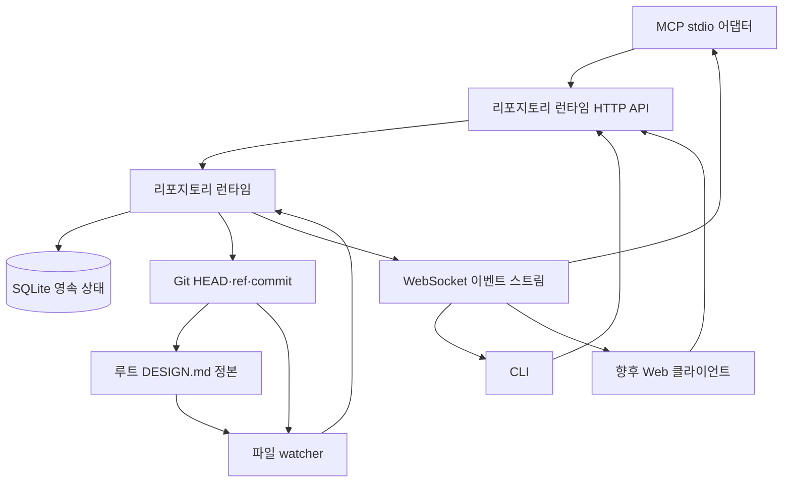
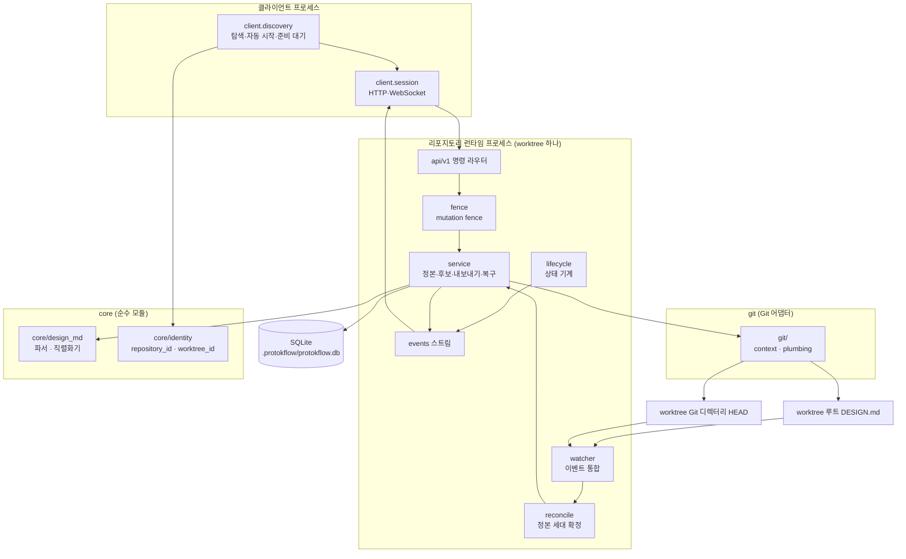
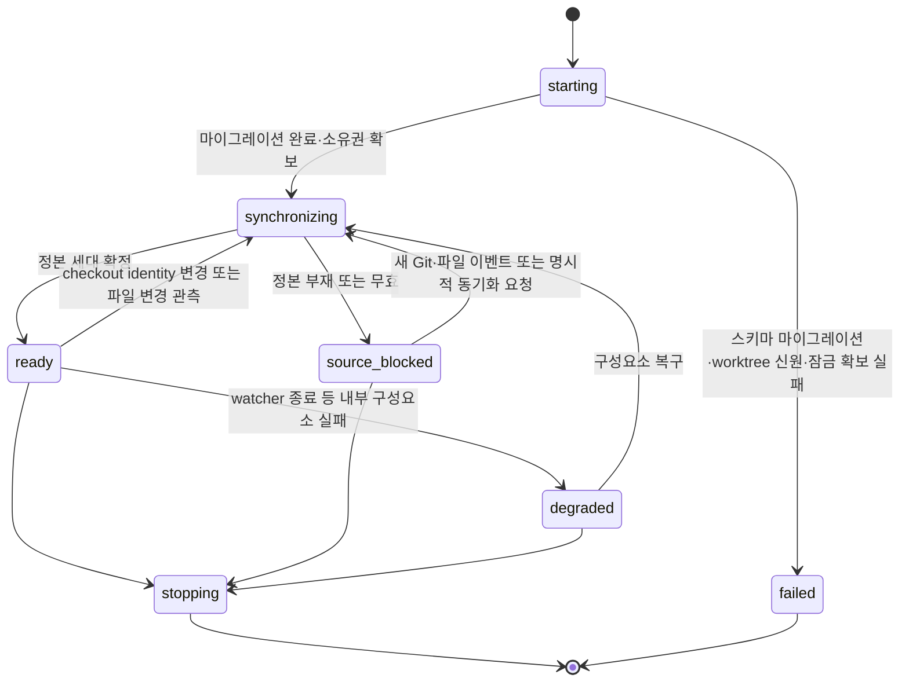
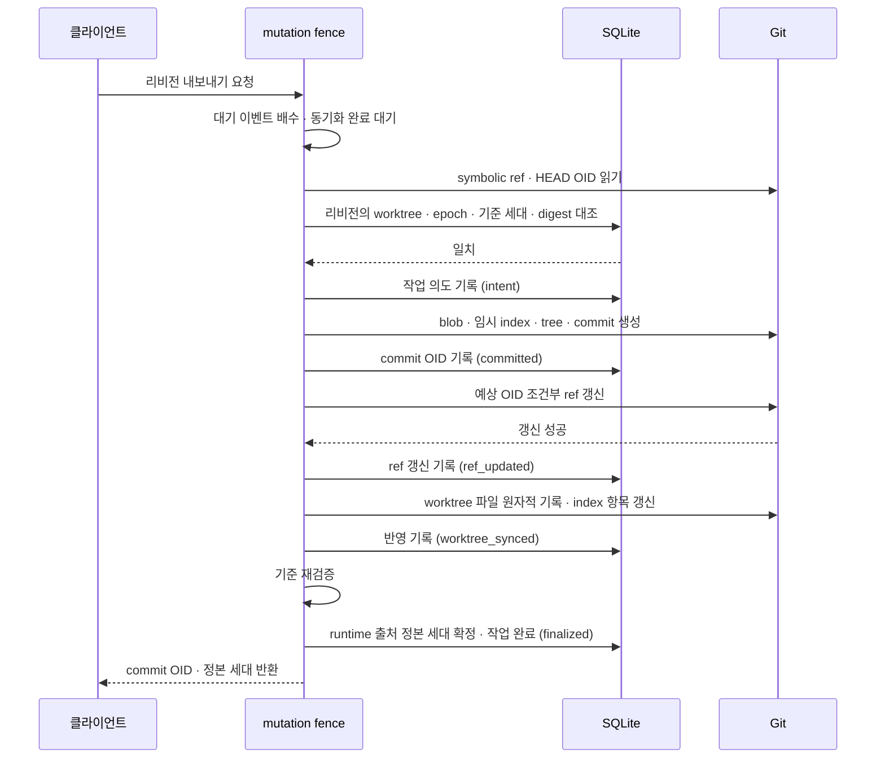
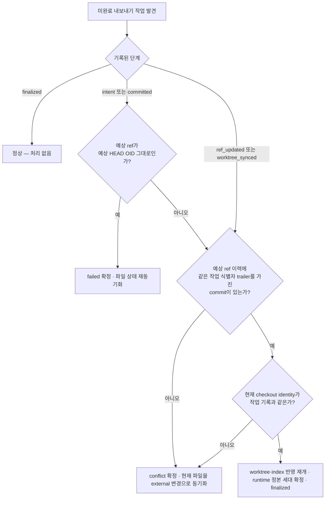
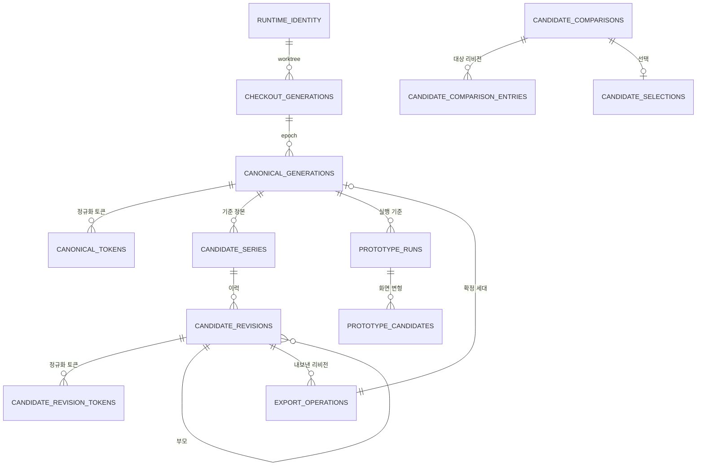
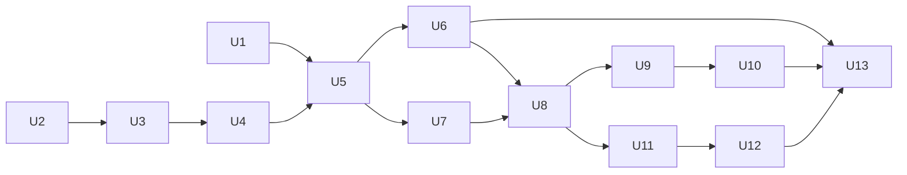

# 리포지토리 런타임과 후보 리비전 - Plan

> 관련 문서: [DESIGN.md 저장소 계층 플랜](./2026-08-24-1252-feat-designmd-storage-layer-plan.md) · [데이터베이스 스키마 설계](../concepts/database-schema.md) · [MCP + HTTP 하이브리드 DB 스키마 리서치](../research/2026-08-22-mcp-http-hybrid-db-schema-research.md)

## Goal Capsule

### Objective
사용자와 에이전트가 리포지토리에 후보 파일을 만들지 않고, 동기화가 끝나지 않은 설계 상태를 보지 않고, 설계 후보를 생성·비교·수정·내보낼 수 있다. 내보낸 결과는 Git 이력에서 확인하고 되돌릴 수 있다.

### Means
Git worktree 단위 리포지토리 런타임 하나가 checkout 컨텍스트, 정본 `DESIGN.md` 동기화, SQLite 후보 이력, 모든 클라이언트가 공유하는 loopback 프로토콜을 소유한다 (KTD1).

### Product Authority
이 계획은 Product Contract의 R1~R29를 구현 대상으로 삼되, R4의 MCP stdio 어댑터 배선은 이 계획이 런타임 프로토콜·공용 클라이언트·CLI까지만 이행하고 어댑터 자체는 후속 계획의 R4 이행 항목으로 남긴다 (KTD14). Web 후보 비교 화면, 후보 생성 알고리즘, 명시적 rebase와 3-way merge, 백업·보존 기간 제어, 전역 런타임 대시보드는 Product Contract가 이미 후속으로 미룬 항목이며 이 계획이 다시 열지 않는다. 후보 주석의 저장 및 조회는 후속 계획으로 분리하며, 본 계획에서는 비교 및 선택 이력의 영속화까지를 범위로 한정한다.

### Stop Conditions
- 후보 생성 알고리즘, 모델 오케스트레이션, 순위 결정을 구현하지 않는다.
- Web 클라이언트 화면과 상호작용을 구현하지 않는다.
- MCP stdio 어댑터를 배선하지 않는다 (KTD14).
- 런타임을 우회해 SQLite나 정본 파일에 직접 접근하는 경로를 새로 만들지 않는다.
- 원격 다중 사용자 호스팅, 인증 서버, 네트워크 노출 경로를 만들지 않는다.

### Open Blockers
없다.

---

## Product Contract

### 요약

ProtokFlow는 루트 `DESIGN.md`가 있는 Git worktree마다 자동으로 관리되는 리포지토리 런타임 하나를 실행한다.
런타임은 현재 checkout 컨텍스트, 루트 `DESIGN.md`, SQLite 영속화, 후보 리비전 이력, Git commit 기반 내보내기, 모든 클라이언트가 사용하는 로컬 HTTP/WebSocket 인터페이스를 소유한다.

### 문제 정의

현재 저장 경로는 개별 서비스 호출 안에서 파일과 데이터베이스를 함께 조정한다. MCP, CLI, 향후 Web 인터페이스가 동시에 작업하고 후보 비교 이력이 클라이언트 재시작 후에도 유지되어야 하면, 이러한 구조에서는 쓰기 순서와 동기화 완료 시점을 일관되게 보장하기 어렵다.

후보 파일을 리포지토리에 두면 실험 상태와 Git 및 제품이 추적해야 할 단일 정본 설계가 섞인다. 또한 사용자가 후보를 비교하고, 주석을 남기고, 선택하고, 내보내는 이력은 일회성 데이터로 취급할 수 없다. 같은 Git 저장소의 여러 worktree는 서로 다른 브랜치와 `DESIGN.md`를 동시에 가질 수 있고, 한 worktree 안에서도 브랜치 전환이 파일 watcher보다 먼저 checkout 컨텍스트를 바꿀 수 있으므로 런타임 경계와 동기화 경계를 파일 digest만으로 정할 수 없다.

현재 애플리케이션에는 SQLite WAL 설정, 파일을 먼저 기록한 뒤 데이터베이스를 갱신하는 쓰기 경로, 슬러그별 잠금, 프로토타입 실행 및 후보 모델, 루트 `DESIGN.md`와 `design/*.md` 탐색 기능이 있다. 새 구조에서는 저장소 접근을 리포지토리 런타임으로 집중하고, 루트 `DESIGN.md` 하나만 정본 설계로 관리한다.

### 핵심 설계 결정

- **리포지토리 런타임을 단일 저장소 소유자로 지정한다.** Web, MCP, CLI가 같은 worktree 상태와 장기 작업 실행 주체를 공유하도록 watcher, checkout 동기화, 정본 변경, SQLite 쓰기, 후보 작업을 런타임에 집중한다. `Governs R1, R2, R3, R4`
- **Git worktree마다 런타임 하나를 둔다.** Git common directory를 공유하는 경우에도 독립된 worktree는 서로 다른 정본 설계를 가질 수 있으므로, 런타임, watcher, SQLite, 탐색 레코드, 자격 증명은 worktree별로 격리한다. `Governs R1, R2, R22, R23, R25`
- **클라이언트가 런타임을 자동으로 시작하고 준비 완료를 확인한다.** 스키마 검증과 시작 동기화가 끝나기 전에는 요청을 처리하지 않으며, 검증하지 않은 저장 상태를 대신 제공하지 않는다. `Governs R2, R3`
- **데이터 종류별 기준 저장소를 구분한다.** Git이 추적하는 루트 `DESIGN.md`는 정본 설계의 기준이고, SQLite는 후보 및 작업 이력의 영속적인 기준이다. `Governs R5, R11, R14`
- **후보 수정 이력을 SQLite에 보존한다.** 후보를 수정할 때마다 기존 리비전을 변경하지 않고, 현재 리비전을 부모로 하는 새 리비전을 추가한다. `Governs R14, R15, R16, R17`
- **브랜치 전환을 별도의 checkout 세대로 관리한다.** 동일한 파일 내용이라도 서로 다른 Git 브랜치로 잘못 내보내지는 것을 방지하기 위해, 브랜치 전환을 별도의 checkout 세대로 관리한다. `Governs R16, R17, R18, R26, R27`
- **watcher가 아니라 명령 동기화 장벽에서 상태 변경의 기준을 고정한다.** watcher가 checkout을 감지하기 전에 명령이 유입되는 경쟁 상태를 방지하기 위해, watcher가 아니라 명령 동기화 장벽에서 상태 변경의 기준을 고정한다. `Governs R12, R28, R29`
- **내보내기를 Git commit으로 확정한다.** 브랜치 소유권과 복구 경로를 명확히 하고 출처를 보존하기 위해, 내보내기를 Git commit으로 확정한다. `Governs R18, R19, R20`
- **유효한 외부 변경을 정본 변경으로 수용하고 출처를 기록한다.** `Governs R7, R8, R9, R10`
- **HTTP와 WebSocket을 런타임 공통 프로토콜로 사용한다.** `Governs R3, R4, R21, R22, R23, R24`

### 참여 주체

- A1. **리포지토리 사용자:** CLI 또는 Web을 통해 정본 설계를 확인하고, 후보를 비교하며, 선택한 리비전을 내보낸다.
- A2. **에이전트 클라이언트:** MCP stdio 어댑터를 사용하여 런타임에 동일한 리포지토리 작업을 요청한다.
- A3. **리포지토리 런타임:** worktree checkout 동기화, watcher, Git commit 기반 정본 내보내기, SQLite 쓰기, 작업 순서, 준비 상태, 이벤트 발행을 소유한다.
- A4. **외부 저장소 변경자:** 런타임 작업을 통하지 않고 브랜치를 전환하거나 정본 `DESIGN.md`를 교체·수정하는 Git, 편집기 또는 다른 프로세스다.

### 데이터 소유권과 흐름



루트 `DESIGN.md`의 내용은 SQLite의 정본 설계 조회용 표현으로 변환된다. 후보 문서는 SQLite에서만 관리하며, 명시적인 내보내기가 선택된 리비전으로 `DESIGN.md`를 바꾸는 Git commit을 만들고 현재 branch ref에 반영한다.

### 요구사항

**런타임 소유권과 가용성**

- R1. 하나의 `worktree_id`는 동시에 하나의 리포지토리 런타임만 소유해야 한다. 이 소유 범위에는 checkout 및 파일 watcher, Git commit 기반 정본 내보내기, SQLite 쓰기, 후보 작업, 이벤트 발행이 포함된다. 같은 `repository_id`에 속한 형제 worktree는 각각 독립 런타임과 SQLite를 사용해야 한다.
- R2. 클라이언트는 현재 Git worktree의 런타임을 찾거나 자동으로 시작해야 한다. 스키마 검증, worktree 신원 확인, 시작 동기화가 모두 성공한 뒤에만 저장소 요청을 보낼 수 있다.
- R3. 런타임 시작, 시작 동기화, 스키마 검증, 프로토콜 또는 내부 저장소 처리에 실패하면 명시적인 사용 불가 상태로 요청을 거부해야 한다. 검증되지 않은 데이터베이스 상태를 응답으로 제공해서는 안 된다.
- R4. MCP, CLI, Web 어댑터는 런타임 프로토콜을 사용해야 하며 리포지토리 데이터베이스나 정본 파일을 직접 읽거나 쓰면 안 된다.

**정본 설계 동기화**

- R5. Git worktree 루트 `DESIGN.md` 하나만 정본 설계 문서로 사용해야 한다. `DESIGN.md`를 사용하지만 Git worktree가 아닌 디렉터리는 지원하지 않으며, 후보 변형은 리포지토리 파일로 저장하지 않는다.
- R6. watcher는 루트 `DESIGN.md`의 생성, 수정, 삭제, 원자적 교체와 Git checkout identity 변경을 감지해야 한다. 짧은 시간에 연속으로 발생한 이벤트를 하나로 모은 뒤 최종 Git 컨텍스트와 파일 내용을 읽어야 하며, 이벤트 이름이나 순서만으로 변경 결과를 추정하면 안 된다.
- R7. 데이터베이스에 확정한 각 정본 세대에는 런타임 작업으로 시작된 변경인지, 대응하는 런타임 작업 없이 감지된 변경인지 기록해야 한다. 출처 값은 각각 `runtime`, `external`을 사용하고, 원인에는 적어도 `export`, `file_edit`, `git_checkout`, `startup_sync`, `recovery`를 구분할 수 있는 값을 기록해야 한다.
- R8. 안정화된 외부 상태의 파일 digest가 현재 정본과 다르거나 checkout epoch가 바뀌면 사용자 확인 없이 `external` 출처의 새 정본 세대 하나를 생성하고 변경 원인을 이벤트로 발행해야 한다. checkout epoch가 바뀌었다면 파일 digest가 같아도 새 정본 세대를 만들어야 한다.
- R9. 정본 파일이 없거나 유효하지 않으면 마지막으로 확정된 유효한 정본 세대와 기존 후보 이력의 조회는 유지해야 한다. 후보 생성, 새 리비전 생성, 패치, 내보내기 명령은 유효한 정본이 다시 확정될 때까지 거부해야 한다.
- R10. 런타임이 `DESIGN.md`를 바꾸는 Git commit을 만들 때는 작업 식별자, `worktree_id`, checkout epoch, 예상 symbolic ref와 HEAD OID, 목표 digest, 생성된 commit OID, 작업 단계를 영속적으로 관리해야 한다. watcher는 이 정보를 이용해 런타임 내보내기와 외부 변경을 구분하고 같은 결과의 정본 세대를 중복 생성하지 않아야 한다.

**조회와 상태 변경 명령**

- R11. 새로 감지한 정본 파일을 검증하고 저장하는 동안 조회 요청에는 마지막으로 완전히 확정된 정본 세대를 반환해야 한다. 동시에 더 최신 파일 상태를 처리 중임을 응답에 표시해야 한다.
- R12. 정본에 의존하는 상태를 생성하거나 변경하는 명령은 worktree별 mutation fence 안에서 진행 중인 동기화와 대기 중인 watcher 이벤트를 처리한 뒤 현재 checkout identity, checkout epoch, 정본 세대, digest를 다시 읽어 작업의 기준으로 고정해야 한다. 제한 시간 안에 동기화가 끝나지 않거나 기준을 안정적으로 고정할 수 없으면 상태를 변경하지 않고 명령을 실패 처리해야 한다.
- R13. 정본 세대와 해당 정규화 토큰 표현은 하나의 데이터베이스 트랜잭션에서 함께 공개되어야 한다. 어떤 클라이언트도 일부만 갱신된 설계를 볼 수 없어야 한다.

**후보 이력과 비교**

- R14. SQLite는 프로토타입 실행, 후보 시리즈, 불변 후보 리비전, 정규화 후보 토큰, 비교 데이터, 선택 기록, 내보내기 작업 이력의 기준 저장소여야 한다.
- R15. 후보 시리즈를 수정하면 기존 리비전을 변경하지 않고 새 리비전을 추가해야 한다. 새 리비전은 직전 리비전을 부모로 참조하며, 시리즈의 현재 리비전 포인터는 새 리비전으로 이동해야 한다.
- R16. 각 후보 리비전에는 전체 후보 `DESIGN.md` 문서, 문서 digest, 정규화 토큰 표현, 존재하는 경우 부모 리비전, `worktree_id`, 생성 시 checkout identity와 checkout epoch, 관찰한 HEAD OID, 기준 정본의 세대 번호와 digest를 저장해야 한다.
- R17. 후보 비교는 기본적으로 현재 checkout epoch에서 각 시리즈의 현재 리비전을 사용해야 한다. 다른 checkout epoch의 후보는 삭제하거나 자동으로 다시 유효하게 만들지 않고 stale 사유와 생성 Git 컨텍스트를 표시한 채 명시적으로 조회할 수 있어야 하며, 과거의 특정 리비전도 정확한 식별자로 조회할 수 있어야 한다.

**내보내기와 복구**

- R18. 내보내기는 attached HEAD에서만 허용해야 한다. 선택한 리비전의 `worktree_id`, checkout epoch, 기준 정본 세대와 digest가 현재 상태와 모두 일치해야 하며, mutation fence 안에서 symbolic ref와 HEAD OID를 예상값으로 고정해야 한다. 하나라도 다르거나 detached HEAD이면 Git과 SQLite를 변경하지 않고 작업을 거부해야 한다.
- R19. 내보내기는 선택한 후보의 `DESIGN.md` 변경만 포함하고 기존의 다른 staged 또는 working-tree 변경을 포함하지 않는 Git commit을 만들어야 한다. 시작 시 고정한 symbolic ref가 여전히 예상 HEAD OID를 가리킬 때만 ref를 원자적으로 갱신하고, worktree 파일과 index가 새 commit을 반영한 뒤 출처가 `runtime`인 정본 세대 하나를 확정해야 한다. 정본 세대에는 내보낸 후보 리비전과 commit OID를 보존하고 완료 이벤트를 발행해야 한다.
- R20. 내보내기 도중 런타임이 중단되면 재시작 시 영속 작업 단계, 예상 symbolic ref와 HEAD OID, 생성된 commit OID, 예상 ref 이력 반영, 현재 checkout 컨텍스트, 파일 digest, 확정된 데이터베이스 세대를 비교해야 한다. commit과 ref 갱신을 증명할 수 있을 때만 작업을 완료 처리하고, digest만 같거나 Git 결과를 증명할 수 없으면 성공으로 추정하지 않아야 한다. checkout이 바뀐 상태는 충돌 또는 실패로 확정한 뒤 현재 파일을 외부 변경으로 동기화해야 한다.

**프로토콜과 이벤트**

- R21. 런타임은 loopback HTTP 명령 프로토콜 하나와 WebSocket 이벤트 스트림 하나를 제공해야 한다. 이벤트 범위에는 준비 상태, 정본 동기화, 원본 오류, 후보 변경, 내보내기 결과가 포함된다.
- R22. 런타임 탐색 정보에는 `repository_id`, `worktree_id`, 런타임 인스턴스 식별자, 프로토콜 호환성을 확인할 수 있는 정보가 포함되어야 한다. 클라이언트는 자신이 연 실제 worktree 루트와 이 정보의 결박을 첫 요청과 WebSocket 구독 전에 검증하고, 종료된 프로세스의 기록, 다른 worktree의 기록, 호환되지 않는 프로토콜 버전을 거부해야 한다.
- R23. loopback 접근은 `worktree_id`와 현재 런타임 인스턴스에 결박된 로컬 자격 증명으로 인증해야 한다. 자격 증명은 형제 worktree나 재시작한 다른 런타임 인스턴스에 재사용할 수 없어야 하며, 일반 API 응답에 포함하거나 리포지토리에 커밋해서는 안 된다.
- R24. 런타임 상태 응답은 `starting`, `synchronizing`, `ready`, `source-blocked`, `degraded`, `stopping`, `failed` 중 현재 상태와 그 이유를 설명하고 마지막으로 확정된 정본 세대를 식별해야 한다.

**Git worktree와 checkout 컨텍스트**

- R25. `repository_id`는 Git common directory의 안정적인 신원을 나타내고, `worktree_id`는 symlink와 운영체제별 경로 표현을 정규화한 실제 worktree 루트의 신원을 나타내야 한다. 런타임 소유권과 모든 쓰기 격리는 `worktree_id`를 기준으로 해야 한다.
- R26. 런타임은 checkout identity로 항상 전체 symbolic ref를 사용한다. detached HEAD는 지원하지 않는 checkout 상태로 관측해야 하며, 런타임은 이 상태에서 `degraded`를 표시하고 정본 의존 상태 변경 명령과 내보내기를 거부하되 마지막으로 확정된 정본 세대의 조회는 유지해야 한다. identity가 바뀔 때마다 단조 증가하는 checkout epoch를 새로 확정해야 한다. 같은 symbolic ref에서 일반 commit으로 HEAD OID만 바뀌고 `DESIGN.md` 정본이 바뀌지 않은 경우에는 checkout epoch를 증가시키지 않아야 한다.
- R27. checkout identity 변경은 `DESIGN.md` digest 변경과 별도로 감지하고 동기화해야 한다. 브랜치 전환으로 파일 내용이 같더라도 새 checkout epoch와 정본 세대를 확정하고, 전환 중에는 런타임을 `synchronizing` 상태로 표시해야 한다.
- R28. 모든 정본 의존 상태 변경 명령과 내보내기는 worktree별 mutation fence에서 직렬화해야 한다. 명령은 대기 중인 watcher 이벤트를 처리하고 현재 checkout과 파일을 동기화한 뒤 기준을 고정하며, 데이터베이스 또는 Git 결과를 확정하기 직전에 같은 기준을 다시 검증해야 한다.
- R29. 명령 실행 중 checkout identity, checkout epoch, 정본 세대 또는 digest가 바뀌면 성공 이벤트나 새 데이터베이스 상태를 공개하지 않고 재시도 가능한 checkout 충돌로 실패 처리한 뒤 실제 Git 및 파일 상태를 다시 동기화해야 한다. 동기화 중인 조회는 마지막으로 확정된 정본과 더 최신 상태를 처리 중이라는 표시를 반환해야 한다.

### 주요 흐름

- F1. **런타임 탐색과 시작**
  - **시작 조건:** MCP, CLI 또는 Web 클라이언트가 루트 `DESIGN.md`가 있는 Git worktree를 연다.
  - **참여 주체:** A1 또는 A2, A3
  - **처리 순서:** 클라이언트가 `repository_id`와 `worktree_id`를 확인하고 worktree에 결박된 호환 런타임을 찾는다. 런타임이 없으면 새로 시작한다. 런타임이 스키마, checkout identity, `DESIGN.md`, 탐색 및 자격 증명 결박을 검증한 뒤 준비 완료 상태가 되면 요청을 전송한다.
  - **결과:** 모든 어댑터가 검증을 마친 하나의 worktree 상태를 사용하고 형제 worktree의 런타임에는 연결하지 않는다.
  - **관련 요구사항:** R1-R4, R22-R27

- F2. **외부 정본 변경**
  - **시작 조건:** A4가 현재 worktree의 브랜치를 전환하거나 루트 `DESIGN.md`를 수정·교체한다.
  - **참여 주체:** A3, A4
  - **처리 순서:** watcher가 연속된 Git 및 파일 이벤트를 모은 뒤 최종 checkout identity와 파일을 읽는다. checkout identity, checkout epoch, 파일 digest를 현재 정본과 진행 중인 런타임 작업에 비교하고 새 내용을 검증한다. checkout 또는 내용이 바뀌면 `external` 출처와 구체적인 변경 원인을 가진 정본 세대 하나를 확정한다.
  - **결과:** 처리 중에는 이전의 완전한 정본 세대를 계속 조회할 수 있고, 확정 후에는 클라이언트가 새 checkout epoch와 정본 세대 이벤트를 받는다.
  - **관련 요구사항:** R6-R13, R21, R24, R26-R29

- F3. **후보 리비전 생성**
  - **시작 조건:** 사용자 또는 에이전트가 후보를 만들거나 기존 후보 시리즈를 수정한다.
  - **참여 주체:** A1 또는 A2, A3
  - **처리 순서:** 런타임이 mutation fence에서 진행 중인 동기화와 watcher 이벤트를 처리하고 현재 checkout epoch, 정본 세대, digest를 확정한다. 후보 문서, Git 컨텍스트, 정규화 토큰을 같은 트랜잭션에 저장하고, 후보 시리즈의 현재 리비전 포인터를 새 불변 리비전으로 이동한다.
  - **결과:** 리포지토리 파일을 만들지 않고도 새 리비전을 재현하고 비교할 수 있다.
  - **관련 요구사항:** R12-R17, R21, R28-R29

- F4. **후보 내보내기**
  - **시작 조건:** 사용자가 정확한 후보 리비전을 선택하여 내보내기를 요청한다.
  - **참여 주체:** A1, A3
  - **처리 순서:** 런타임이 mutation fence에서 현재 attached symbolic ref와 HEAD OID를 고정하고, 후보의 `worktree_id`, checkout epoch, 기준 정본 세대 및 digest를 현재 상태와 비교한다. 모두 일치하면 영속 작업 의도를 기록하고 선택한 후보의 `DESIGN.md` 변경만 포함한 commit을 만든다. symbolic ref가 여전히 예상 HEAD OID를 가리킬 때만 원자적으로 갱신하고, worktree와 index를 commit에 맞춘 뒤 commit OID를 참조하는 새 정본 세대를 확정하고 완료 이벤트를 발행한다.
  - **결과:** 후보 생성 이후 발생한 checkout 또는 정본 변경을 덮어쓰지 않으면서 선택한 리비전을 감사 가능하고 되돌릴 수 있는 Git commit으로 승격한다.
  - **관련 요구사항:** R10, R12, R16-R20, R26-R29

- F5. **정본 원본 오류와 복구**
  - **시작 조건:** watcher가 없거나 유효하지 않은 루트 `DESIGN.md`를 감지한다.
  - **참여 주체:** A1 또는 A2, A3, A4
  - **처리 순서:** 런타임은 마지막으로 확정된 정본과 후보 이력의 조회를 유지하고 원본 오류를 알린다. 정본에 의존하는 상태 변경 명령을 거부하며, 이후 Git·파일 이벤트 또는 명시적인 동기화 요청이 들어오면 checkout과 파일을 다시 검증한다. 중단된 내보내기가 있으면 commit OID와 예상 ref 이력 반영을 작업 단계 및 파일 digest와 함께 검증한다.
  - **결과:** 기존 이력은 계속 확인할 수 있고, 유효한 정본 세대가 확정된 후에만 상태 변경 명령을 다시 처리한다.
  - **관련 요구사항:** R3, R9-R12, R20-R21, R24, R26-R29

- F6. **Git checkout 전환**
  - **시작 조건:** A4가 같은 worktree에서 다른 브랜치로 전환하거나 attached HEAD와 detached HEAD 사이를 이동한다.
  - **참여 주체:** A3, A4
  - **처리 순서:** 런타임이 Git 및 파일 이벤트를 수집하고 `synchronizing` 상태로 전환한다. 관측이 detached HEAD이면 지원하지 않는 checkout 상태로 `degraded`를 확정한다 (R26). attached HEAD이면 안정화된 symbolic ref를 checkout identity로 확인하고 checkout epoch를 증가시킨 뒤 최종 `DESIGN.md`를 검증한다. 파일 내용이 이전과 같아도 새 정본 세대를 확정하며, 이전 epoch의 후보를 stale로 표시한다.
  - **결과:** 새 checkout에서 이전 checkout의 후보를 자동으로 내보낼 수 없고, 이전 후보 이력은 생성 컨텍스트와 stale 사유를 포함해 계속 조회할 수 있다.
  - **관련 요구사항:** R8, R11-R12, R16-R18, R24, R26-R29

### 수용 예시

- AE1. **자동 시작 중에는 검증되지 않은 상태를 제공하지 않는다**
  - **관련 요구사항:** R1-R4, R22-R27
  - **조건:** 실행 중인 런타임이 없고 Git worktree에 유효한 `DESIGN.md`와 기존 데이터베이스가 있다.
  - **동작:** MCP 또는 CLI 클라이언트가 첫 리포지토리 요청을 보낸다.
  - **기대 결과:** worktree에 결박된 런타임 하나가 시작되어 Git 컨텍스트, 탐색 및 자격 증명 결박, 정본을 검증하고 동기화한 뒤 확정된 정본 세대의 데이터를 반환한다.

- AE2. **유효한 외부 편집을 출처가 명시된 새 세대로 저장한다**
  - **관련 요구사항:** R6-R13, R21
  - **조건:** 정본 세대 12가 확정되어 있고 세대 12를 기준으로 만든 후보 리비전이 있다.
  - **동작:** Git 또는 편집기가 내용이 다른 유효한 `DESIGN.md`를 기록한다.
  - **기대 결과:** 처리 중에는 완전한 세대 12를 계속 반환한다. 이후 `external` 출처의 세대 13 하나를 확정하고 클라이언트에 변경 이벤트를 보낸다.

- AE3. **정본 내용이 유효하지 않으면 정본 의존 명령만 차단한다**
  - **관련 요구사항:** R3, R9, R11, R12, R24
  - **조건:** 유효한 정본 세대와 후보 이력이 있다.
  - **동작:** 외부 작성자가 유효하지 않은 정본 내용을 저장한다.
  - **기대 결과:** 원본 오류를 표시하면서 기존 정본과 후보 이력은 계속 조회할 수 있다. 유효한 파일을 다시 감지할 때까지 후보 생성, 리비전 생성, 패치, 내보내기는 거부한다.

- AE4. **후보 수정은 과거 이력을 바꾸거나 파일을 만들지 않는다**
  - **관련 요구사항:** R5, R14-R17
  - **조건:** 후보 시리즈의 현재 리비전이 A1이다.
  - **동작:** 사용자가 해당 후보를 수정한다.
  - **기대 결과:** A1을 부모로 하는 리비전 A2를 저장하고 A1은 변경하지 않는다. 시리즈의 현재 리비전은 A2로 이동하며 리포지토리에 후보 `DESIGN.md` 파일을 만들지 않는다.

- AE5. **기준 정본이 바뀐 후보의 내보내기를 거부한다**
  - **관련 요구사항:** R12, R16-R18, R28-R29
  - **조건:** 후보 리비전은 정본 세대 20을 기준으로 만들었고, 외부 편집으로 현재 정본이 세대 21이 되었다.
  - **동작:** 사용자가 이전 후보 리비전의 내보내기를 요청한다.
  - **기대 결과:** 런타임은 내보내기를 거부하고 Git과 SQLite를 변경하지 않는다. 후보가 이전 정본 세대를 기준으로 한다는 정보를 반환한다.

- AE6. **내보내기 한 번은 Git commit과 정본 세대를 하나씩 생성한다**
  - **관련 요구사항:** R10, R18-R21, R28-R29
  - **조건:** attached HEAD에서 선택한 후보 리비전의 worktree, checkout epoch, 기준 정본이 현재 상태와 일치한다.
  - **동작:** 사용자가 후보 리비전을 내보낸다.
  - **기대 결과:** 예상 branch ref가 예상 HEAD OID에서 선택한 후보의 `DESIGN.md` 변경만 포함하는 새 commit으로 이동한다. SQLite에는 commit OID와 내보낸 리비전을 참조하는 `runtime` 출처의 정본 세대 하나만 생기며, watcher는 중복 세대를 만들지 않고 클라이언트는 완료 이벤트를 받는다.

- AE7. **중단된 내보내기는 재시작 후 하나의 결과로 확정된다**
  - **관련 요구사항:** R19, R20
  - **조건:** 런타임이 내보내기 의도를 기록한 뒤 또는 Git commit과 ref 갱신을 수행한 뒤, 데이터베이스 상태를 모두 확정하기 전에 중단되었다.
  - **동작:** 리포지토리 런타임을 다시 시작한다.
  - **기대 결과:** 런타임은 영속 작업 단계, commit OID, 예상 ref 이력 반영, checkout 컨텍스트, digest를 함께 검증하여 내보내기를 완료·충돌·실패 중 하나로 확정한다. digest만 같다는 이유로 외부 Git 변경을 성공으로 오인하지 않고, 두 개의 정본 현재 세대를 노출하거나 선택한 리비전을 기록 없이 버리지 않는다.

- AE8. **내용이 같은 다른 브랜치에서도 이전 후보를 내보낼 수 없다**
  - **관련 요구사항:** R8, R16-R18, R26-R27
  - **조건:** 브랜치 A와 B의 `DESIGN.md` digest가 같고, 후보는 브랜치 A의 checkout epoch를 기준으로 만들었다.
  - **동작:** 사용자가 브랜치 B로 전환한 뒤 이전 후보를 내보내려 한다.
  - **기대 결과:** 런타임은 새 checkout epoch와 정본 세대를 확정하고 후보를 stale로 표시하며 내보내기를 거부한다. 후보 이력은 브랜치 A의 생성 컨텍스트와 함께 조회할 수 있다.

- AE9. **브랜치 왕복은 이전 후보를 자동으로 다시 유효하게 만들지 않는다**
  - **관련 요구사항:** R16-R18, R26-R27
  - **조건:** 브랜치 A에서 후보를 만든 뒤 A→B→A로 전환했고 최종 `DESIGN.md` digest는 처음과 같다.
  - **동작:** 사용자가 처음 만든 후보를 조회하고 내보내려 한다.
  - **기대 결과:** 후보는 이전 checkout epoch를 기준으로 한 stale 상태로 조회되며 자동으로 다시 활성화되지 않고 내보내기도 거부된다.

- AE10. **형제 worktree는 런타임과 후보 이력을 공유하지 않는다**
  - **관련 요구사항:** R1-R2, R22-R23, R25
  - **조건:** 같은 Git common directory를 공유하는 worktree A와 B가 서로 다른 `DESIGN.md`를 갖는다.
  - **동작:** MCP와 CLI가 두 worktree를 동시에 연다.
  - **기대 결과:** 각 클라이언트는 자신의 `worktree_id`에 결박된 별도 런타임, SQLite, 탐색 레코드, 자격 증명을 사용한다. 한 worktree의 후보와 이벤트는 다른 worktree에서 보이지 않는다.

- AE11. **watcher가 늦어도 상태 변경 명령이 이전 checkout을 사용하지 않는다**
  - **관련 요구사항:** R12, R28-R29
  - **조건:** Git이 브랜치를 전환했지만 watcher가 아직 이벤트를 처리하지 않았고 이전 정본 세대가 현재로 표시되어 있다.
  - **동작:** 후보 생성 또는 내보내기 명령이 도착한다.
  - **기대 결과:** 명령은 mutation fence에서 checkout과 파일을 다시 읽고 동기화한다. 이전 checkout을 기준으로 상태를 만들지 않으며, 안정적인 기준을 확정할 수 없으면 재시도 가능한 checkout 충돌로 실패한다.

- AE12. **detached HEAD에서는 지원하지 않는 상태로 명령을 거부한다**
  - **관련 요구사항:** R18, R24, R26
  - **조건:** 런타임이 detached HEAD checkout을 관측했고 유효한 정본과 후보 이력이 있다.
  - **동작:** 사용자가 후보 리비전을 수정하거나 내보내려 한다.
  - **기대 결과:** 런타임은 `degraded` 상태와 지원하지 않는 checkout 상태라는 사유를 표시한다. 마지막으로 확정된 정본 세대의 정본·후보 조회는 유지되지만 후보 수정과 내보내기는 갱신할 symbolic ref가 없다는 명시적인 오류와 함께 Git과 SQLite를 변경하지 않고 거부된다.

- AE13. **같은 브랜치의 일반 commit은 후보를 불필요하게 무효화하지 않는다**
  - **관련 요구사항:** R16-R18, R26
  - **조건:** attached HEAD에서 후보를 만든 뒤 `DESIGN.md`를 바꾸지 않는 다른 commit으로 HEAD OID만 전진했다.
  - **동작:** 사용자가 후보를 조회하거나 내보내려 한다.
  - **기대 결과:** symbolic ref, checkout epoch, 정본 세대, digest가 유지되므로 후보는 stale로 바뀌지 않는다. 내보내기는 명령 시작 시의 새 HEAD OID를 예상값으로 고정하여 commit을 만든다.

### 성공 기준

- 리포지토리 어댑터에 독립 watcher, SQLite 직접 쓰기 경로, 정본 파일 직접 변경 경로가 없어야 한다.
- 후보 생성, 수정, 비교, 내보내기 흐름을 수행한 뒤에도 리포지토리에는 루트 정본 `DESIGN.md` 하나만 있고 후보 설계 문서는 없어야 한다.
- 반환되는 모든 정본 또는 후보 문서는 완전히 확정된 정본 세대 하나 또는 불변 후보 리비전 하나에 대응해야 한다.
- MCP, CLI, HTTP 클라이언트에서 동일한 `worktree_id`, checkout epoch, 후보 리비전 식별자, 정본 세대 식별자, 성공한 내보내기 commit OID를 확인할 수 있어야 한다.
- 같은 저장소의 두 worktree를 동시에 실행하는 테스트에서 런타임, SQLite, 이벤트, 자격 증명이 교차하지 않아야 한다.
- 브랜치 전환 테스트에서 내용이 같은 브랜치, 내용이 다른 브랜치, A→B→A 왕복, detached HEAD, watcher 처리 전 명령을 검증하고 이전 checkout 후보를 잘못 내보내는 경로가 없어야 한다.
- 런타임 재시작 테스트에서 내보내기 의도 기록, commit 생성, ref 갱신, worktree 반영, 데이터베이스 확정의 각 경계 이후 복구를 검증하고, 외부 Git 변경을 성공으로 오인하거나 중복 정본 세대와 불명확한 내보내기 상태를 만들지 않아야 한다.
- 후속 계획 작성자는 worktree 소유권, checkout epoch, 동기화 장벽, 후보 stale 정책, Git commit 내보내기, 중단 복구의 제품 동작을 추가로 결정하지 않고 구현 작업을 도출할 수 있어야 한다.

### 범위

**후속 단계에서 다룰 항목**

- Web 후보 비교 화면과 상호작용 설계
- 후보 생성 알고리즘, 모델 오케스트레이션, 순위 결정, 평가 정책
- 명시적인 후보 rebase, 토큰 단위 3-way merge, 병합 충돌 UI
- 영속적인 SQLite 후보 이력을 위한 사용자용 백업, 복원, 보존 기간 제어
- 여러 리포지토리 런타임을 탐색하고 관리하는 사용자 전역 실행기 또는 대시보드

**초기 모델에 포함하지 않는 항목**

- Git worktree가 아닌 디렉터리에서 루트 `DESIGN.md`를 사용하는 동작
- 리포지토리에 저장하는 후보 `DESIGN.md` 파일
- `design/*.md`와 같은 복수 정본 설계 문서
- 변경 가능한 후보 리비전, 부모가 여러 개인 병합 리비전, 강제 이력 변경 또는 reset 동작
- 런타임을 사용할 수 없을 때 SQLite나 `DESIGN.md`에 직접 접근하는 어댑터 우회 경로
- 유효한 외부 변경을 이전 데이터베이스 표현으로 자동 복원하여 덮어쓰는 동작
- Git commit을 만들지 않는 file-only 내보내기와 detached HEAD 내보내기
- 여러 worktree가 런타임 또는 SQLite 후보 이력을 공유하는 동작

**이 계획에서 후속 작업으로 미루는 항목**

- MCP stdio 어댑터 배선 (KTD14). 이 계획은 어댑터가 사용할 공용 클라이언트와 프로토콜 계약까지 만든다.
- 후보 리비전을 기준으로 하는 프로토타입 실행. 프로토타입 실행은 정본 세대만 참조하도록 재배선한다 (KTD17).
- 후보 시리즈 사이의 토큰 단위 3-way 비교 시각화. 이 계획은 비교 데이터와 선택 기록의 영속 모델까지 만든다.

<!-- ce-section: work-relationships -->
### 다른 작업과의 관계

이 계획은 리포지토리 런타임, 정본 동기화, 영속 후보 리비전 모델, 비교 데이터 API, 내보내기 계약을 정의한다. 전체 제품의 세부 작업 분할은 후속 계획에서 조정할 수 있다.

- **가능하게 하는 작업:** 공통 HTTP 및 WebSocket 계약을 사용하는 Web 후보 비교 화면
- **가능하게 하는 작업:** 런타임을 통해 불변 리비전을 저장하는 후보 생성 및 평가 worker
- **공유하는 개념:** 향후 미리보기와 내보내기 기능은 같은 정본 세대 및 후보 리비전 식별자를 사용한다.
- **독립적으로 진행할 수 있는 작업:** 런타임 API 계약이 안정되면 Web 비교 화면의 시각 설계를 별도로 진행할 수 있다.
- **후속 결정 사항:** 리포지토리 간 관리, stale 후보의 명시적 재기준화 사용자 경험, 백업 정책, 보존 기간 제어

### 의존성과 전제

- 런타임은 로컬 리포지토리와 loopback 네트워크에서 동작한다. 원격 다중 사용자 호스팅은 이 계약의 범위에 포함하지 않는다.
- 파일시스템 알림은 변경이 발생했다는 신호일 뿐 완전한 변경 이력이 아니다. 따라서 시작 동기화와 명시적인 동기화 명령을 복구 경로로 제공해야 한다.
- 루트 `DESIGN.md`가 있는 프로젝트는 Git worktree이며, Git ref와 commit을 정본 내보내기의 영속적인 경계로 사용할 수 있다고 전제한다.
- 외부 Git 명령은 런타임의 mutation fence를 따르지 않을 수 있다. 따라서 런타임은 watcher 신호에만 의존하지 않고 명령 시작과 확정 시 checkout을 재검증하며, ref 갱신에는 예상 HEAD OID 조건을 사용해야 한다.
- 기존 `DESIGN.md` 파서와 정규화 토큰 표현은 정본 및 후보 조회용 표현을 만드는 입력으로 계속 사용할 수 있다고 전제한다.
- SQLite 후보 이력은 영속적인 제품 데이터다. 이 구조를 도입한 뒤에는 데이터베이스 삭제에 의존하는 스키마 변경 방식을 사용할 수 없다.
- 데이터베이스는 worktree 내부에 있으므로 worktree 제거(예: `git worktree remove`)는 미내보내기 후보 이력을 함께 소실시킨다. `.protokflow/`는 Git이 추적하지 않으므로 Git의 변경 보호도 받지 못한다. 후보 이력의 내구성 경계는 내보내기가 만드는 Git commit이다.
- 일반적인 설계 편집 흐름을 ProtokFlow 안으로 옮기더라도 Git을 사용한 변경과 긴급 수동 복구는 가능해야 한다.

### 근거 자료

- `backend/database/db.py` — SQLite 엔진, WAL, 외래 키, busy timeout, 스키마 초기화
- `backend/app/protokflow/service/design_system_service.py` — 현재 파일 우선 쓰기와 슬러그별 잠금 동작
- `backend/app/protokflow/core/discovery.py` — 새 구조에서 교체할 루트 및 형제 설계 문서 탐색 동작
- `backend/app/protokflow/model/prototype_run.py`, `backend/app/protokflow/model/candidate.py` — 기존 프로토타입 실행 및 후보 모델 범위
- `backend/core/registrar.py`, `backend/main.py` — 기존 애플리케이션 수명주기 및 시작 연결
- `CONCEPTS.md` — 런타임 소유권과 정본 세대에 맞춰 정리한 공통 용어

---

## Planning Contract

### Key Technical Decisions

- KTD1. **리포지토리 런타임을 worktree마다 1개의 독립 프로세스로 구동하고 loopback HTTP/WebSocket으로만 노출한다.** 기존 FastAPI 애플리케이션과 uvicorn을 재사용하되, 진입점을 `backend/run.py`의 고정 포트 개발 서버가 아니라 임의 포트에 결박된 런타임 프로세스로 바꾼다. 클라이언트가 같은 프로세스 안에서 코어를 직접 호출하는 in-process 방식은 형제 worktree 격리와 다중 클라이언트 공유를 동시에 만족시키지 못한다. `Governs R1, R3, R4, R21`

- KTD2. **watcher는 `watchfiles`를 사용하고 worktree 루트와 worktree 전용 Git 디렉터리를 각각 비재귀로 감시한다.** 리포지토리 전체를 재귀 감시하면 대형 리포지토리에서 비용이 감시 대상과 무관하게 커진다. 원자적 교체(rename)로 단일 파일 watch가 끊기는 문제를 피하기 위해 파일이 아니라 그 부모 디렉터리를 감시하고 이름으로 거른다. debounce 창은 정확성 장치가 아니라 처리량 조절 장치다 — 정확성은 KTD5의 기준 재검증이 보장하므로 창 값을 성능 관점에서만 조정한다. `Governs R6, R27`

- KTD3. **Git 접근은 `git` 실행 파일 서브프로세스로 한다.** 정본이 Git worktree라는 전제(Product Contract 의존성 절)가 `git` 존재를 보장하므로, libgit2 계열 바인딩을 컴파일 의존성으로 들이는 비용을 지불하지 않는다. 조회 명령에는 `GIT_OPTIONAL_LOCKS=0`을 적용해 관측이 index를 건드리지 않게 한다. `Governs R10, R18, R19, R25, R26`

- KTD4. **내보내기 commit은 임시 index와 plumbing으로 만들고 ref는 예상 OID 조건부 갱신으로 확정한다.** `HEAD` 트리를 임시 index에 읽어 `DESIGN.md` 항목만 교체하고 tree와 commit 객체를 만든 뒤, 예상 이전 OID를 함께 넘기는 ref 갱신으로 원자적으로 이동시킨다. porcelain 경로는 hook을 실행하고 사용자의 실제 index 상태에 영향을 받으며 ref 비교·교환 조건을 걸 수 없어 R19의 두 조건(다른 staged 변경 미포함, 예상 HEAD OID 조건부 갱신)을 함께 만족시키지 못한다. `Governs R19`

- KTD5. **정본 의존 명령은 worktree 단위 단일 mutation fence에서 직렬화하고 기준을 두 번 검증한다.** 명령 진입 시 대기 이벤트를 배수하고 checkout identity·epoch·정본 세대·digest를 고정하며, 데이터베이스 또는 Git 결과를 확정하기 직전에 같은 값을 다시 읽어 비교한다. 불일치는 재시도 가능한 checkout 충돌로 실패시킨다. `Governs R12, R28, R29`

- KTD6. **checkout identity와 epoch는 `HEAD` 관측에서 파생하고 데이터베이스의 단조 증가 정수로 확정한다.** identity는 항상 전체 symbolic ref이며 detached HEAD는 지원하지 않는 관측 상태로 런타임이 `degraded`로 확정한다. HEAD OID는 epoch의 입력이 아니라 명령 시작 시점에 읽는 값이며, 그래서 같은 브랜치의 일반 commit은 epoch를 올리지 않는다. `Governs R26, R27`

- KTD7. **`repository_id`와 `worktree_id`는 정규화된 실제 경로에서 유도한 결정적 해시다.** worktree 루트와 Git common directory를 symlink 해소·유니코드 정규화 후, 대상 파일시스템이 대소문자를 구분하지 않을 때만 Unicode case folding을 적용해 정규화하고 구분 파일시스템에서는 대소문자를 보존한다. 정규화 경로는 식별자 이름으로 도메인 구분한 UTF-8 바이트열로 직렬화해 SHA-256으로 해시하고 소문자 16진수로 표기한다. 클라이언트가 런타임에 접속하기 전에 같은 값을 스스로 계산할 수 있어야 결박 검증(R22)이 성립하므로, 데이터베이스가 발급하는 식별자를 쓰지 않는다. `Governs R22, R25`

- KTD8. **런타임 탐색 레코드와 loopback 자격 증명은 worktree 로컬 `.protokflow/`에 두고, 단일 소유권은 같은 디렉터리의 배타 잠금으로 강제한다.** 자격 증명 파일은 소유자 전용 권한으로 만들고, 런타임이 `.protokflow/.gitignore`에 `*` 한 줄을 보장해 추적 대상 `.gitignore`를 수정하지 않고도 커밋을 차단한다. 런타임 시작 시 `.protokflow/`와 상위 경로 전부가 소유자 소유의 일반 디렉터리인지 검증하고 symlink·하드링크를 거부한다. 자격 증명·탐색 레코드·잠금·데이터베이스 파일은 no-follow 원자적 생성으로 열고, 검증에 실패하면 시작을 `failed`로 확정한다. 탐색 레코드는 프로세스 수명주기와 동기화되어 소멸되어야 하므로 데이터베이스가 아니라 파일에 둔다(리서치 F9). `Governs R1, R22, R23`

- KTD9. **스키마 변경은 Alembic으로 보존형 마이그레이션을 수행하고, `PRAGMA user_version` 게이트와 "데이터베이스 삭제 후 재인덱싱" 복구 경로를 폐기한다.** 후보 이력이 파일로부터 복원 불가능한 영속 제품 데이터가 되면서 기존 스키마 문서 §1-1의 소멸 가능 저장소 불변식이 더 이상 성립하지 않는다. 마이그레이션은 worktree마다 열리는 데이터베이스에 대해 런타임 시작 시 동기 URL로 실행한다. 영속 제품 데이터의 안전한 관리를 위해 자체 마이그레이션 러너 대신 표준 도구의 리비전 그래프와 자동 생성 검증을 제공하는 Alembic을 채택한다. `Governs R14`

- KTD10. **내보내기 작업은 영속 단계 전이로 기록하고, 복구는 commit 메시지의 작업 식별자 trailer로 증명한다.** 단계는 의도 기록 → commit 생성 → ref 갱신 → worktree·index 반영 → 데이터베이스 확정이며 각 경계가 커밋된다. 재시작 시 파일 digest 일치는 증거로 인정하지 않고, 예상 ref 이력에 해당 작업 식별자를 가진 commit이 있는지로 판정한다. `Governs R10, R20`

- KTD11. **후보 리비전은 델타가 아니라 문서 전문과 정규화 토큰 전량을 저장한다.** 리비전은 불변이고 비교·내보내기가 임의 리비전을 직접 재현해야 하므로, 델타 체인 재생을 도입하면 조회마다 이력 전체 의존성이 생긴다. 문서 크기가 수십 KB 수준이라 저장 비용이 재생 비용보다 싸다. `Governs R15, R16`

- KTD12. **정본 파일을 바꾸는 런타임 경로는 내보내기 하나뿐이다.** 현재의 토큰 write-through 경로(정본 파일을 직접 in-place 패치하고 데이터베이스를 뒤이어 갱신)를 제거한다. 토큰 패치는 후보 시리즈에 새 리비전을 추가하는 명령으로 대체한다. 두 개의 정본 쓰기 경로를 유지하면 R10의 런타임·외부 변경 구분과 R19의 commit 단일성이 동시에 깨진다. `Governs R5, R15, R19`

- KTD13. **정본 조회는 마지막으로 완전히 확정된 세대와 처리 중 표시를 함께 반환한다.** 처리 중 표시는 별도 상태 컬럼이 아니라 런타임 메모리의 관측 상태에서 파생한다 — 데이터베이스에 중간 상태를 쓰면 R13의 단일 트랜잭션 공개 규칙과 충돌한다. `Governs R11, R13, R29`

- KTD14. **이 계획의 클라이언트 표면은 공용 클라이언트 라이브러리와 CLI다.** 프로토콜 계약을 먼저 고정하여 어댑터 구현 복잡도를 낮추기 위해, MCP stdio 어댑터는 공용 클라이언트를 사용하는 후속 작업으로 분리하고 현 단계에서는 런타임 의존성에 MCP SDK를 포함하지 않는다. `Governs R4`

- KTD15. **기존 프로토타입 화면 변형 테이블을 `prototype_candidates`로 개명한다.** `CONCEPTS.md`의 Candidate Series와 Candidate Revision이 "후보"라는 이름을 갖게 되므로, 프로토타입 실행 안의 화면 변형이 같은 이름을 계속 쓰면 저장소·API·문서에서 두 개념이 반복 충돌한다. 사전 릴리스 원칙에 따라 공용 어휘 체계에서 "후보(Candidate)" 개념을 일원화하기 위해 테이블에 별도 접두사를 붙이지 않고 기존 테이블을 개명한다. `Governs R14`

- KTD16. **데이터베이스는 worktree 루트의 `.protokflow/protokflow.db` 하나이고, 엔진과 세션 팩토리는 런타임 시작 시점에 만든다.** 현재의 import 시점 전역 엔진은 프로세스 CWD에 결박되어 worktree 격리(R1)를 표현할 수 없다. 저장 계층 전체 — 데이터베이스 본체와 WAL/SHM, journal, 임시 파일 — 는 소유자 전용 권한·소유권을 유지하고 런타임 시작 시 검증한다. 테스트 하니스가 의존하는 세션 팩토리 프록시는 유지하고, 그 뒤의 엔진 생성 시점만 옮긴다. worktree 제거(`git worktree remove` 등)는 Git의 변경 보호를 받지 못한 채 미내보내기 후보 이력을 함께 소실하며, 후보 이력의 내구성 경계는 내보내기가 만드는 Git commit이다. `Governs R1, R2`

- KTD17. **프로토타입 실행은 삭제되는 `design_systems` 대신 정본 세대를 참조한다.** `design_systems`의 다중 슬러그 모델은 R5가 정본을 루트 문서 하나로 좁히면서 사라진다. 프로토타입 실행이 후보 리비전을 기준으로 실행되는 형태는 이 계획의 범위 밖이므로 정본 세대 참조로만 재배선한다. `Governs R5, R14`

- KTD18. **내보내기 commit의 author·committer는 리포지토리 `--local` 설정에서 해석해 자식 프로세스에 명시 주입하고, 설정이 없으면 런타임 고정 신원으로 폴백한다.** 해석한 값은 `GIT_AUTHOR_NAME`·`GIT_AUTHOR_EMAIL`·`GIT_COMMITTER_NAME`·`GIT_COMMITTER_EMAIL`로 주입해 ambient 환경 의존을 제거하며, 고정 신원은 `Protokflow Runtime <runtime@protokflow.invalid>`를 사용한다. `commit-tree`는 hook을 실행하지 않고 `commit.gpgsign`을 존중하지 않으므로 Assumptions의 hook·서명 조건은 별도 조치 없이 충족된다. 기각한 대안: ambient Git 설정에만 의존 — 신원이 설정되지 않은 서비스 계정에서 내보내기가 `unable to auto-detect email address`로 실패한다. `Governs R19`

- KTD19. **plumbing 계층은 frozen dataclass가 데이터를, 모듈 함수가 동작을 담당한다.** `GitRepo(worktree_root, git_executable, timeout)` frozen dataclass를 모든 plumbing 함수의 첫 인자로 전달한다. `IsolatedIndex`는 임시 index 경로라는 실제 상태를 보유하므로 유지하되 `GitRepo`를 품는다. 이는 `core/design_md.py`, `git/process.py`, `git/context.py`가 채택한 "모듈 함수 + frozen dataclass" 형태와 일치하며 U9의 내보내기 시퀀스 연쇄에서 인자 반복 전달을 제거한다. `backend/app/protokflow/storage/`는 `__init__.py`만 존재해 선례로 사용할 수 없다. 기각한 대안: 전면 객체지향(`RepoPlumbing` 클래스에 메서드 집중) — 내부 일관성을 위해 `context.py`·`process.py`까지 함께 바꿔야 한다 / 두 seam 공존 유지 — 이후 유닛이 서로 다른 호출 규약을 선택하게 되어 회수 비용이 커진다. `Governs R19`

### High-Level Technical Design

#### 런타임 내부 구성과 소유권



fence를 통과하지 않는 경로는 조회뿐이다. watcher는 상태를 직접 바꾸지 않고 reconcile에 관측을 넘긴다. Git 관측과 plumbing은 `git/` 어댑터가 담당하고, `core/`는 subprocess를 실행하지 않는 순수 계산 모듈로 유지한다.

#### 런타임 상태 기계



`source-blocked`와 `degraded`는 조회를 계속 제공하고 정본 의존 상태 변경만 거부한다. `failed`는 요청을 전혀 처리하지 않는다.

#### 내보내기 확정 순서



각 단계 전이는 그 자체로 커밋된다. 재검증 실패는 정본 세대를 만들지 않고 작업을 충돌로 확정한다.

#### 재시작 시 내보내기 판정



파일 digest 일치는 어느 분기에서도 성공 증거로 쓰지 않는다.

#### 저장 모델



`design_systems`와 `design_tokens`는 정본 세대와 그 토큰 표현으로 대체된다. `PROTOTYPE_CANDIDATES`는 기존 `candidates`의 개명 결과다 (KTD15).

### Output Structure

```
alembic.ini
backend/
  database/
    db.py                         (엔진 생성 시점 재구성)
    url.py                        (worktree 기준 경로 유도)
    migrations/
      env.py
      script.py.mako
      versions/
  app/protokflow/
    core/
      identity.py                 (신규)
      canonical.py                (신규 — discovery.py 대체)
    git/
      process.py
      context.py
      plumbing.py
    runtime/
      lifecycle.py
      record.py
      watcher.py
      reconcile.py
      fence.py
      events.py
      state.py
    service/
      canonical_service.py
      candidate_service.py
      export_service.py
      recovery_service.py
    crud/                         (정본 세대 · 후보 · 내보내기 작업 DAO)
    model/                        (정본 세대 · 후보 · 내보내기 작업 모델)
    schema/                       (런타임 · 정본 · 후보 · 내보내기 스키마)
    api/v1/
      runtime.py
      canonical.py
      candidates.py
      exports.py
      events.py
    client/
      discovery.py
      session.py
tests/
  fixtures/git.py
  fixtures/runtime.py
  app/protokflow/git/
  app/protokflow/runtime/
  app/protokflow/client/
  integration/
```

디렉터리 트리는 예상 산출 형태이며, 유닛별 `Files` 명세를 확정 목록으로 적용한다.

### Assumptions

- 개발 및 실행 환경에 `git` 실행 파일이 있고 예상 OID 조건부 ref 갱신을 지원한다. 이 계획은 이를 시작 시 확인하고, 없으면 런타임을 `failed`로 확정한다.
- `watchfiles`, `alembic`, `httpx`, `websockets`의 정확한 버전은 `uv add` 시점의 최신 안정 버전으로 고정한다. 이 계획은 특정 버전을 지정하지 않는다.
- 내보내기 commit은 Git hook을 실행하지 않고 서명하지 않는다. author와 committer는 리포지토리의 Git 설정을 따르며, 설정이 없으면 런타임 고정 신원을 사용한다.
- 사전 릴리스 단계이므로 기존 개발 데이터베이스를 보존하지 않는다. Alembic 초기 리비전은 계획 이전의 현재 모델 메타데이터를 기준선으로 삼고, 기존 파일은 삭제 후 재생성한다. 이 예외는 이번 도입 시점에만 적용되고 이후 리비전부터는 보존형 마이그레이션이 강제된다.
- 런타임 재시작 복구 테스트는 실제 프로세스 강제 종료가 아니라 각 단계 경계에 주입 가능한 중단 지점을 두고 검증한다. 실제 프로세스 종료는 통합 스위트에서 하나의 경계에 대해서만 확인한다.

### Sequencing

U1과 U2는 기반 유닛으로 선행 완료되어야 한다. U3와 U4는 U2 완료 후 순차 진행하며, U5는 U1~U4를 기반으로 실행된다. U6과 U7은 U5 이후 병렬 진행할 수 있다. U8은 U6과 U7에 의존하고, U9는 U8, U10은 U9에 의존한다. U11은 U8 완료 후 착수 가능하나 U9·U10 명령 노출을 위해 선행 완료를 요한다. U12는 U11에 의존하며, U13은 최종 통합 검증 단계이다.



### System-Wide Impact

- **데이터베이스가 소멸 가능한 작업 저장소에서 영속 제품 데이터로 바뀐다.** `docs/concepts/database-schema.md` §1-1의 저장소 위상 불변식, §5.1의 스키마 버전 게이트, §9의 마이그레이션 절이 더 이상 현재 설계를 기술하지 않는다. U2가 코드를 바꾸고 U13이 문서를 맞춘다.
- **애플리케이션 진입점이 바뀐다.** 고정 포트 개발 서버 대신 worktree에 결박된 런타임 프로세스가 표준 실행 형태가 된다. `backend/run.py`의 역할이 축소된다.
- **CLI가 제품의 공개 표면으로 확장된다.** 런타임 시작·상태·후보·내보내기 명령의 이름과 출력 형태가 사실상 계약이 된다.
- **테스트 하니스가 Git worktree를 다루기 시작한다.** 기존 하니스는 데이터베이스 격리만 보장한다. worktree 픽스처가 추가되면서 테스트가 임시 Git 저장소를 만들고 정리해야 하며, `--dist=loadscope` 병렬 실행에서 포트와 경로가 겹치지 않아야 한다.
- **런타임 의존성 표면이 넓어진다.** `alembic`, `watchfiles`, `httpx`, `websockets`가 설치 경로에 추가된다. `watchfiles`는 네이티브 확장을 포함하므로 배포 대상 플랫폼의 휠 가용성이 설치 성공에 영향을 준다.
- **`.protokflow/`가 자격 증명을 담는 디렉터리가 된다.** 파일 권한과 자체 `.gitignore` 보장이 보안 경계가 된다.

### Risks & Dependencies

- **파일시스템 알림의 플랫폼 편차.** macOS FSEvents, Linux inotify, Windows 디렉터리 변경 알림은 원자적 교체와 디렉터리 재생성을 다르게 보고한다. 완화: 이벤트 이름을 신뢰하지 않고 통합 후 최종 상태를 다시 읽는다(R6). 시작 동기화와 명시적 동기화 명령이 알림 누락의 탈출구다.
- **`git` 버전과 동작 편차.** 예상 OID 조건부 ref 갱신과 임시 index 경로는 오래된 기능이지만, 리포지토리 설정(예: hook 경로, 템플릿, 대소문자 처리)이 결과를 바꿀 수 있다. 완화: plumbing만 사용하고 시작 시 `git` 가용성과 버전을 확인한다.
- **Alembic과 worktree마다 열리는 데이터베이스의 결합.** 마이그레이션 실행 경로가 애플리케이션 부팅이 아니라 런타임 시작에 붙으므로, 실행 실패가 곧 런타임 `failed`가 된다. 완화: 마이그레이션 실패를 명시적 상태와 사유로 보고하고, 모델 메타데이터와 마이그레이션 결과가 일치하는지 검증하는 테스트를 둔다.
- **중단 복구 판정의 증거 부족 구간.** 의도 기록과 commit 생성 사이에서 중단되면 commit 객체가 만들어졌는지 여부를 작업 기록만으로는 알 수 없다. 완화: 판정을 예상 ref 이력의 작업 식별자 trailer로 좁히고, ref가 예상 위치 그대로면 실패로 확정한다(KTD10).
- **테스트 실행 시간 증가.** 실제 Git 저장소와 런타임 프로세스를 띄우는 통합 스위트는 기존 단위 테스트보다 느리다. 완화: 통합 스위트를 별도 디렉터리로 분리하고, 무거운 시나리오는 옵트인 마커로 분리할지 U13에서 판단한다.
- **저장 계층 철거의 폭.** `design_systems` 계열 제거는 약 1,600줄의 기존 테스트를 함께 걷어낸다. 완화: U3에서 제거와 대체를 같은 유닛으로 묶어 중간 상태로 머무르지 않게 한다.

### Sources & Research

- `docs/research/2026-08-22-mcp-http-hybrid-db-schema-research.md` — F9(데몬 상태를 파일에 두는 근거, KTD8), F4(정수 키 rowid 재사용 차단), F5(제약 명시 네이밍), F10(스키마 마이그레이션과 데이터 마이그레이션 분리, KTD9), F12(불변 버전 + 이동 포인터 형태, 후보 시리즈 head 포인터의 선례).
- `docs/concepts/database-schema.md` §1-1, §5.1, §6, §9 — 이 계획이 뒤집는 저장소 위상 불변식과 스키마 버전 게이트의 현재 규정.
- `docs/plans/2026-08-24-1252-feat-designmd-storage-layer-plan.md` KTD8·KTD9 — 헤들리스 코어 원칙과 파일 우선 쓰기 순서. KTD12가 후자를 대체한다.
- `backend/common/fs.py` — 원자적 파일 쓰기(`_atomic_write_bytes`)와 디렉터리 fsync. U3가 design_system_service.py에서 이전하고 U9의 worktree 반영이 재사용한다.
- `backend/database/db.py`, `tests/fixtures/db.py`, `tests/support/db.py` — 세션 팩토리 프록시와 테스트 격리 훅. KTD16이 이 경계를 유지한다.
- `docs/solutions/architecture-patterns/test-db-isolation-harness.md`, `tests/meta/test_xdist_isolation.py` — 병렬 실행 격리 규약. U13의 worktree 픽스처가 같은 규약을 따른다.
- `CONCEPTS.md` "Storage Reconciliation" — Repository Runtime, Canonical Generation, Candidate Series, Candidate Revision, Change Origin, Precheck, Reconcile, File-Ahead State의 확정 정의.

---

## Implementation Units

| U-ID | 제목 | 주요 파일 | 의존 |
|---|---|---|---|
| U1 | Git 컨텍스트와 plumbing 어댑터 | `backend/app/protokflow/git/`, `core/identity.py` | — |
| U2 | worktree 범위 영속화와 Alembic 마이그레이션 | `backend/database/`, `alembic.ini` | — |
| U3 | 정본 세대와 checkout 세대 스키마 | `backend/app/protokflow/model/`, `core/canonical.py` | U2 |
| U4 | 후보 시리즈·리비전·비교·내보내기 작업 스키마 | `backend/app/protokflow/model/`, `crud/` | U3 |
| U5 | 런타임 프로세스 수명주기와 단일 소유권 | `backend/app/protokflow/runtime/lifecycle.py`, `record.py`, `state.py` | U1, U4 |
| U6 | watcher와 정본 reconcile | `backend/app/protokflow/runtime/watcher.py`, `reconcile.py` | U5 |
| U7 | mutation fence와 명령 기준 고정 | `backend/app/protokflow/runtime/fence.py` | U5 |
| U8 | 정본 조회와 후보 명령 | `backend/app/protokflow/service/canonical_service.py`, `candidate_service.py` | U7 |
| U9 | Git commit 내보내기 | `backend/app/protokflow/service/export_service.py` | U8 |
| U10 | 내보내기 중단 복구 | `backend/app/protokflow/service/recovery_service.py` | U9 |
| U11 | HTTP 명령 프로토콜과 이벤트 스트림 | `backend/app/protokflow/api/v1/`, `schema/`, `runtime/events.py` | U8 |
| U12 | 클라이언트 라이브러리와 CLI 어댑터 | `backend/app/protokflow/client/`, `backend/cli.py` | U11 |
| U13 | 통합 검증 스위트와 문서 정합 | `tests/integration/`, `docs/concepts/database-schema.md` | U6, U10, U12 |

### U1. Git 컨텍스트와 plumbing 어댑터

**Goal**: checkout identity, HEAD OID, worktree·common directory 경로, 정규화된 식별자, 내보내기용 plumbing 절차를 데이터베이스와 프로토콜을 모르는 모듈로 제공한다. Git 관측과 plumbing은 `git/` 어댑터가 맡고, 식별자 계산은 순수 코어가 맡는다.

**Requirements**: R10, R18, R19, R25, R26 / KTD3, KTD4, KTD7, KTD18, KTD19

**Dependencies**: 없음

**Files**
- `backend/app/protokflow/git/process.py` (신규)
- `backend/app/protokflow/git/context.py` (신규)
- `backend/app/protokflow/git/plumbing.py` (신규)
- `backend/app/protokflow/core/identity.py` (신규)
- `backend/app/protokflow/error/git.py` (신규)
- `tests/app/protokflow/git/test_process.py` (신규)
- `tests/app/protokflow/git/test_context.py` (신규)
- `tests/app/protokflow/git/test_plumbing.py` (신규)
- `tests/app/protokflow/core/test_identity.py` (신규)
- `tests/fixtures/git.py` (신규)

**Approach**
1. `process.py`에 `git` 서브프로세스 실행 래퍼를 둔다. 작업 디렉터리를 명시적으로 받고, 상속된 Git 라우팅·설정 환경 변수를 제거한 위생화 환경에서 실행하며, 조회 명령에는 index를 건드리지 않는 환경 변수를 적용하고 출력을 `LC_ALL=C`로 고정하며, 시간 제한으로 바운딩하고 비정상 종료를 도메인 오류로 변환한다 (KTD3).
2. `context.py`가 worktree 루트, Git common directory, worktree 전용 Git 디렉터리, symbolic ref, HEAD OID, detached 여부를 한 번의 관측으로 묶어 반환한다. checkout identity는 R26의 규칙대로 항상 전체 symbolic ref이며, detached HEAD는 지원하지 않는 관측 상태로 호출자에게 명시된다.
3. `identity.py`가 경로를 symlink 해소·유니코드 정규화·플랫폼별 대소문자 정규화한 뒤 결정적 해시로 `repository_id`와 `worktree_id`를 만든다 (KTD7).
4. `plumbing.py`가 blob 기록, 임시 index로의 tree 구성, commit 객체 생성, 예상 OID 조건부 ref 갱신, 실제 index의 단일 경로 갱신을 각각 독립 함수로 제공한다 (KTD4). 모든 함수는 frozen `GitRepo` 핸들을 첫 인자로 받으며(KTD19), commit 신원은 `--local` 설정에서 해석해 명시 주입하고 없으면 고정 신원으로 폴백한다(KTD18).
5. `tests/fixtures/git.py`에 임시 Git 저장소와 연결 worktree를 만드는 픽스처를 둔다. 이후 모든 유닛이 이 픽스처를 재사용한다.

**Patterns to follow**: `backend/app/protokflow/core/design_md.py`의 순수 모듈 규약(SQLAlchemy·FastAPI 미의존 — `identity.py`), `backend/app/protokflow/error/`의 도메인 예외 계층 구조, 모듈 함수 + frozen dataclass 구조(`git/process.py`, `git/context.py` — KTD19).

**Test scenarios**
- 임시 저장소에서 attached HEAD를 관측하면 전체 symbolic ref와 현재 commit OID를 함께 반환한다.
- detached HEAD로 이동한 뒤 관측하면 detached임이 명시적으로 표시되고 checkout identity 값이 존재하지 않는다.
- 연결 worktree에서 관측하면 common directory와 worktree 전용 Git 디렉터리가 서로 다른 경로로 반환된다.
- 같은 worktree 루트를 심볼릭 링크 경로로 열어도 `worktree_id`가 같고, 형제 worktree는 `worktree_id`가 다르며 `repository_id`는 같다.
- 대소문자만 다른 경로 표기로 열었을 때, 대소문자를 구분하지 않는 파일시스템에서 같은 `worktree_id`가 나온다.
- 대소문자를 구분하는 파일시스템에서는 대소문자만 다른 경로가 서로 다른 `worktree_id`를 가진다.
- staged 변경과 working-tree 변경이 있는 저장소에서 임시 index로 commit을 만들면 새 commit의 tree에 `DESIGN.md` 변경만 반영되고 다른 staged 변경은 포함되지 않는다.
- 예상 OID 조건부 ref 갱신은 ref가 예상값일 때 성공하고, 다른 프로세스가 먼저 ref를 옮긴 뒤에는 실패하며 ref를 바꾸지 않는다.
- `git`이 없는 환경을 흉내내면 도메인 오류를 던지고 원본 오류를 원인으로 보존한다.
- Git 저장소가 아닌 디렉터리를 관측하면 명시적 오류로 거부한다.
- `git` 서브프로세스는 시간 제한을 초과하면 명령과 제한 값을 보존한 도메인 오류로 실패한다.
- 상속된 Git 라우팅·설정 환경 변수(`GIT_DIR`, `GIT_CONFIG_*` 등)는 자식 프로세스에 전달되지 않고, 호출 시 명시한 값이 우선하며 `None`을 전달하면 해당 변수를 제거한다.
- 개행 문자를 포함한 worktree 경로도 위치 기반 파싱 없이 정확히 관측된다.
- unborn HEAD에서는 symbolic ref를 반환하고 HEAD OID를 비워 반환한다.
- CAS ref 갱신 거부는 동시 이동·삭제로 인한 재시도 가능 충돌과, ref가 예상값 그대로인 영구 실패로 구분되고 거부 결과는 현재 OID와 stderr을 보존한다.
- 임시 index 스코프는 상속된 `GIT_INDEX_FILE`의 영향을 받지 않으며 예외 종료를 포함한 모든 경로에서 임시 index 파일을 삭제한다.
- 대소문자 탐지는 심볼릭 링크 별칭을 오탐하지 않고, 이름에 대소문자가 없는 디렉터리에서도 올바르게 판정하며, 탐지 흔적을 남기지 않는다.
- author·committer 신원은 리포지토리 `--local` 설정을 따르고 설정이 없으면 고정 런타임 신원으로 폴백한다 (KTD18).

**Verification**: 임시 저장소와 연결 worktree를 대상으로 한 테스트가 통과하고, 모듈이 SQLAlchemy·FastAPI를 import 하지 않는다.

### U2. worktree 범위 영속화와 Alembic 마이그레이션

**Goal**: 데이터베이스 위치를 worktree 루트 기준으로 유도하고, 엔진과 세션 팩토리를 런타임 시작 시점에 만들며, 스키마 변경을 보존형 마이그레이션으로 바꾼다.

**Requirements**: R1, R2, R14 / KTD9, KTD16

**Dependencies**: 없음

**Files**
- `pyproject.toml` (수정 — `alembic` 의존성 추가)
- `alembic.ini` (신규)
- `backend/database/migrations/env.py` (신규)
- `backend/database/migrations/script.py.mako` (신규)
- `backend/database/migrations/versions/` (신규)
- `backend/database/url.py` (수정)
- `backend/database/db.py` (수정 — `EXPECTED_SCHEMA_VERSION`, `SchemaVersionMismatch`, `ensure_schema_version`, `create_tables`, `drop_tables` 제거 및 대체)
- `backend/core/registrar.py` (수정 — 부팅 시 `create_tables` 호출 제거)
- `tests/fixtures/db.py` (수정)
- `tests/database/test_migrations.py` (신규)
- `tests/database/test_engine_boundary.py` (수정)

**Approach**
1. `url.py`가 worktree 루트를 인자로 받아 `.protokflow/protokflow.db` 경로를 유도한다. 환경 변수 재정의는 테스트 격리를 위해 유지한다.
2. `db.py`에서 import 시점 전역 엔진 생성을 걷어내고, worktree 루트를 받아 엔진과 세션 팩토리를 만들어 활성 슬롯에 설치하는 명시적 진입점을 둔다. 테스트가 의존하는 세션 팩토리 프록시와 재정의 훅은 유지한다 (KTD16).
3. Alembic을 비동기 엔진과 분리해 동기 SQLite URL로 실행한다. 실행은 런타임 시작 경로에서 작업 스레드로 호출한다 (KTD9).
4. 초기 리비전은 계획 이전의 현재 모델 메타데이터를 기준선으로 만든다. 이 유닛에서는 현재 모델 메타데이터에 대한 기준선 리비전을 생성하고, U3·U4가 각각 리비전을 추가한다.
5. 배치 모드 렌더링을 켜서 SQLite에서 컬럼 변경이 가능하도록 한다.

**Execution note**: 마이그레이션 결과와 모델 메타데이터가 일치하는지 검증하는 테스트를 먼저 만들고 나머지를 붙인다. 이후 모든 스키마 유닛이 이 테스트를 회귀 감지기로 사용한다.

**Patterns to follow**: `backend/common/model.py`의 `naming_convention` — 명시적 제약 이름이 있어야 마이그레이션 자동 생성이 허위 변경을 만들지 않는다. `tests/support/db.py`의 테스트 경로 검증 규약.

**Test scenarios**
- 빈 디렉터리에서 마이그레이션을 실행하면 스키마가 생성되고 리비전이 최신으로 기록된다.
- 이미 최신 리비전인 데이터베이스에 다시 실행하면 변경 없이 통과한다.
- 마이그레이션을 최신까지 적용한 스키마와 모델 메타데이터에서 직접 생성한 스키마의 테이블·컬럼·제약·인덱스가 일치한다.
- 앞으로 정의될 리비전보다 높은 리비전이 기록된 데이터베이스를 열면 명시적 오류로 거부한다.
- 서로 다른 worktree 루트를 주면 서로 다른 데이터베이스 파일 경로가 유도된다.
- 데이터베이스 파일이 소유자 전용 권한으로 생성된다.
- 엔진 초기화 전에 세션 팩토리를 사용하면 명시적 오류가 발생한다.
- 테스트 하니스가 지정한 경로 밖의 데이터베이스로 마이그레이션이 실행되지 않는다.

**Verification**: 기존 테스트 스위트가 `create_tables` 호출 없이 통과하고, 마이그레이션과 모델 일치 테스트가 통과한다.

### U3. 정본 세대와 checkout 세대 스키마

**Goal**: checkout 세대와 정본 세대, 그 정규화 토큰 표현을 저장하는 모델을 만들고, 다중 슬러그 설계 시스템 모델과 탐색 경로를 제거한다.

**Requirements**: R5, R7, R8, R13, R16, R26, R27 / KTD6, KTD17

**Dependencies**: U2

**Files**
- `backend/app/protokflow/model/runtime_identity.py` (신규)
- `backend/app/protokflow/model/checkout_generation.py` (신규)
- `backend/app/protokflow/model/canonical_generation.py` (신규)
- `backend/app/protokflow/model/canonical_token.py` (신규)
- `backend/app/protokflow/model/design_system.py` (삭제)
- `backend/app/protokflow/model/design_token.py` (삭제)
- `backend/app/protokflow/model/prototype_run.py` (수정 — 정본 세대 참조로 재배선)
- `backend/app/protokflow/model/__init__.py` (수정)
- `backend/app/protokflow/core/canonical.py` (신규)
- `backend/app/protokflow/core/discovery.py` (삭제)
- `backend/app/protokflow/crud/crud_design_system.py`, `crud_design_token.py` (삭제)
- `backend/app/protokflow/crud/crud_canonical_generation.py` (신규)
- `backend/app/protokflow/crud/crud_checkout_generation.py` (신규)
- `backend/common/fs.py` (신규 — `_atomic_write_bytes`와 디렉터리 fsync 도우미를 design_system_service.py에서 이전)
- `backend/app/protokflow/service/design_system_service.py` (삭제)
- `backend/app/protokflow/error/storage.py` (수정 — 정본 세대 어휘로 정리)
- `backend/database/migrations/versions/` (리비전 추가)
- `tests/app/protokflow/core/test_discovery.py` (삭제)
- `tests/app/protokflow/service/test_indexing.py`, `test_write_through.py` (삭제)
- `tests/app/protokflow/storage/test_design_source.py`, `test_design_system_store.py` (삭제)
- `tests/app/protokflow/crud/test_crud_design_system.py`, `test_crud_design_token.py` (삭제)
- `tests/app/protokflow/core/test_canonical.py` (신규)
- `tests/app/protokflow/crud/test_crud_canonical_generation.py` (신규)

**Approach**
1. `runtime_identity`는 `repository_id`, `worktree_id`, 정규화된 worktree 루트를 담는 단일 행 테이블이다. 다른 worktree의 데이터베이스를 잘못 여는 경우를 시작 시 잡는다 (R22).
2. `checkout_generations`는 단조 증가 epoch, checkout 종류, symbolic ref, 관측 HEAD OID, 관측 시각을 담는다. epoch 증가 규칙은 KTD6을 따른다.
3. `canonical_generations`는 단조 증가 세대 번호, checkout 세대 참조, 문서 전문, digest, 출처(`runtime`/`external`), 원인, 내보낸 리비전 참조, commit OID를 담는다. 출처와 원인에는 명시적 이름의 CHECK 제약을 건다 (R7).
4. `canonical_tokens`는 정본 세대별 정규화 토큰이다. 세대와 토큰은 같은 트랜잭션에서 기록한다 (R13).
5. `core/canonical.py`는 worktree 루트에서 정본 파일 경로를 정하고 바이트와 메타데이터를 한 디스크립터로 읽는다. `design/*.md` 탐색과 슬러그 개념을 걷어낸다 (R5). 기존 `_read_design_file`의 단일 디스크립터 읽기 규약을 이어받는다.
6. 프로토타입 실행의 설계 시스템 참조를 정본 세대 참조로 바꾼다 (KTD17).
7. 삭제 전에 design_system_service.py의 `_atomic_write_bytes`와 디렉터리 fsync 도우미를 `backend/common/fs.py`로 옮기고 관련 테스트를 이전한다. U8·U9는 새 위치를 참조한다.

**Test scenarios**
- 정본 세대와 그 토큰을 하나의 트랜잭션에서 기록하고, 트랜잭션 실패 시 어느 쪽도 남지 않는다.
- 세대 번호는 삽입 순서대로 단조 증가하고 중복을 허용하지 않는다.
- 출처에 `runtime`과 `external` 이외의 값을 쓰면 제약 위반으로 거부된다.
- 원인에 `export`, `file_edit`, `git_checkout`, `startup_sync`, `recovery`를 각각 기록하고 다시 읽을 수 있다.
- checkout 세대의 epoch가 중복되면 거부된다.
- 정본 파일이 없는 worktree 루트를 읽으면 명시적 부재 오류가 발생하고, 디렉터리인 경우도 같은 오류로 수렴한다.
- 정본 파일 읽기가 digest와 크기·수정 시각을 같은 디스크립터에서 얻는다.
- `design/` 아래 문서가 있어도 정본으로 인식하지 않는다.
- 서로 다른 `worktree_id`가 기록된 데이터베이스를 열면 신원 불일치 오류가 발생한다.

**Verification**: 삭제 대상 모듈에 대한 import가 저장소 어디에도 남아 있지 않고, 새 모델에 대한 마이그레이션과 메타데이터 일치 테스트가 통과한다.

### U4. 후보 시리즈·리비전·비교·내보내기 작업 스키마

**Goal**: 불변 후보 리비전 이력, 비교와 선택 기록, 내보내기 작업 단계를 저장하는 모델을 만든다.

**Requirements**: R14, R15, R16, R17, R10, R20 / KTD10, KTD11, KTD15

**Dependencies**: U3

**Files**
- `backend/app/protokflow/model/candidate_series.py` (신규)
- `backend/app/protokflow/model/candidate_revision.py` (신규)
- `backend/app/protokflow/model/candidate_revision_token.py` (신규)
- `backend/app/protokflow/model/candidate_comparison.py` (신규)
- `backend/app/protokflow/model/candidate_selection.py` (신규)
- `backend/app/protokflow/model/export_operation.py` (신규)
- `backend/app/protokflow/model/candidate.py` (수정 — `prototype_candidates`로 개명)
- `backend/app/protokflow/model/slot_content.py`, `token_patch.py`, `export.py` (수정 — 개명된 테이블 참조)
- `backend/app/protokflow/crud/crud_candidate_series.py` (신규)
- `backend/app/protokflow/crud/crud_candidate_revision.py` (신규)
- `backend/app/protokflow/crud/crud_export_operation.py` (신규)
- `backend/database/migrations/versions/` (리비전 추가)
- `tests/app/protokflow/crud/test_crud_candidate_revision.py` (신규)
- `tests/app/protokflow/crud/test_crud_export_operation.py` (신규)

**Approach**
1. `candidate_series`는 시리즈 식별자, 라벨, `worktree_id`, 생성 시 기준 정본 세대, 현재 리비전 포인터를 담는다.
2. `candidate_revisions`는 R16이 요구하는 필드 전부를 담는다 — 문서 전문, digest, 부모 리비전, `worktree_id`, checkout identity와 epoch, 관측 HEAD OID, 기준 정본 세대 번호와 digest. 부모는 자기 참조이며 하나만 허용한다 (Product Contract 범위: 다중 부모 병합 리비전 비포함).
3. 리비전 불변성은 저장 계층에서 강제한다 — 리비전 행에 대한 갱신 경로를 DAO에 두지 않고, 시리즈의 현재 리비전 포인터만 이동한다 (R15).
4. `candidate_comparisons`와 `candidate_comparison_entries`가 비교 대상 리비전 집합을, `candidate_selections`가 선택 기록을 담는다.
5. `export_operations`는 KTD10의 단계 값, 작업 식별자, `worktree_id`, checkout epoch, 예상 symbolic ref와 HEAD OID, 목표 digest, 생성된 commit OID, 확정 정본 세대를 담는다. 단계에는 명시적 이름의 CHECK 제약을 건다.
6. 기존 화면 변형 테이블을 `prototype_candidates`로 개명하고 이를 참조하는 외래 키를 함께 옮긴다 (KTD15).

**Test scenarios**
- 시리즈에 리비전을 추가하면 새 리비전이 직전 리비전을 부모로 참조하고 현재 리비전 포인터가 이동한다.
- 이전 리비전의 문서, digest, 토큰, Git 컨텍스트는 이후 리비전 추가 후에도 변하지 않는다.
- 리비전과 그 정규화 토큰이 하나의 트랜잭션에서 기록된다.
- 부모 없는 최초 리비전을 만들 수 있고, 존재하지 않는 부모를 지정하면 외래 키 위반으로 거부된다.
- 같은 시리즈 안에서 특정 리비전을 식별자로 직접 조회할 수 있다.
- 서로 다른 checkout epoch의 리비전이 같은 시리즈에 공존할 수 있고 각자의 생성 컨텍스트를 보존한다.
- 내보내기 작업의 단계 값에 정의되지 않은 값을 쓰면 제약 위반으로 거부된다.
- 한 작업 식별자에 대해 두 개의 활성 작업을 만들 수 없다.
- 개명된 화면 변형 테이블을 참조하는 슬롯 내용과 패치 이력의 외래 키가 정상 동작하고 상위 행 삭제 시 함께 삭제된다.

**Verification**: 마이그레이션과 메타데이터 일치 테스트가 통과하고, 리비전 불변성 테스트가 통과한다.

### U5. 런타임 프로세스 수명주기와 단일 소유권

**Goal**: worktree에 결박된 런타임 프로세스를 띄우고, 상태 기계를 노출하며, 탐색 레코드와 loopback 자격 증명으로 소유권과 결박을 강제한다.

**Requirements**: R1, R2, R3, R22, R23, R24 / KTD1, KTD8, KTD16

**Dependencies**: U1, U4

**Files**
- `backend/app/protokflow/runtime/state.py` (신규)
- `backend/app/protokflow/runtime/lifecycle.py` (신규)
- `backend/app/protokflow/runtime/record.py` (신규)
- `backend/app/protokflow/error/runtime.py` (신규)
- `backend/core/registrar.py` (수정 — 런타임 수명주기 연결)
- `backend/run.py` (수정)
- `tests/app/protokflow/runtime/test_state.py` (신규)
- `tests/app/protokflow/runtime/test_lifecycle.py` (신규)
- `tests/app/protokflow/runtime/test_record.py` (신규)
- `tests/fixtures/runtime.py` (신규)

**Approach**
1. `state.py`가 R24의 7개 상태와 사유, 마지막 확정 정본 세대를 담는 상태 모델을 정의한다. 전이 규칙은 Planning Contract의 상태 기계 도형을 따른다.
2. `record.py`가 `.protokflow/` 아래 탐색 레코드와 자격 증명을 관리한다. 소유자 전용 권한으로 만들고, `*` 한 줄이 든 `.gitignore`를 보장하며, 배타 잠금으로 같은 worktree에 두 번째 런타임이 뜨지 못하게 한다 (KTD8). 레코드·자격 증명·잠금은 no-follow 원자적 생성으로 만든다.
3. `lifecycle.py`가 시작 절차를 순서대로 수행한다 — worktree 신원 확인, 잠금 확보, `.protokflow/` 경로·소유·권한 검증(KTD8, KTD16), 데이터베이스 초기화와 마이그레이션, 저장된 신원과 대조, 임의 포트 바인딩, 레코드 기록, 시작 동기화 위임, 준비 완료 전환.
4. 시작 절차의 어느 단계라도 실패하면 `failed`로 확정하고 사유를 상태에 담는다. 검증되지 않은 데이터베이스 상태로 요청을 처리하지 않는다 (R3).
5. 정지 시 레코드와 잠금을 제거한다. 비정상 종료로 남은 레코드는 프로세스 생존 확인으로 걸러낸다.

**Test scenarios**
- 유효한 worktree에서 시작하면 상태가 `starting` → `synchronizing` → `ready`로 전이하고 마지막 확정 정본 세대를 보고한다.
- 마이그레이션 실패를 주입하면 상태가 `failed`가 되고 사유가 담기며 요청을 처리하지 않는다.
- 저장된 `worktree_id`가 현재 worktree와 다르면 시작이 신원 불일치로 실패한다.
- 같은 worktree에서 두 번째 런타임을 시작하면 잠금 확보 실패로 거부된다.
- 형제 worktree에서 시작하면 각자 다른 데이터베이스 파일, 다른 포트, 다른 자격 증명으로 동시에 뜬다.
- 탐색 레코드에 `repository_id`, `worktree_id`, 런타임 인스턴스 식별자, 프로토콜 버전이 담긴다.
- 자격 증명 파일이 소유자 전용 권한으로 생성되고 `.protokflow/.gitignore`가 존재해 Git이 디렉터리 전체를 무시한다.
- `.protokflow/` 또는 그 상위 경로가 symlink이거나 소유자가 아니면 시작이 `failed`로 확정되고 자격 증명·레코드를 기록하지 않는다.
- 데이터베이스·WAL/SHM·journal·임시 파일이 소유자 전용 권한이 아니면 시작이 `failed`로 확정된다.
- 프로세스가 사라진 뒤 남은 레코드는 사용 불가로 판정되고 새 런타임 시작을 막지 않는다.
- 정지하면 레코드와 잠금이 제거된다.

**Verification**: 형제 worktree 두 개를 동시에 띄우는 테스트가 통과하고, 남은 레코드가 있는 상태에서도 시작이 성공한다.

### U6. watcher와 정본 reconcile

**Goal**: Git checkout 변경과 정본 파일 변경을 관측해 통합하고, 유효한 변경을 하나의 정본 세대로 확정한다.

**Requirements**: R6, R7, R8, R9, R11, R26, R27 / KTD2, KTD6, KTD13

**Dependencies**: U5

**Files**
- `pyproject.toml` (수정 — `watchfiles` 의존성 추가)
- `backend/app/protokflow/runtime/watcher.py` (신규)
- `backend/app/protokflow/runtime/reconcile.py` (신규)
- `backend/app/protokflow/service/canonical_service.py` (신규)
- `tests/app/protokflow/runtime/test_watcher.py` (신규)
- `tests/app/protokflow/runtime/test_reconcile.py` (신규)

**Approach**
1. `watcher.py`가 worktree 루트와 worktree 전용 Git 디렉터리를 각각 비재귀로 감시하고 관심 대상 이름만 통과시킨다 (KTD2). 이벤트를 통합 창 안에서 모은 뒤 관측 요청 하나로 축약한다.
2. 관측 시 checkout 컨텍스트, 정본 파일 내용, digest를 읽고 다시 checkout 컨텍스트를 재판독한다. 두 관측이 일치할 때만 안정 상태로 판정하고, 일치하지 않으면 확정하지 않고 다음 관측을 기다린다. 이벤트 이름과 순서는 결과 판정에 쓰지 않는다 (R6).
3. `reconcile.py`가 판정을 수행한다 — checkout identity 변경이면 epoch를 올리고, digest 변경이면 내용 변경으로 처리하며, 둘 다 아니면 아무것도 확정하지 않는다. epoch가 바뀌었으면 digest가 같아도 새 정본 세대를 만든다 (R8). 판정과 확정은 worktree mutation fence(U7)를 획득한 뒤에만 수행하고, 관측 수집만 fence 밖에 남는다.
4. 진행 중인 내보내기 작업의 목표 digest·commit OID와 대조해 런타임이 만든 변경을 `runtime` 출처로 판정하고 중복 세대를 만들지 않는다 (R10).
5. 정본이 없거나 파싱에 실패하면 상태를 `source-blocked`로 옮기고 마지막 확정 세대의 조회는 유지한다 (R9).
6. 확정 전까지 조회는 마지막 확정 세대와 처리 중 표시를 반환한다 (KTD13).

**Execution note**: 파일시스템 알림의 플랫폼 편차 때문에 관측 계층과 판정 계층을 분리하고, 판정 테스트는 알림 없이 관측 결과를 직접 넣어 검증한다.

**Test scenarios**
- Covers AE2. 유효한 외부 편집 후 새 세대가 `external` 출처와 `file_edit` 원인으로 하나만 확정되고 변경 이벤트가 발행된다.
- Covers AE3. 유효하지 않은 정본을 쓰면 상태가 `source-blocked`가 되고 마지막 확정 세대와 후보 이력 조회는 계속 동작한다.
- Covers F6. 내용이 다른 브랜치로 전환하면 epoch가 증가하고 새 정본 세대가 `git_checkout` 원인으로 확정된다.
- 내용이 같은 브랜치로 전환해도 epoch가 증가하고 새 정본 세대가 만들어진다.
- Covers AE13. 같은 브랜치에서 `DESIGN.md`를 바꾸지 않는 commit으로 HEAD OID만 전진하면 epoch도 정본 세대도 늘지 않는다.
- 짧은 간격의 연속 쓰기 여러 건이 통합되어 최종 내용에 대한 정본 세대 하나만 확정된다.
- 원자적 교체로 파일이 대체되어도 감시가 끊기지 않고 새 내용이 관측된다.
- 정본 파일 삭제 후 다시 생성하면 `source-blocked`를 거쳐 새 정본 세대가 확정된다.
- 진행 중인 내보내기의 목표 digest와 같은 파일 변경은 `external` 세대를 만들지 않는다.
- 관측 중 checkout 전환과 파일 교체가 겹쳐 컨텍스트와 내용이 서로 다른 시점을 가리키면 세대를 확정하지 않고 다음 안정 관측으로 대기한다.
- reconcile 확정이 진행 중인 동안 도착한 후보 명령은 fence에서 직렬화되고, reconcile이 확정한 세대 이후 기준으로 진행한다.
- 확정 처리 중 도착한 조회는 마지막 확정 세대와 처리 중 표시를 함께 반환한다.
- watcher가 중단되면 상태가 `degraded`로 바뀌고 명시적 동기화 요청으로 복구된다.

**Verification**: 브랜치 전환 시나리오와 외부 편집 시나리오가 임시 저장소 위에서 통과하고, 정본 세대가 시나리오당 정확히 하나 생긴다.

### U7. mutation fence와 명령 기준 고정

**Goal**: 정본 의존 명령을 worktree 단위로 직렬화하고, 진입 시 기준을 고정하고 확정 직전에 재검증하는 공통 경계를 만든다.

**Requirements**: R12, R28, R29 / KTD5

**Dependencies**: U5

**Files**
- `backend/app/protokflow/runtime/fence.py` (신규)
- `backend/app/protokflow/error/runtime.py` (수정 — checkout 충돌 오류 추가)
- `tests/app/protokflow/runtime/test_fence.py` (신규)

**Approach**
1. fence는 worktree 단위 단일 진입 경계다. 명령은 fence 안에서만 상태를 만들거나 바꾼다.
2. 진입 시 대기 중인 watcher 관측을 배수하고 동기화 완료를 기다린 뒤, checkout identity·epoch·정본 세대 번호·digest를 하나의 기준 값으로 고정한다.
3. 제한 시간 안에 동기화가 끝나지 않거나 관측이 안정되지 않으면 상태를 바꾸지 않고 실패시킨다 (R12).
4. 확정 직전 같은 값을 다시 읽어 비교한다. 하나라도 다르면 재시도 가능한 checkout 충돌로 실패시키고 성공 이벤트나 새 상태를 공개하지 않는다 (R29). fence는 명령 구간의 checkout 관측을 단조 증가 시퀀스로 기록하며, 최종 값이 기준 값과 같아도 구간 내 checkout 관측이 한 건이라도 있으면 같은 충돌로 실패한다.
5. 정본이 유효하지 않은 상태에서는 진입 자체를 거부한다 (R9).

**Technical design**: 방향성 스케치 — fence 진입은 `배수 → 동기화 대기 → 기준 고정 → 본문 실행 → 기준 재검증 → 확정` 순서를 강제하는 비동기 컨텍스트로 노출하고, 본문은 고정된 기준 값을 인자로 받는다. 본문이 기준을 스스로 다시 읽는 경로를 만들지 않는다.

**Test scenarios**
- Covers AE11. watcher가 아직 처리하지 못한 브랜치 전환이 있는 상태에서 명령이 진입하면, fence가 checkout을 다시 읽고 새 기준으로 진행한다.
- 두 개의 정본 의존 명령이 동시에 도착하면 직렬로 실행되고 두 번째 명령이 첫 번째의 결과를 기준으로 본다.
- 본문 실행 중 외부에서 브랜치를 전환하면 재검증에서 checkout 충돌로 실패하고 데이터베이스에 아무것도 남지 않는다.
- 본문 실행 중 정본 파일이 바뀌면 재검증에서 실패하고 성공 이벤트가 발행되지 않는다.
- 본문 실행 중 브랜치가 A→B→A로 왕복하면 최종 값이 기준과 같아도 관측 시퀀스 전진으로 충돌 처리된다.
- 동기화가 제한 시간 안에 끝나지 않으면 상태 변경 없이 실패한다.
- `source-blocked` 상태에서 진입을 시도하면 거부되고 사유가 반환된다.
- 조회 요청은 fence를 통과하지 않고 처리된다.
- checkout 충돌 실패는 재시도 가능으로 표시되어 반환된다.

**Verification**: 동시 명령과 실행 중 외부 변경 시나리오에서 데이터베이스 상태가 남지 않는다.

### U8. 정본 조회와 후보 명령

**Goal**: 정본 조회, 후보 시리즈 생성, 리비전 추가, 토큰 패치, 비교, 선택을 fence 위에서 제공한다.

**Requirements**: R9, R11, R12, R13, R14, R15, R16, R17 / KTD11, KTD12, KTD13

**Dependencies**: U6, U7

**Files**
- `backend/app/protokflow/service/canonical_service.py` (수정)
- `backend/app/protokflow/service/candidate_service.py` (신규)
- `backend/app/protokflow/error/candidate.py` (신규)
- `tests/app/protokflow/service/test_canonical_service.py` (신규)
- `tests/app/protokflow/service/test_candidate_service.py` (신규)

**Approach**
1. 정본 조회는 fence를 통과하지 않고 마지막 확정 세대와 처리 중 표시를 반환한다 (KTD13).
2. 후보 시리즈 생성은 fence 안에서 기준을 고정하고, 현재 정본 문서를 출발점으로 하는 최초 리비전을 만든다.
3. 리비전 추가와 토큰 패치는 같은 경로를 쓴다 — 현재 리비전 문서에 변경을 적용해 새 문서를 만들고, 부모를 현재 리비전으로 하는 리비전을 추가한 뒤 시리즈 포인터를 옮긴다. 리포지토리 파일은 만들지 않는다 (KTD12).
4. 토큰 패치는 기존 `core/design_md.py`의 직렬화기로 원문 서식을 보존한 채 대상 토큰만 치환한다. 정규화 토큰 표현은 같은 트랜잭션에서 함께 저장한다.
5. 비교는 기본적으로 현재 checkout epoch의 각 시리즈 현재 리비전을 대상으로 한다. 다른 epoch의 리비전은 stale 사유와 생성 Git 컨텍스트를 붙여 명시적 요청으로만 포함한다 (R17).
6. 선택 기록은 비교 대상 중 하나의 리비전을 가리키며 이후 내보내기의 입력이 된다.

**Execution note**: 후보 이력의 불변성은 이 유닛의 핵심 계약이다. 리비전 갱신을 시도하는 테스트를 먼저 만들어 저장 계층이 그 경로를 제공하지 않음을 고정한다.

**Patterns to follow**: design_system_service.py의 서비스 계층 트랜잭션 소유권 규약과 키워드 전용 인자 스타일(U3에서 파일은 삭제되고 원자적 쓰기 도우미만 `backend/common/fs.py`로 이전). 파일 I/O 소유권만 fence로 옮긴다.

**Test scenarios**
- Covers F3 / AE4. 현재 리비전이 있는 시리즈를 수정하면 부모가 이전 리비전인 새 리비전이 생기고 이전 리비전은 변하지 않으며 시리즈 포인터가 이동한다.
- 후보 생성과 수정 후에도 worktree에 후보 설계 파일이 만들어지지 않는다.
- 토큰 패치가 원문 서식을 보존하고 대상 토큰 값만 바뀐다.
- 리비전과 정규화 토큰이 하나의 트랜잭션에서 공개되어 부분 갱신 상태가 조회되지 않는다.
- Covers AE3. `source-blocked` 상태에서 시리즈 생성, 리비전 추가, 토큰 패치가 모두 거부되고 조회는 동작한다.
- 존재하지 않는 토큰 경로를 패치하면 명시적 오류로 거부되고 리비전이 생기지 않는다.
- 빈 패치는 새 리비전을 만들지 않고 현재 리비전을 그대로 반환한다.
- Covers AE9. 브랜치 A→B→A 왕복 후 최초 후보를 조회하면 이전 epoch 기준의 stale 상태로 표시되고 자동으로 다시 활성화되지 않는다.
- 비교 기본 동작이 현재 epoch의 시리즈 현재 리비전만 포함한다.
- 다른 epoch의 리비전을 명시적으로 요청하면 stale 사유와 생성 Git 컨텍스트가 함께 반환된다.
- 과거 리비전을 식별자로 직접 조회할 수 있다.
- 선택 기록은 비교 대상에 없는 리비전을 가리킬 수 없다.
- 명령 실행 중 브랜치가 바뀌면 리비전이 생기지 않고 checkout 충돌로 실패한다.

**Verification**: 후보 생성·수정·비교 시나리오 후 worktree에 정본 `DESIGN.md` 하나만 남는다.

### U9. Git commit 내보내기

**Goal**: 선택한 후보 리비전을 선택 변경만 담은 Git commit으로 승격하고 `runtime` 출처 정본 세대 하나를 확정한다.

**Requirements**: R10, R18, R19, R28, R29 / KTD4, KTD10

**Dependencies**: U8

**Files**
- `backend/app/protokflow/service/export_service.py` (신규)
- `backend/app/protokflow/error/export.py` (신규)
- `tests/app/protokflow/service/test_export_service.py` (신규)

**Approach**
1. fence 안에서 attached HEAD 여부, symbolic ref, HEAD OID를 확인한다. detached HEAD이면 즉시 거부한다 (R18).
2. 선택한 리비전의 `worktree_id`, checkout epoch, 기준 정본 세대 번호와 digest를 현재 상태와 대조한다. 하나라도 다르면 Git과 SQLite를 바꾸지 않고 거부한다. 실제 index의 `DESIGN.md` 항목이 HEAD와 일치하지 않으면 staged 정본 변경 충돌로 같은 방식으로 거부한다.
3. 작업 의도를 먼저 커밋한다 — 작업 식별자, 예상 ref와 HEAD OID, 목표 digest, 대상 리비전 (KTD10).
4. blob·임시 index·tree·commit을 만든다. commit 메시지에 작업 식별자, 리비전 식별자, worktree 식별자를 trailer로 넣는다. hook은 실행하지 않고 서명하지 않는다.
5. 예상 OID 조건부로 ref를 갱신한다. 실패하면 commit 객체는 남기고 작업을 충돌로 확정한다.
6. worktree 파일을 원자적으로 쓰고 실제 index의 해당 경로 항목만 갱신한다. 다른 staged 항목은 건드리지 않는다.
7. 기준을 재검증한 뒤 `runtime` 출처, `export` 원인, commit OID와 리비전 참조를 담은 정본 세대를 확정하고 완료 이벤트를 발행한다.

**Patterns to follow**: `backend/common/fs.py`의 `_atomic_write_bytes`와 디렉터리 fsync(U3가 design_system_service.py에서 이전) — 임시 파일을 같은 디렉터리에 만들고 rename으로 교체하며 symlink·하드링크를 거부하는 규약을 그대로 재사용한다.

**Test scenarios**
- Covers AE6. 조건이 모두 맞으면 branch ref가 예상 HEAD OID에서 새 commit으로 이동하고, `runtime` 출처 정본 세대 하나만 생기며 완료 이벤트가 발행된다.
- Covers AE6. 새 commit의 tree에는 정본 문서 변경만 있고 다른 staged·working-tree 변경은 포함되지 않는다.
- 내보내기 후에도 기존 staged 변경이 index에 그대로 남아 있다.
- Covers AE5. 기준 정본 세대가 바뀐 리비전의 내보내기는 Git과 SQLite를 바꾸지 않고 거부되며 기준 세대 정보를 반환한다.
- 내보내기 전에 `DESIGN.md`가 이미 staged되어 index가 HEAD와 다르면, Git과 SQLite를 바꾸지 않고 staged 충돌로 거부한다.
- Covers AE12. detached HEAD에서는 갱신할 symbolic ref가 없다는 오류로 내보내기가 거부되고, 마지막으로 확정된 정본 세대의 조회는 유지되며 후보 수정도 거부된다.
- Covers AE8. 내용이 같은 다른 브랜치로 전환한 뒤 이전 후보를 내보내려 하면 stale로 거부된다.
- Covers AE13. 같은 브랜치에서 HEAD OID만 전진한 뒤 내보내면 명령 시작 시점의 새 HEAD OID를 예상값으로 사용해 성공한다.
- 다른 프로세스가 ref를 먼저 옮기면 조건부 갱신이 실패하고 정본 세대가 생기지 않으며 작업이 충돌로 확정된다.
- 내보낸 리비전과 commit OID가 확정된 정본 세대에 보존된다.
- commit 메시지 trailer에 작업 식별자와 리비전 식별자가 담긴다.
- 정본 파일이 심볼릭 링크이면 worktree 반영 단계에서 거부되고 작업이 실패로 확정된다.
- 내보내기 직후 watcher가 관측해도 중복 정본 세대를 만들지 않는다.

**Verification**: 내보내기 한 번에 commit 하나와 정본 세대 하나가 생기고, 거부 경로에서 Git과 SQLite가 모두 변하지 않는다.

### U10. 내보내기 중단 복구

**Goal**: 미완료 내보내기 작업을 재시작 시 완료·충돌·실패 중 하나로 확정한다.

**Requirements**: R20, R9, R24 / KTD10

**Dependencies**: U9

**Files**
- `backend/app/protokflow/service/recovery_service.py` (신규)
- `backend/app/protokflow/runtime/lifecycle.py` (수정 — 시작 동기화에 복구 단계 연결)
- `tests/app/protokflow/service/test_recovery_service.py` (신규)

**Approach**
1. 시작 동기화에서 미완료 작업을 조회하고 Planning Contract의 판정 흐름을 그대로 수행한다.
2. 예상 ref가 예상 HEAD OID 그대로면 어떤 commit도 반영되지 않은 것이므로 실패로 확정한다.
3. ref가 움직였으면 예상 ref 이력에서 같은 작업 식별자 trailer를 가진 commit을 찾는다. 없으면 충돌로 확정하고 현재 파일을 외부 변경으로 동기화한다.
4. 찾았고 예상 ref가 기록된 내보내기 commit OID를 정확히 가리키며 현재 checkout identity가 작업 기록과 같으면 worktree·index 반영을 재개하고 정본 세대를 확정한다. ref가 그 commit보다 앞서 있으면 이후 변경을 덮어쓰지 않도록 충돌로 확정하고 현재 checkout을 외부 변경으로 동기화한다.
5. 파일 digest 일치는 어느 분기에서도 성공 증거로 쓰지 않는다 (R20).
6. 복구로 확정한 정본 세대의 원인은 `recovery`로 기록한다 (R7).

**Execution note**: 각 단계 경계에 주입 가능한 중단 지점을 두고, 경계마다 재시작 결과를 검증하는 테스트를 먼저 만든다.

**Test scenarios**
- Covers AE7. 의도 기록 직후 중단하고 재시작하면, ref가 그대로이므로 작업이 실패로 확정되고 정본 세대가 생기지 않는다.
- Covers AE7. commit 생성 후 ref 갱신 전에 중단하고 재시작하면, ref가 그대로이므로 실패로 확정되고 남은 commit 객체가 정본 세대를 만들지 않는다.
- Covers AE7. ref 갱신 후 중단하고 재시작하면, 이력에서 작업 식별자를 확인해 worktree 반영을 재개하고 `recovery` 원인의 정본 세대 하나를 확정한다.
- Covers AE7. worktree 반영 후 데이터베이스 확정 전에 중단하고 재시작하면 정본 세대 하나만 확정되고 중복이 생기지 않는다.
- 중단 사이에 외부에서 같은 내용의 `DESIGN.md`를 직접 커밋했으면, 작업 식별자가 없으므로 성공으로 오인하지 않고 충돌로 확정한다.
- 중단 사이에 브랜치가 바뀌었으면 충돌로 확정하고 현재 파일을 외부 변경으로 동기화한다.
- 재시작 전에 다른 프로세스가 같은 브랜치를 내보내기 commit 이후로 전진시켰으면, trailer commit이 있어도 충돌로 확정되고 현재 파일은 외부 변경으로 동기화된다.
- 중단 사이에 예상 ref가 삭제되었으면 충돌로 확정한다.
- 복구 후 정본 현재 세대가 항상 하나만 노출된다.
- 미완료 작업이 여러 건이면 순서대로 각각 하나의 결과로 확정된다.
- 복구가 끝나기 전에는 런타임이 `ready`로 전이하지 않는다.

**Verification**: 다섯 개 경계 각각에 대한 재시작 테스트가 통과하고, 어느 경우에도 정본 현재 세대가 둘이 되지 않는다.

### U11. HTTP 명령 프로토콜과 이벤트 스트림

**Goal**: 런타임 명령을 loopback HTTP로, 상태 변화와 결과를 WebSocket 이벤트로 노출하고 자격 증명과 결박을 검증한다.

**Requirements**: R3, R4, R21, R22, R23, R24 / KTD1, KTD8

**Dependencies**: U8

**Files**
- `pyproject.toml` (수정 — `websockets` 의존성 추가)
- `backend/app/protokflow/runtime/events.py` (신규)
- `backend/app/protokflow/schema/runtime.py`, `canonical.py`, `candidate.py`, `export.py` (신규)
- `backend/app/protokflow/api/v1/runtime.py` (신규)
- `backend/app/protokflow/api/v1/canonical.py` (신규)
- `backend/app/protokflow/api/v1/candidates.py` (신규)
- `backend/app/protokflow/api/v1/exports.py` (신규)
- `backend/app/protokflow/api/v1/events.py` (신규)
- `backend/app/protokflow/api/router.py` (수정)
- `backend/middleware/` (수정 — loopback 인증 경계 추가)
- `tests/app/protokflow/api/test_runtime_api.py` (신규)
- `tests/app/protokflow/api/test_candidate_api.py` (신규)
- `tests/app/protokflow/api/test_events_ws.py` (신규)

**Approach**
1. 상태 조회 응답에 R24의 상태, 사유, 마지막 확정 정본 세대, 프로토콜 버전, `repository_id`, `worktree_id`, 런타임 인스턴스 식별자를 담는다.
2. 인증은 자격 증명 토큰을 요구하고 `worktree_id`와 현재 인스턴스에 결박한다. 일반 응답에 자격 증명을 담지 않는다 (R23).
3. 클라이언트가 자신이 연 worktree 식별자를 함께 보내면 서버가 결박을 검증하고 불일치를 거부한다 (R22).
4. `events.py`가 상태·정본 동기화·원본 오류·후보 변경·내보내기 결과를 하나의 이벤트 스트림으로 발행한다. 구독 시점 이후의 이벤트만 보낸다.
5. 준비되지 않은 상태에서 도착한 명령은 상태와 사유를 담아 거부한다 (R3).
6. 응답과 오류 형태는 기존 표준 응답 규약을 따른다.

**Patterns to follow**: `backend/common/response/response_schema.py`와 `backend/common/exception/exception_handler.py`의 표준 응답·오류 규약, `backend/app/protokflow/api/router.py`의 버전 프리픽스 라우터 구성.

**Test scenarios**
- 자격 증명 없이 명령을 보내면 거부된다.
- 다른 worktree의 자격 증명으로 보내면 거부된다.
- 재시작해 인스턴스가 바뀐 뒤 이전 자격 증명으로 보내면 거부된다.
- 클라이언트가 보낸 worktree 식별자가 런타임과 다르면 거부된다.
- 호환되지 않는 프로토콜 버전을 요구하면 거부되고 사유가 반환된다.
- 상태 조회가 7개 상태 중 하나와 사유, 마지막 확정 정본 세대를 반환한다.
- `starting` 상태에서 도착한 명령이 상태와 사유를 담아 거부된다.
- WebSocket 구독 후 외부 편집이 발생하면 정본 동기화 이벤트를 받는다.
- WebSocket 구독 후 후보 리비전이 추가되면 후보 변경 이벤트를 받는다.
- 내보내기 성공과 거부가 각각 구분되는 결과 이벤트로 전달된다.
- 자격 증명이 어떤 정상 응답 본문에도 포함되지 않는다.
- 정본 조회 응답이 처리 중 표시를 포함한다.

**Verification**: 인증·결박 거부 경로가 모두 동작하고, 이벤트 스트림이 다섯 가지 범위를 모두 전달한다.

### U12. 클라이언트 라이브러리와 CLI 어댑터

**Goal**: 런타임을 찾거나 시작하고 준비 완료를 확인한 뒤 명령을 보내는 공용 클라이언트를 만들고, CLI를 그 위에 올린다.

**Requirements**: R2, R4, R22, R23 / KTD1, KTD7, KTD14

**Dependencies**: U11

**Files**
- `pyproject.toml` (수정 — `httpx` 의존성 추가)
- `backend/app/protokflow/client/discovery.py` (신규)
- `backend/app/protokflow/client/session.py` (신규)
- `backend/app/protokflow/error/client.py` (신규)
- `backend/cli.py` (수정)
- `tests/app/protokflow/client/test_client_discovery.py` (신규)
- `tests/app/protokflow/client/test_client_session.py` (신규)
- `tests/test_cli.py` (신규)

**Approach**
1. `discovery.py`가 현재 디렉터리에서 worktree 루트를 찾고 식별자를 계산한 뒤 탐색 레코드를 읽는다. 레코드가 없거나 사용 불가면 런타임을 시작하고 준비 완료까지 기다린다 (R2).
2. 결박 검증은 첫 요청과 WebSocket 구독 전에 수행한다 — 종료된 프로세스의 기록, 다른 worktree의 기록, 호환되지 않는 프로토콜 버전을 거부한다 (R22).
3. `session.py`가 명령 호출과 이벤트 구독을 제공한다. 재시도 가능한 checkout 충돌을 호출자가 구분할 수 있게 노출한다.
4. CLI는 상태 확인, 정본 조회, 후보 시리즈 생성, 리비전 추가, 비교, 선택, 내보내기, 명시적 동기화, 런타임 정지를 서브커맨드로 노출한다. 모든 명령이 클라이언트를 통하고 데이터베이스나 정본 파일에 직접 접근하지 않는다 (R4).
5. 여러 클라이언트가 동시에 자동 시작을 시도해도 런타임이 하나만 뜨도록 U5의 잠금 결과를 그대로 사용한다.

**Test scenarios**
- Covers AE1. 실행 중인 런타임이 없는 worktree에서 첫 명령을 보내면 런타임이 시작되어 검증과 동기화를 마친 뒤 확정된 정본 세대의 데이터가 반환된다.
- 이미 실행 중인 런타임이 있으면 새로 시작하지 않고 재사용한다.
- 종료된 프로세스의 레코드가 남아 있으면 거부하고 새 런타임을 시작한다.
- 형제 worktree의 레코드를 가리키도록 조작하면 결박 검증에서 거부한다.
- 호환되지 않는 프로토콜 버전의 런타임에는 연결하지 않는다.
- Covers AE10. 두 worktree에서 각각 클라이언트를 열면 서로의 후보와 이벤트가 보이지 않는다.
- 두 클라이언트가 동시에 자동 시작을 시도해도 런타임이 하나만 뜬다.
- 런타임이 `failed`이면 클라이언트가 사유를 담아 실패한다.
- checkout 충돌 실패가 재시도 가능으로 구분되어 호출자에게 전달된다.
- CLI 명령이 데이터베이스 파일과 정본 파일을 직접 열지 않는다.
- CLI가 런타임 준비 대기 중에 취소되면 시작된 런타임을 남기지 않거나 남은 런타임을 다음 실행이 재사용한다.

**Verification**: CLI만으로 후보 생성부터 내보내기까지 수행할 수 있고, 어떤 CLI 경로도 저장소에 직접 접근하지 않는다.

### U13. 통합 검증 스위트와 문서 정합

**Goal**: 성공 기준이 요구하는 교차 시나리오를 실제 Git 저장소와 런타임 프로세스로 검증하고, 뒤집힌 저장소 규정을 문서에 반영한다.

**Requirements**: 성공 기준 전체 / R1, R20, R25, R27

**Dependencies**: U6, U10, U12

**Files**
- `tests/integration/__init__.py` (신규)
- `tests/integration/test_sibling_worktrees.py` (신규)
- `tests/integration/test_checkout_matrix.py` (신규)
- `tests/integration/test_restart_recovery.py` (신규)
- `tests/meta/test_adapter_boundary.py` (신규)
- `docs/concepts/database-schema.md` (수정)
- `AGENTS.md` (수정 — 실행 명령 갱신)
- `CONCEPTS.md` (수정 — 필요한 경우 정의 보강)

**Approach**
1. 형제 worktree 두 개를 동시에 띄우고 런타임, 데이터베이스, 이벤트, 자격 증명이 교차하지 않음을 확인한다.
2. checkout 매트릭스를 한 스위트로 묶는다 — 내용이 같은 브랜치, 내용이 다른 브랜치, A→B→A 왕복, detached HEAD, watcher 처리 전 명령.
3. 재시작 복구는 다섯 경계 각각에 대해 검증하고, 그중 하나는 실제 프로세스 종료로 확인한다.
4. `tests/meta/test_adapter_boundary.py`가 구조 검사로 어댑터 경계를 고정한다 — 클라이언트와 CLI 모듈이 저장소·모델·정본 파일 모듈을 import 하지 않고, `core/` 모듈이 subprocess를 실행하지 않는다.
5. `docs/concepts/database-schema.md`의 저장소 위상 불변식, 스키마 버전 게이트, 마이그레이션 절을 새 규정으로 바꾼다.

**Patterns to follow**: `tests/support/ast_guards.py`의 구조 검사 방식과 `tests/meta/test_xdist_isolation.py`의 격리 검증 규약.

**Test scenarios**
- Covers AE10. 형제 worktree 두 개가 동시에 동작하고 한쪽의 후보와 이벤트가 다른 쪽에 보이지 않는다.
- 형제 worktree의 자격 증명을 교차 사용하면 거부된다.
- Covers AE8, AE9, AE13. checkout 매트릭스 전 항목에서 이전 checkout 후보의 내보내기가 성공하는 경로가 없다.
- Covers AE12. detached HEAD 상태에서 런타임이 `degraded`로 표시되고 내보내기와 후보 수정이 거부되며 조회는 유지된다.
- Covers AE11. watcher 처리 전에 도착한 명령이 이전 checkout을 기준으로 상태를 만들지 않는다.
- Covers AE7. 다섯 경계 각각에서 재시작 후 내보내기가 하나의 결과로 확정된다.
- 실제 프로세스 종료 후 재시작해도 정본 현재 세대가 하나만 노출된다.
- 후보 생성·수정·비교·내보내기 전 과정을 수행한 뒤 worktree에 정본 문서 하나만 남는다.
- 클라이언트와 CLI 모듈이 저장소 모듈을 import 하지 않고 `core/` 모듈이 subprocess를 실행하지 않는다.
- 병렬 실행에서 두 워커의 통합 테스트가 서로의 worktree와 포트를 침범하지 않는다.

**Verification**: 성공 기준의 모든 항목에 대응하는 테스트가 존재하고 통과하며, 저장소 규정 문서가 현재 설계를 기술한다.

---

## Verification Contract

| 게이트 | 명령 | 적용 대상 |
|---|---|---|
| 린트 | `uv run ruff check` | 전 유닛 |
| 포맷 | `uv run ruff format` | 전 유닛 |
| 타입 | `uv run mypy backend tests --show-error-codes` | 전 유닛 |
| 의존성 잠금 | `uv lock --check` | U1, U2, U6, U11, U12 |
| 단위 및 통합 테스트 | `uv run pytest` | 전 유닛 |
| 직렬 재현 확인 | `uv run pytest -n 0` | U5, U6, U13 |
| 통합 스위트 단독 | `uv run pytest tests/integration` | U13 |

추가 게이트:

- 마이그레이션과 모델 메타데이터 일치 테스트가 스키마를 바꾸는 모든 유닛에서 통과해야 한다 (U2에서 도입).
- 어댑터 경계 구조 검사가 통과해야 한다 (U13에서 도입).
- 병렬 실행(`-n 4 --dist=loadscope`)과 직렬 실행에서 결과가 같아야 한다. 통합 스위트가 임시 worktree와 임의 포트를 쓰므로 워커 간 충돌이 없어야 한다.

## Definition of Done

**전역**

- Product Contract의 R1~R29가 각각 하나 이상의 유닛과 테스트로 대응된다. 단 R4의 MCP stdio 어댑터 배선은 이 계획의 범위가 아니며(KTD14), 공용 클라이언트 라이브러리와 프로토콜 계약으로 어댑터의 기반을 이행한다.
- AE1~AE13이 각각 하나 이상의 테스트 시나리오로 검증된다.
- 성공 기준 8개 항목이 U13의 스위트로 확인된다.
- Verification Contract의 모든 게이트가 통과한다.
- `design_systems` 계열 모듈과 그 테스트가 저장소에 남아 있지 않고, 이를 참조하는 import도 없다.
- 정본 파일을 바꾸는 코드 경로가 내보내기 하나뿐이다.
- 실험 중 만든 미사용 코드, 임시 스크립트, 폐기한 접근의 잔재가 diff에 남아 있지 않다.
- `docs/concepts/database-schema.md`가 새 저장소 규정을 기술하고, `CONCEPTS.md`의 용어와 코드의 이름이 일치한다.

**유닛별**

| U-ID | 완료 신호 |
|---|---|
| U1 | 임시 저장소와 연결 worktree에서 checkout 관측과 조건부 ref 갱신이 검증된다 |
| U2 | 마이그레이션이 최신까지 적용되고 모델 메타데이터와 일치한다 |
| U3 | 정본 세대와 토큰이 한 트랜잭션에서 공개되고 다중 슬러그 모델이 제거되었다 |
| U4 | 리비전이 불변이고 시리즈 포인터만 이동한다 |
| U5 | 형제 worktree 두 개가 각자의 런타임·데이터베이스·자격 증명으로 동시에 뜬다 |
| U6 | 외부 편집과 브랜치 전환이 시나리오당 정본 세대 하나를 확정한다 |
| U7 | 실행 중 외부 변경이 checkout 충돌로 실패하고 상태를 남기지 않는다 |
| U8 | 후보 흐름 후 worktree에 정본 문서 하나만 남는다 |
| U9 | 내보내기 한 번이 commit 하나와 정본 세대 하나를 만들고 다른 staged 변경을 보존한다 |
| U10 | 다섯 경계 각각의 재시작이 하나의 결과로 확정된다 |
| U11 | 인증·결박 거부 경로가 동작하고 이벤트 다섯 범위가 전달된다 |
| U12 | CLI만으로 후보 생성부터 내보내기까지 수행되고 저장소 직접 접근이 없다 |
| U13 | 성공 기준 전 항목에 대응하는 테스트가 통과한다 |

---

## Open Questions

**차단하지 않는 미결 사항**

- 이벤트 통합 창의 기본값은 구현 중 실제 리포지토리 작업 부하로 조정한다. 정확성은 fence의 기준 재검증이 보장하므로 이 값은 처리량 문제다 (KTD2).
- 통합 스위트를 옵트인 마커로 분리할지는 U13에서 실행 시간을 측정한 뒤 판단한다.
- 후보 시리즈 라벨의 유일성 범위(worktree 전체 대 checkout epoch)는 U8에서 비교 사용성을 보고 정한다.
- 내보내기 commit 메시지의 본문 형식은 U9에서 확정한다. trailer 키 집합만 이 계획이 고정한다.

**검토 및 보안/안정성 고려사항**

- **런타임 자동 시작 프로세스 실행 계약 명세** (`U5`, `U12`)
  자동 시작 클라이언트가 런타임을 구동할 때 필요한 실행 파일 경로, 인자 전달, worktree 루트 지정, 준비 대기 타임아웃 및 실패 정리 절차를 명확히 정의하여 잘못된 저장소 위치 참조 및 고아 레코드 생성을 방지한다.

- **작업 주체별 권한 경계 정의** (`U11`, `U12`)
  자격 증명 기반 인증 외에 후보 내보내기(Git commit 생성) 및 런타임 정지 등 파괴적/확정적 작업에 대해 사용자 및 에이전트 클라이언트의 역할별 권한 매트릭스를 정립한다.

- **내보내기 확정 직전 외부 편집 경합 방지** (`KTD5`, `U9`)
  확정 직전 기준 재검증과 실제 worktree 파일 반영 사이의 극단적 경합 상태에서 외부 편집이 유입될 경우를 대비하여, 파일 갱신 시점의 원자적 검증 및 충돌 감지 메커니즘을 보강한다.
