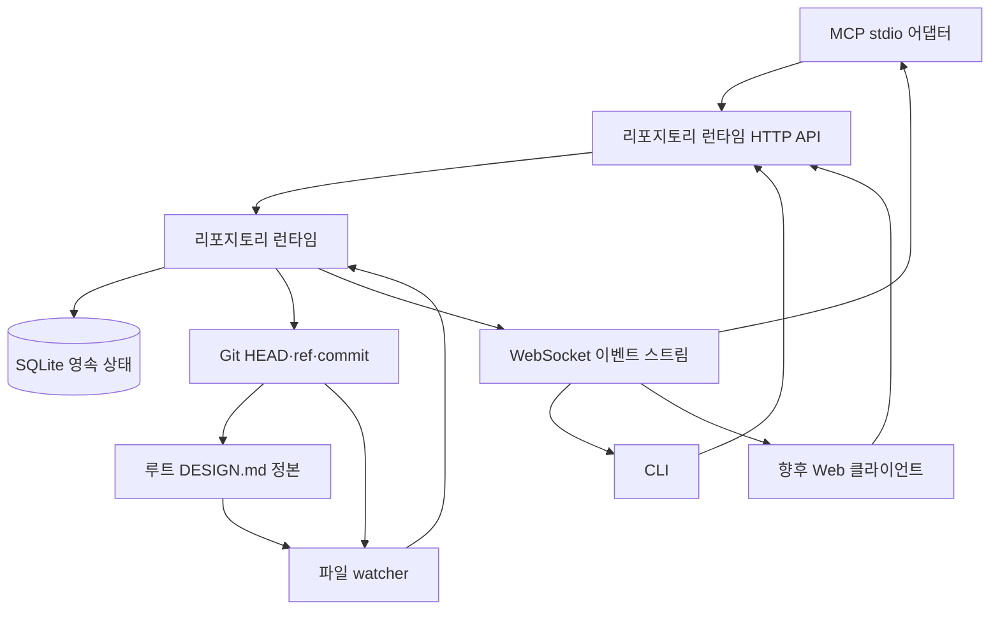

# 리포지토리 런타임과 후보 리비전 - Plan

## Goal Capsule

- **목표:** 사용자와 에이전트가 후보 파일을 리포지토리에 만들거나 동기화가 끝나지 않은 설계 상태를 보지 않고, 하나의 리포지토리 런타임을 통해 설계 후보를 생성·비교·수정·내보낼 수 있어야 한다.
- **수단:** Git worktree 단위 데몬이 checkout 컨텍스트와 정본 파일 동기화, 영속적인 후보 이력, MCP·CLI·Web 클라이언트가 공유하는 API를 소유한다.
- **제품 데이터의 기준:** Git이 추적하는 루트 `DESIGN.md`를 정본 설계의 기준으로 삼는다. SQLite는 프로토타입 실행, 후보 이력, 비교, 선택, 런타임 작업 기록의 기준으로 삼고, 성공한 내보내기의 Git commit OID를 보존한다.
- **진행을 막는 미결 사항:** 없다.

---

## Product Contract

### 요약

ProtokFlow는 루트 `DESIGN.md`가 있는 Git worktree마다 자동으로 관리되는 리포지토리 런타임 하나를 실행한다.
런타임은 현재 checkout 컨텍스트, 루트 `DESIGN.md`, SQLite 영속화, 후보 리비전 이력, Git commit 기반 내보내기, 모든 클라이언트가 사용하는 로컬 HTTP/WebSocket 인터페이스를 소유한다.

### 문제 정의

현재 저장 경로는 개별 서비스 호출 안에서 파일과 데이터베이스를 함께 조정한다. MCP, CLI, 향후 Web 인터페이스가 동시에 작업하고 후보 비교 이력이 클라이언트 재시작 후에도 유지되어야 하면, 이러한 구조에서는 쓰기 순서와 동기화 완료 시점을 일관되게 보장하기 어렵다.

후보 파일을 리포지토리에 두면 실험 상태와 Git 및 제품이 추적해야 할 단일 정본 설계가 섞인다. 또한 사용자가 후보를 비교하고, 주석을 남기고, 선택하고, 내보내는 이력은 일회성 데이터로 취급할 수 없다. 같은 Git 저장소의 여러 worktree는 서로 다른 브랜치와 `DESIGN.md`를 동시에 가질 수 있고, 한 worktree 안에서도 브랜치 전환이 파일 watcher보다 먼저 checkout 컨텍스트를 바꿀 수 있으므로 런타임 경계와 동기화 경계를 파일 digest만으로 정할 수 없다.

현재 애플리케이션에는 SQLite WAL 설정, 파일을 먼저 기록한 뒤 데이터베이스를 갱신하는 쓰기 경로, 슬러그별 잠금, 프로토타입 실행 및 후보 모델, 루트 `DESIGN.md`와 `design/*.md` 탐색 기능이 있다. 새 구조에서는 저장소 접근을 리포지토리 런타임으로 집중하고, 루트 `DESIGN.md` 하나만 정본 설계로 관리한다.

### 핵심 설계 결정

- **리포지토리 런타임을 단일 저장소 소유자로 지정한다.** Web, MCP, CLI가 같은 worktree 상태와 장기 작업 실행 주체를 공유하도록 watcher, checkout 동기화, 정본 변경, SQLite 쓰기, 후보 작업을 런타임에 집중한다. R1, R2, R3, R4에 적용한다.
- **Git worktree마다 런타임 하나를 둔다.** 같은 Git common directory를 공유하더라도 런타임, watcher, SQLite, 탐색 레코드, 자격 증명은 worktree별로 격리한다. `repository_id`는 관련 worktree를 묶는 상위 식별자이고, 정규화된 실제 worktree 루트에서 얻은 `worktree_id`가 런타임 소유권의 기준이다. (session-settled: user-approved — chosen over sharing one runtime across a Git common directory: independent worktrees can hold different canonical designs.) R1, R2, R22, R23, R25에 적용한다.
- **클라이언트가 런타임을 자동으로 시작하고 준비 완료를 확인한다.** 스키마 검증과 시작 동기화가 끝나기 전에는 요청을 처리하지 않으며, 검증하지 않은 저장 상태를 대신 제공하지 않는다. R2, R3에 적용한다.
- **데이터 종류별 기준 저장소를 구분한다.** Git이 추적하는 루트 `DESIGN.md`는 정본 설계의 기준이고, SQLite는 후보 및 작업 이력의 영속적인 기준이다. R5, R11에 적용한다.
- **후보 수정 이력을 SQLite에 보존한다.** 후보를 수정할 때마다 기존 리비전을 변경하지 않고, 현재 리비전을 부모로 하는 새 리비전을 추가한다. 리포지토리에 후보 파일을 늘리지 않고도 비교와 내보내기를 재현할 수 있다. R14, R15, R16, R17에 적용한다.
- **브랜치 전환을 별도의 checkout 세대로 관리한다.** attached HEAD에서는 symbolic ref, detached HEAD에서는 commit OID를 checkout identity로 사용하고, identity가 바뀔 때마다 파일 내용이 같아도 checkout epoch를 증가시킨다. A→B→A로 돌아와도 이전 후보를 자동으로 다시 유효하게 만들지 않는다. (session-settled: user-approved — chosen over digest-only compatibility: equal file content must not permit export to a different Git branch.) R16, R17, R18, R26, R27에 적용한다.
- **watcher가 아니라 명령 동기화 장벽에서 상태 변경의 기준을 고정한다.** 정본 의존 명령은 worktree별 mutation fence 안에서 대기 중인 이벤트를 처리하고 checkout과 `DESIGN.md`를 동기화한 뒤 기준을 고정하며, 확정 직전에 다시 검증한다. (session-settled: user-approved — chosen over waiting only for an already-running watcher sync: a command can otherwise enter before the watcher observes a checkout.) R12, R28, R29에 적용한다.
- **내보내기를 Git commit으로 확정한다.** 루트 `DESIGN.md`를 사용하는 프로젝트는 Git worktree로 간주하며, 내보내기는 선택한 후보만 포함하는 commit을 만들고 시작 시 고정한 branch ref를 예상 HEAD에서 원자적으로 갱신한다. 성공한 commit OID가 내보내기와 복구의 영속 증거다. (session-settled: user-directed — chosen over file-only export with a runtime journal: Git commit provenance makes branch ownership and recovery explicit.) R18, R19, R20에 적용한다.
- **유효한 외부 변경을 정본 변경으로 수용하고 출처를 기록한다.** Git, 편집기, 다른 프로세스가 만든 유효한 변경을 새 정본 세대로 저장하며, 변경 주체를 `external`로 표시한다. R7, R8, R9, R10에 적용한다.
- **HTTP와 WebSocket을 런타임 공통 프로토콜로 사용한다.** 모든 어댑터가 같은 명령, 오류, 준비 상태, 변경 이벤트 계약을 사용한다. R3, R4, R21, R22, R23, R24에 적용한다.

### 참여 주체

- A1. **리포지토리 사용자:** CLI 또는 Web을 통해 정본 설계를 확인하고, 후보를 비교하며, 선택한 리비전을 내보낸다.
- A2. **에이전트 클라이언트:** MCP stdio 어댑터를 사용하여 런타임에 동일한 리포지토리 작업을 요청한다.
- A3. **리포지토리 런타임:** worktree checkout 동기화, watcher, Git commit 기반 정본 내보내기, SQLite 쓰기, 작업 순서, 준비 상태, 이벤트 발행을 소유한다.
- A4. **외부 저장소 변경자:** 런타임 작업을 통하지 않고 브랜치를 전환하거나 정본 `DESIGN.md`를 교체·수정하는 Git, 편집기 또는 다른 프로세스다.

### 데이터 소유권과 흐름

루트 `DESIGN.md`의 내용은 SQLite의 정본 설계 조회용 표현으로 변환된다. 후보 문서는 SQLite에서만 관리하며, 명시적인 내보내기가 선택된 리비전으로 `DESIGN.md`를 바꾸는 Git commit을 만들고 현재 branch ref에 반영한다.

### 요구사항

**런타임 소유권과 가용성**

- R1. 하나의 `worktree_id`는 동시에 하나의 리포지토리 런타임만 소유해야 한다. 이 소유 범위에는 checkout 및 파일 watcher, Git commit 기반 정본 내보내기, SQLite 쓰기, 후보 작업, 이벤트 발행이 포함된다. 같은 `repository_id`에 속한 형제 worktree는 각각 독립 런타임과 SQLite를 사용해야 한다.
- R2. 클라이언트는 현재 Git worktree의 런타임을 찾거나 자동으로 시작해야 한다. 스키마 검증, worktree 신원 확인, 시작 동기화가 모두 성공한 뒤에만 저장소 요청을 보낼 수 있다.
- R3. 런타임 시작, 시작 동기화, 스키마 검증, 프로토콜 또는 내부 저장소 처리에 실패하면 명시적인 사용 불가 상태로 요청을 거부해야 한다. 검증되지 않은 데이터베이스 상태를 응답으로 제공해서는 안 된다.
- R4. MCP, CLI, Web 어댑터는 런타임 프로토콜을 사용해야 하며 리포지토리 데이터베이스나 정본 파일을 직접 읽거나 쓰면 안 된다.

**정본 설계 동기화**

- R5. Git worktree 루트 `DESIGN.md` 하나만 정본 설계 문서로 사용해야 한다. `DESIGN.md`를 사용하지만 Git worktree가 아닌 디렉터리는 지원하지 않으며, 후보 변형은 리포지토리 파일로 저장하지 않는다.
- R6. watcher는 루트 `DESIGN.md`의 생성, 수정, 삭제, 원자적 교체와 Git checkout identity 변경을 감지해야 한다. 짧은 시간에 연속으로 발생한 이벤트를 하나로 모은 뒤 최종 Git 컨텍스트와 파일 내용을 읽어야 하며, 이벤트 이름이나 순서만으로 변경 결과를 추정하면 안 된다.
- R7. 데이터베이스에 확정한 각 정본 세대에는 런타임 작업으로 시작된 변경인지, 대응하는 런타임 작업 없이 감지된 변경인지 기록해야 한다. 출처 값은 각각 `runtime`, `external`을 사용하고, 원인에는 적어도 `export`, `file_edit`, `git_checkout`, `startup_sync`, `recovery`를 구분할 수 있는 값을 기록해야 한다.
- R8. 안정화된 외부 상태의 파일 digest가 현재 정본과 다르거나 checkout epoch가 바뀌면 사용자 확인 없이 `external` 출처의 새 정본 세대 하나를 생성하고 변경 원인을 이벤트로 발행해야 한다. checkout epoch가 바뀌었다면 파일 digest가 같아도 새 정본 세대를 만들어야 한다.
- R9. 정본 파일이 없거나 유효하지 않으면 마지막으로 확정된 유효한 정본 세대와 기존 후보 이력의 조회는 유지해야 한다. 후보 생성, 새 리비전 생성, 패치, 내보내기 명령은 유효한 정본이 다시 확정될 때까지 거부해야 한다.
- R10. 런타임이 `DESIGN.md`를 바꾸는 Git commit을 만들 때는 작업 식별자, `worktree_id`, checkout epoch, 예상 symbolic ref와 HEAD OID, 목표 digest, 생성된 commit OID, 작업 단계를 영속적으로 관리해야 한다. watcher는 이 정보를 이용해 런타임 내보내기와 외부 변경을 구분하고 같은 결과의 정본 세대를 중복 생성하지 않아야 한다.

**조회와 상태 변경 명령**

- R11. 새로 감지한 정본 파일을 검증하고 저장하는 동안 조회 요청에는 마지막으로 완전히 확정된 정본 세대를 반환해야 한다. 동시에 더 최신 파일 상태를 처리 중임을 응답에 표시해야 한다.
- R12. 정본에 의존하는 상태를 생성하거나 변경하는 명령은 worktree별 mutation fence 안에서 진행 중인 동기화와 대기 중인 watcher 이벤트를 처리한 뒤 현재 checkout identity, checkout epoch, 정본 세대, digest를 다시 읽어 작업의 기준으로 고정해야 한다. 제한 시간 안에 동기화가 끝나지 않거나 기준을 안정적으로 고정할 수 없으면 상태를 변경하지 않고 명령을 실패 처리해야 한다.
- R13. 정본 세대와 해당 정규화 토큰 표현은 하나의 데이터베이스 트랜잭션에서 함께 공개되어야 한다. 어떤 클라이언트도 일부만 갱신된 설계를 볼 수 없어야 한다.

**후보 이력과 비교**

- R14. SQLite는 프로토타입 실행, 후보 시리즈, 불변 후보 리비전, 정규화 후보 토큰, 비교 데이터, 선택 기록, 내보내기 작업 이력의 기준 저장소여야 한다.
- R15. 후보 시리즈를 수정하면 기존 리비전을 변경하지 않고 새 리비전을 추가해야 한다. 새 리비전은 직전 리비전을 부모로 참조하며, 시리즈의 현재 리비전 포인터는 새 리비전으로 이동해야 한다.
- R16. 각 후보 리비전에는 전체 후보 `DESIGN.md` 문서, 문서 digest, 정규화 토큰 표현, 존재하는 경우 부모 리비전, `worktree_id`, 생성 시 checkout identity와 checkout epoch, 관찰한 HEAD OID, 기준 정본의 세대 번호와 digest를 저장해야 한다.
- R17. 후보 비교는 기본적으로 현재 checkout epoch에서 각 시리즈의 현재 리비전을 사용해야 한다. 다른 checkout epoch의 후보는 삭제하거나 자동으로 다시 유효하게 만들지 않고 stale 사유와 생성 Git 컨텍스트를 표시한 채 명시적으로 조회할 수 있어야 하며, 과거의 특정 리비전도 정확한 식별자로 조회할 수 있어야 한다.

**내보내기와 복구**

- R18. 내보내기는 attached HEAD에서만 허용해야 한다. 선택한 리비전의 `worktree_id`, checkout epoch, 기준 정본 세대와 digest가 현재 상태와 모두 일치해야 하며, mutation fence 안에서 symbolic ref와 HEAD OID를 예상값으로 고정해야 한다. 하나라도 다르거나 detached HEAD이면 Git과 SQLite를 변경하지 않고 작업을 거부해야 한다.
- R19. 내보내기는 선택한 후보의 `DESIGN.md` 변경만 포함하고 기존의 다른 staged 또는 working-tree 변경을 포함하지 않는 Git commit을 만들어야 한다. 시작 시 고정한 symbolic ref가 여전히 예상 HEAD OID를 가리킬 때만 ref를 원자적으로 갱신하고, worktree 파일과 index가 새 commit을 반영한 뒤 출처가 `runtime`인 정본 세대 하나를 확정해야 한다. 정본 세대에는 내보낸 후보 리비전과 commit OID를 보존하고 완료 이벤트를 발행해야 한다.
- R20. 내보내기 도중 런타임이 중단되면 재시작 시 영속 작업 단계, 예상 symbolic ref와 HEAD OID, 생성된 commit OID, 예상 ref 이력 반영, 현재 checkout 컨텍스트, 파일 digest, 확정된 데이터베이스 세대를 비교해야 한다. commit과 ref 갱신을 증명할 수 있을 때만 작업을 완료 처리하고, digest만 같거나 Git 결과를 증명할 수 없으면 성공으로 추정하지 않아야 한다. checkout이 바뀐 상태는 충돌 또는 실패로 확정한 뒤 현재 파일을 외부 변경으로 동기화해야 한다.

**프로토콜과 이벤트**

- R21. 런타임은 loopback HTTP 명령 프로토콜 하나와 WebSocket 이벤트 스트림 하나를 제공해야 한다. 이벤트 범위에는 준비 상태, 정본 동기화, 원본 오류, 후보 변경, 내보내기 결과가 포함된다.
- R22. 런타임 탐색 정보에는 `repository_id`, `worktree_id`, 런타임 인스턴스 식별자, 프로토콜 호환성을 확인할 수 있는 정보가 포함되어야 한다. 클라이언트는 자신이 연 실제 worktree 루트와 이 정보의 결박을 첫 요청과 WebSocket 구독 전에 검증하고, 종료된 프로세스의 기록, 다른 worktree의 기록, 호환되지 않는 프로토콜 버전을 거부해야 한다.
- R23. loopback 접근은 `worktree_id`와 현재 런타임 인스턴스에 결박된 로컬 자격 증명으로 인증해야 한다. 자격 증명은 형제 worktree나 재시작한 다른 런타임 인스턴스에 재사용할 수 없어야 하며, 일반 API 응답에 포함하거나 리포지토리에 커밋해서는 안 된다.
- R24. 런타임 상태 응답은 `starting`, `synchronizing`, `ready`, `source-blocked`, `degraded`, `stopping`, `failed` 중 현재 상태와 그 이유를 설명하고 마지막으로 확정된 정본 세대를 식별해야 한다.

**Git worktree와 checkout 컨텍스트**

- R25. `repository_id`는 Git common directory의 안정적인 신원을 나타내고, `worktree_id`는 symlink와 운영체제별 경로 표현을 정규화한 실제 worktree 루트의 신원을 나타내야 한다. 런타임 소유권과 모든 쓰기 격리는 `worktree_id`를 기준으로 해야 한다.
- R26. 런타임은 attached HEAD에서 전체 symbolic ref를 checkout identity로 사용하고 detached HEAD에서 commit OID를 checkout identity로 사용해야 한다. identity가 바뀔 때마다 단조 증가하는 checkout epoch를 새로 확정해야 한다. 같은 symbolic ref에서 일반 commit으로 HEAD OID만 바뀌고 `DESIGN.md` 정본이 바뀌지 않은 경우에는 checkout epoch를 증가시키지 않아야 한다.
- R27. checkout identity 변경은 `DESIGN.md` digest 변경과 별도로 감지하고 동기화해야 한다. 브랜치 전환으로 파일 내용이 같더라도 새 checkout epoch와 정본 세대를 확정하고, 전환 중에는 런타임을 `synchronizing` 상태로 표시해야 한다.
- R28. 모든 정본 의존 상태 변경 명령과 내보내기는 worktree별 mutation fence에서 직렬화해야 한다. 명령은 대기 중인 watcher 이벤트를 처리하고 현재 checkout과 파일을 동기화한 뒤 기준을 고정하며, 데이터베이스 또는 Git 결과를 확정하기 직전에 같은 기준을 다시 검증해야 한다.
- R29. 명령 실행 중 checkout identity, checkout epoch, 정본 세대 또는 digest가 바뀌면 성공 이벤트나 새 데이터베이스 상태를 공개하지 않고 재시도 가능한 checkout 충돌로 실패 처리한 뒤 실제 Git 및 파일 상태를 다시 동기화해야 한다. 동기화 중인 조회는 마지막으로 확정된 정본과 더 최신 상태를 처리 중이라는 표시를 반환해야 한다.

### 주요 흐름

- F1. **런타임 탐색과 시작**
  - **시작 조건:** MCP, CLI 또는 Web 클라이언트가 루트 `DESIGN.md`가 있는 Git worktree를 연다.
  - **참여 주체:** A1 또는 A2, A3
  - **처리 순서:** 클라이언트가 `repository_id`와 `worktree_id`를 확인하고 worktree에 결박된 호환 런타임을 찾는다. 런타임이 없으면 새로 시작한다. 런타임이 스키마, checkout identity, `DESIGN.md`, 탐색 및 자격 증명 결박을 검증한 뒤 준비 완료 상태가 되면 요청을 전송한다.
  - **결과:** 모든 어댑터가 검증을 마친 하나의 worktree 상태를 사용하고 형제 worktree의 런타임에는 연결하지 않는다.
  - **관련 요구사항:** R1-R4, R22-R27

- F2. **외부 정본 변경**
  - **시작 조건:** A4가 현재 worktree의 브랜치를 전환하거나 루트 `DESIGN.md`를 수정·교체한다.
  - **참여 주체:** A3, A4
  - **처리 순서:** watcher가 연속된 Git 및 파일 이벤트를 모은 뒤 최종 checkout identity와 파일을 읽는다. checkout identity, checkout epoch, 파일 digest를 현재 정본과 진행 중인 런타임 작업에 비교하고 새 내용을 검증한다. checkout 또는 내용이 바뀌면 `external` 출처와 구체적인 변경 원인을 가진 정본 세대 하나를 확정한다.
  - **결과:** 처리 중에는 이전의 완전한 정본 세대를 계속 조회할 수 있고, 확정 후에는 클라이언트가 새 checkout epoch와 정본 세대 이벤트를 받는다.
  - **관련 요구사항:** R6-R13, R21, R24, R26-R29

- F3. **후보 리비전 생성**
  - **시작 조건:** 사용자 또는 에이전트가 후보를 만들거나 기존 후보 시리즈를 수정한다.
  - **참여 주체:** A1 또는 A2, A3
  - **처리 순서:** 런타임이 mutation fence에서 진행 중인 동기화와 watcher 이벤트를 처리하고 현재 checkout epoch, 정본 세대, digest를 확정한다. 후보 문서, Git 컨텍스트, 정규화 토큰을 같은 트랜잭션에 저장하고, 후보 시리즈의 현재 리비전 포인터를 새 불변 리비전으로 이동한다.
  - **결과:** 리포지토리 파일을 만들지 않고도 새 리비전을 재현하고 비교할 수 있다.
  - **관련 요구사항:** R12-R17, R21, R28-R29

- F4. **후보 내보내기**
  - **시작 조건:** 사용자가 정확한 후보 리비전을 선택하여 내보내기를 요청한다.
  - **참여 주체:** A1, A3
  - **처리 순서:** 런타임이 mutation fence에서 현재 attached symbolic ref와 HEAD OID를 고정하고, 후보의 `worktree_id`, checkout epoch, 기준 정본 세대 및 digest를 현재 상태와 비교한다. 모두 일치하면 영속 작업 의도를 기록하고 선택한 후보의 `DESIGN.md` 변경만 포함한 commit을 만든다. symbolic ref가 여전히 예상 HEAD OID를 가리킬 때만 원자적으로 갱신하고, worktree와 index를 commit에 맞춘 뒤 commit OID를 참조하는 새 정본 세대를 확정하고 완료 이벤트를 발행한다.
  - **결과:** 후보 생성 이후 발생한 checkout 또는 정본 변경을 덮어쓰지 않으면서 선택한 리비전을 감사 가능하고 되돌릴 수 있는 Git commit으로 승격한다.
  - **관련 요구사항:** R10, R12, R16-R20, R26-R29

- F5. **정본 원본 오류와 복구**
  - **시작 조건:** watcher가 없거나 유효하지 않은 루트 `DESIGN.md`를 감지한다.
  - **참여 주체:** A1 또는 A2, A3, A4
  - **처리 순서:** 런타임은 마지막으로 확정된 정본과 후보 이력의 조회를 유지하고 원본 오류를 알린다. 정본에 의존하는 상태 변경 명령을 거부하며, 이후 Git·파일 이벤트 또는 명시적인 동기화 요청이 들어오면 checkout과 파일을 다시 검증한다. 중단된 내보내기가 있으면 commit OID와 예상 ref 이력 반영을 작업 단계 및 파일 digest와 함께 검증한다.
  - **결과:** 기존 이력은 계속 확인할 수 있고, 유효한 정본 세대가 확정된 후에만 상태 변경 명령을 다시 처리한다.
  - **관련 요구사항:** R3, R9-R12, R20-R21, R24, R26-R29

- F6. **Git checkout 전환**
  - **시작 조건:** A4가 같은 worktree에서 다른 브랜치로 전환하거나 attached HEAD와 detached HEAD 사이를 이동한다.
  - **참여 주체:** A3, A4
  - **처리 순서:** 런타임이 Git 및 파일 이벤트를 수집하고 `synchronizing` 상태로 전환한다. 안정화된 checkout identity를 확인하고 checkout epoch를 증가시킨 뒤 최종 `DESIGN.md`를 검증한다. 파일 내용이 이전과 같아도 새 정본 세대를 확정하며, 이전 epoch의 후보를 stale로 표시한다.
  - **결과:** 새 checkout에서 이전 checkout의 후보를 자동으로 내보낼 수 없고, 이전 후보 이력은 생성 컨텍스트와 stale 사유를 포함해 계속 조회할 수 있다.
  - **관련 요구사항:** R8, R11-R12, R16-R18, R24, R26-R29

### 수용 예시

- AE1. **자동 시작 중에는 검증되지 않은 상태를 제공하지 않는다**
  - **관련 요구사항:** R1-R4, R22-R27
  - **조건:** 실행 중인 런타임이 없고 Git worktree에 유효한 `DESIGN.md`와 기존 데이터베이스가 있다.
  - **동작:** MCP 또는 CLI 클라이언트가 첫 리포지토리 요청을 보낸다.
  - **기대 결과:** worktree에 결박된 런타임 하나가 시작되어 Git 컨텍스트, 탐색 및 자격 증명 결박, 정본을 검증하고 동기화한 뒤 확정된 정본 세대의 데이터를 반환한다.

- AE2. **유효한 외부 편집을 출처가 명시된 새 세대로 저장한다**
  - **관련 요구사항:** R6-R13, R21
  - **조건:** 정본 세대 12가 확정되어 있고 세대 12를 기준으로 만든 후보 리비전이 있다.
  - **동작:** Git 또는 편집기가 내용이 다른 유효한 `DESIGN.md`를 기록한다.
  - **기대 결과:** 처리 중에는 완전한 세대 12를 계속 반환한다. 이후 `external` 출처의 세대 13 하나를 확정하고 클라이언트에 변경 이벤트를 보낸다.

- AE3. **정본 내용이 유효하지 않으면 정본 의존 명령만 차단한다**
  - **관련 요구사항:** R3, R9, R11, R12, R24
  - **조건:** 유효한 정본 세대와 후보 이력이 있다.
  - **동작:** 외부 작성자가 유효하지 않은 정본 내용을 저장한다.
  - **기대 결과:** 원본 오류를 표시하면서 기존 정본과 후보 이력은 계속 조회할 수 있다. 유효한 파일을 다시 감지할 때까지 후보 생성, 리비전 생성, 패치, 내보내기는 거부한다.

- AE4. **후보 수정은 과거 이력을 바꾸거나 파일을 만들지 않는다**
  - **관련 요구사항:** R5, R14-R17
  - **조건:** 후보 시리즈의 현재 리비전이 A1이다.
  - **동작:** 사용자가 해당 후보를 수정한다.
  - **기대 결과:** A1을 부모로 하는 리비전 A2를 저장하고 A1은 변경하지 않는다. 시리즈의 현재 리비전은 A2로 이동하며 리포지토리에 후보 `DESIGN.md` 파일을 만들지 않는다.

- AE5. **기준 정본이 바뀐 후보의 내보내기를 거부한다**
  - **관련 요구사항:** R12, R16-R18, R28-R29
  - **조건:** 후보 리비전은 정본 세대 20을 기준으로 만들었고, 외부 편집으로 현재 정본이 세대 21이 되었다.
  - **동작:** 사용자가 이전 후보 리비전의 내보내기를 요청한다.
  - **기대 결과:** 런타임은 내보내기를 거부하고 Git과 SQLite를 변경하지 않는다. 후보가 이전 정본 세대를 기준으로 한다는 정보를 반환한다.

- AE6. **내보내기 한 번은 Git commit과 정본 세대를 하나씩 생성한다**
  - **관련 요구사항:** R10, R18-R21, R28-R29
  - **조건:** attached HEAD에서 선택한 후보 리비전의 worktree, checkout epoch, 기준 정본이 현재 상태와 일치한다.
  - **동작:** 사용자가 후보 리비전을 내보낸다.
  - **기대 결과:** 예상 branch ref가 예상 HEAD OID에서 선택한 후보의 `DESIGN.md` 변경만 포함하는 새 commit으로 이동한다. SQLite에는 commit OID와 내보낸 리비전을 참조하는 `runtime` 출처의 정본 세대 하나만 생기며, watcher는 중복 세대를 만들지 않고 클라이언트는 완료 이벤트를 받는다.

- AE7. **중단된 내보내기는 재시작 후 하나의 결과로 확정된다**
  - **관련 요구사항:** R19, R20
  - **조건:** 런타임이 내보내기 의도를 기록한 뒤 또는 Git commit과 ref 갱신을 수행한 뒤, 데이터베이스 상태를 모두 확정하기 전에 중단되었다.
  - **동작:** 리포지토리 런타임을 다시 시작한다.
  - **기대 결과:** 런타임은 영속 작업 단계, commit OID, 예상 ref 이력 반영, checkout 컨텍스트, digest를 함께 검증하여 내보내기를 완료·충돌·실패 중 하나로 확정한다. digest만 같다는 이유로 외부 Git 변경을 성공으로 오인하지 않고, 두 개의 정본 현재 세대를 노출하거나 선택한 리비전을 기록 없이 버리지 않는다.

- AE8. **내용이 같은 다른 브랜치에서도 이전 후보를 내보낼 수 없다**
  - **관련 요구사항:** R8, R16-R18, R26-R27
  - **조건:** 브랜치 A와 B의 `DESIGN.md` digest가 같고, 후보는 브랜치 A의 checkout epoch를 기준으로 만들었다.
  - **동작:** 사용자가 브랜치 B로 전환한 뒤 이전 후보를 내보내려 한다.
  - **기대 결과:** 런타임은 새 checkout epoch와 정본 세대를 확정하고 후보를 stale로 표시하며 내보내기를 거부한다. 후보 이력은 브랜치 A의 생성 컨텍스트와 함께 조회할 수 있다.

- AE9. **브랜치 왕복은 이전 후보를 자동으로 다시 유효하게 만들지 않는다**
  - **관련 요구사항:** R16-R18, R26-R27
  - **조건:** 브랜치 A에서 후보를 만든 뒤 A→B→A로 전환했고 최종 `DESIGN.md` digest는 처음과 같다.
  - **동작:** 사용자가 처음 만든 후보를 조회하고 내보내려 한다.
  - **기대 결과:** 후보는 이전 checkout epoch를 기준으로 한 stale 상태로 조회되며 자동으로 다시 활성화되지 않고 내보내기도 거부된다.

- AE10. **형제 worktree는 런타임과 후보 이력을 공유하지 않는다**
  - **관련 요구사항:** R1-R2, R22-R23, R25
  - **조건:** 같은 Git common directory를 공유하는 worktree A와 B가 서로 다른 `DESIGN.md`를 갖는다.
  - **동작:** MCP와 CLI가 두 worktree를 동시에 연다.
  - **기대 결과:** 각 클라이언트는 자신의 `worktree_id`에 결박된 별도 런타임, SQLite, 탐색 레코드, 자격 증명을 사용한다. 한 worktree의 후보와 이벤트는 다른 worktree에서 보이지 않는다.

- AE11. **watcher가 늦어도 상태 변경 명령이 이전 checkout을 사용하지 않는다**
  - **관련 요구사항:** R12, R28-R29
  - **조건:** Git이 브랜치를 전환했지만 watcher가 아직 이벤트를 처리하지 않았고 이전 정본 세대가 현재로 표시되어 있다.
  - **동작:** 후보 생성 또는 내보내기 명령이 도착한다.
  - **기대 결과:** 명령은 mutation fence에서 checkout과 파일을 다시 읽고 동기화한다. 이전 checkout을 기준으로 상태를 만들지 않으며, 안정적인 기준을 확정할 수 없으면 재시도 가능한 checkout 충돌로 실패한다.

- AE12. **detached HEAD에서는 내보내기를 거부한다**
  - **관련 요구사항:** R18, R26
  - **조건:** 런타임이 detached HEAD checkout을 동기화했고 유효한 정본과 후보 이력이 있다.
  - **동작:** 사용자가 후보 리비전을 내보내려 한다.
  - **기대 결과:** 정본 및 후보 조회와 후보 수정은 유지되지만, 갱신할 symbolic ref가 없다는 명시적인 오류와 함께 내보내기는 Git과 SQLite를 변경하지 않고 거부된다.

- AE13. **같은 브랜치의 일반 commit은 후보를 불필요하게 무효화하지 않는다**
  - **관련 요구사항:** R16-R18, R26
  - **조건:** attached HEAD에서 후보를 만든 뒤 `DESIGN.md`를 바꾸지 않는 다른 commit으로 HEAD OID만 전진했다.
  - **동작:** 사용자가 후보를 조회하거나 내보내려 한다.
  - **기대 결과:** symbolic ref, checkout epoch, 정본 세대, digest가 유지되므로 후보는 stale로 바뀌지 않는다. 내보내기는 명령 시작 시의 새 HEAD OID를 예상값으로 고정하여 commit을 만든다.

### 성공 기준

- 리포지토리 어댑터에 독립 watcher, SQLite 직접 쓰기 경로, 정본 파일 직접 변경 경로가 없어야 한다.
- 후보 생성, 수정, 비교, 내보내기 흐름을 수행한 뒤에도 리포지토리에는 루트 정본 `DESIGN.md` 하나만 있고 후보 설계 문서는 없어야 한다.
- 반환되는 모든 정본 또는 후보 문서는 완전히 확정된 정본 세대 하나 또는 불변 후보 리비전 하나에 대응해야 한다.
- MCP, CLI, HTTP 클라이언트에서 동일한 `worktree_id`, checkout epoch, 후보 리비전 식별자, 정본 세대 식별자, 성공한 내보내기 commit OID를 확인할 수 있어야 한다.
- 같은 저장소의 두 worktree를 동시에 실행하는 테스트에서 런타임, SQLite, 이벤트, 자격 증명이 교차하지 않아야 한다.
- 브랜치 전환 테스트에서 내용이 같은 브랜치, 내용이 다른 브랜치, A→B→A 왕복, detached HEAD, watcher 처리 전 명령을 검증하고 이전 checkout 후보를 잘못 내보내는 경로가 없어야 한다.
- 런타임 재시작 테스트에서 내보내기 의도 기록, commit 생성, ref 갱신, worktree 반영, 데이터베이스 확정의 각 경계 이후 복구를 검증하고, 외부 Git 변경을 성공으로 오인하거나 중복 정본 세대와 불명확한 내보내기 상태를 만들지 않아야 한다.
- 후속 계획 작성자는 worktree 소유권, checkout epoch, 동기화 장벽, 후보 stale 정책, Git commit 내보내기, 중단 복구의 제품 동작을 추가로 결정하지 않고 구현 작업을 도출할 수 있어야 한다.

### 범위

**후속 단계에서 다룰 항목**

- Web 후보 비교 화면과 상호작용 설계
- 후보 생성 알고리즘, 모델 오케스트레이션, 순위 결정, 평가 정책
- 명시적인 후보 rebase, 토큰 단위 3-way merge, 병합 충돌 UI
- 영속적인 SQLite 후보 이력을 위한 사용자용 백업, 복원, 보존 기간 제어
- 여러 리포지토리 런타임을 탐색하고 관리하는 사용자 전역 실행기 또는 대시보드

**초기 모델에 포함하지 않는 항목**

- Git worktree가 아닌 디렉터리에서 루트 `DESIGN.md`를 사용하는 동작
- 리포지토리에 저장하는 후보 `DESIGN.md` 파일
- `design/*.md`와 같은 복수 정본 설계 문서
- 변경 가능한 후보 리비전, 부모가 여러 개인 병합 리비전, 강제 이력 변경 또는 reset 동작
- 런타임을 사용할 수 없을 때 SQLite나 `DESIGN.md`에 직접 접근하는 어댑터 우회 경로
- 유효한 외부 변경을 이전 데이터베이스 표현으로 자동 복원하여 덮어쓰는 동작
- Git commit을 만들지 않는 file-only 내보내기와 detached HEAD 내보내기
- 여러 worktree가 런타임 또는 SQLite 후보 이력을 공유하는 동작

<!-- ce-section: work-relationships -->
### 다른 작업과의 관계

이 계획은 리포지토리 런타임, 정본 동기화, 영속 후보 리비전 모델, 비교 데이터 API, 내보내기 계약을 정의한다. 전체 제품의 세부 작업 분할은 후속 계획에서 조정할 수 있다.

- **가능하게 하는 작업:** 공통 HTTP 및 WebSocket 계약을 사용하는 Web 후보 비교 화면
- **가능하게 하는 작업:** 런타임을 통해 불변 리비전을 저장하는 후보 생성 및 평가 worker
- **공유하는 개념:** 향후 미리보기와 내보내기 기능은 같은 정본 세대 및 후보 리비전 식별자를 사용한다.
- **독립적으로 진행할 수 있는 작업:** 런타임 API 계약이 안정되면 Web 비교 화면의 시각 설계를 별도로 진행할 수 있다.
- **후속 결정 사항:** 리포지토리 간 관리, stale 후보의 명시적 재기준화 사용자 경험, 백업 정책, 보존 기간 제어

### 의존성과 전제

- 런타임은 로컬 리포지토리와 loopback 네트워크에서 동작한다. 원격 다중 사용자 호스팅은 이 계약의 범위에 포함하지 않는다.
- 파일시스템 알림은 변경이 발생했다는 신호일 뿐 완전한 변경 이력이 아니다. 따라서 시작 동기화와 명시적인 동기화 명령을 복구 경로로 제공해야 한다.
- 루트 `DESIGN.md`가 있는 프로젝트는 Git worktree이며, Git ref와 commit을 정본 내보내기의 영속적인 경계로 사용할 수 있다고 전제한다.
- 외부 Git 명령은 런타임의 mutation fence를 따르지 않을 수 있다. 따라서 런타임은 watcher 신호에만 의존하지 않고 명령 시작과 확정 시 checkout을 재검증하며, ref 갱신에는 예상 HEAD OID 조건을 사용해야 한다.
- 기존 `DESIGN.md` 파서와 정규화 토큰 표현은 정본 및 후보 조회용 표현을 만드는 입력으로 계속 사용할 수 있다고 전제한다.
- SQLite 후보 이력은 영속적인 제품 데이터다. 이 구조를 도입한 뒤에는 데이터베이스 삭제에 의존하는 스키마 변경 방식을 사용할 수 없다.
- 일반적인 설계 편집 흐름을 ProtokFlow 안으로 옮기더라도 Git을 사용한 변경과 긴급 수동 복구는 가능해야 한다.

### 근거 자료

- `backend/database/db.py` — SQLite 엔진, WAL, 외래 키, busy timeout, 스키마 초기화
- `backend/app/protokflow/service/design_system_service.py` — 현재 파일 우선 쓰기와 슬러그별 잠금 동작
- `backend/app/protokflow/core/discovery.py` — 새 구조에서 교체할 루트 및 형제 설계 문서 탐색 동작
- `backend/app/protokflow/model/prototype_run.py`, `backend/app/protokflow/model/candidate.py` — 기존 프로토타입 실행 및 후보 모델 범위
- `backend/core/registrar.py`, `backend/main.py` — 기존 애플리케이션 수명주기 및 시작 연결
- `CONCEPTS.md` — 런타임 소유권과 정본 세대에 맞춰 정리한 공통 용어

### 미결 사항

**구현 계획 작성 전에 결정할 사항:** 없다.

**구현 계획에서 결정할 사항**

- 운영체제 간 호환성을 갖춘 파일 watcher 라이브러리를 선택하고 실제 리포지토리 작업 부하에 맞춰 연속 이벤트 통합 시간을 정한다.
- `repository_id`와 `worktree_id`의 정규화 및 영속 형식, 런타임 탐색 레코드, loopback 인증 정보 저장 위치, 프로토콜 버전 확인 형식을 구체화한다.
- 정본 세대, checkout epoch, 후보 시리즈, 불변 리비전, 정규화 토큰, Git commit 내보내기 작업을 저장할 데이터베이스 테이블과 인덱스를 정의한다.
- 선택한 후보만 commit에 포함하면서 기존 staged 및 working-tree 변경을 보존할 Git porcelain 또는 plumbing 절차와 ref compare-and-swap 방식을 선택한다.
- 내보내기 commit 메시지, author/committer, 서명, hooks 실행 정책을 정의한다.
- 내보내기 의도 기록, commit 생성, ref 갱신, worktree와 index 반영, SQLite 확정 사이의 장애 복구 기록과 처리 순서를 정의한다.
