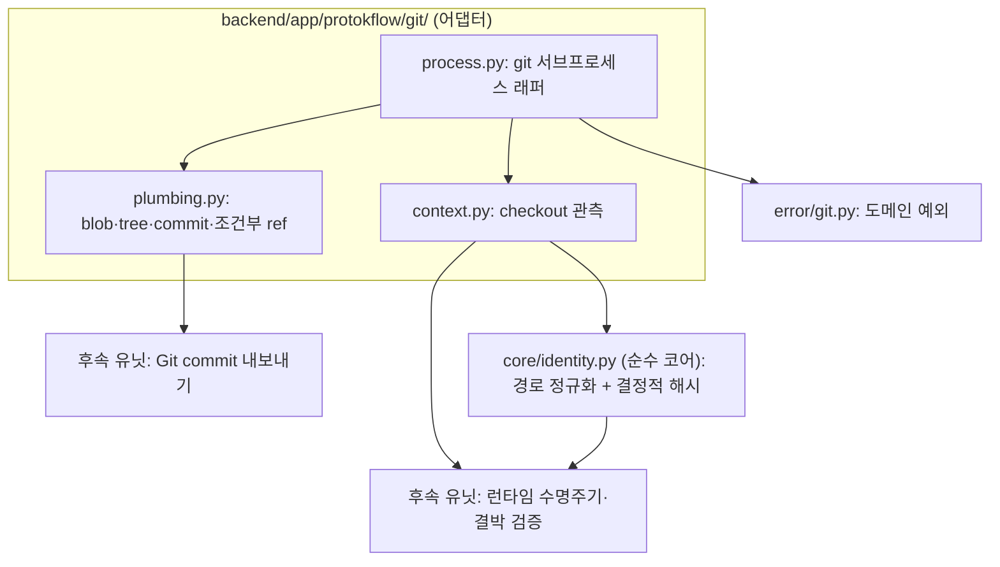

# 리포지토리 런타임 U1 Git 컨텍스트와 plumbing 어댑터 - Plan

> 상위 계획: [리포지토리 런타임과 후보 리비전 - Plan](./2026-08-28-1453-feat-repository-runtime-plan.md) (U1 실행 범위 한정)

## Goal Capsule

### Objective
런타임, 클라이언트, 내보내기 프로세스가 Git worktree 신원과 checkout 상태를 일관되게 계산하고, 내보내기 commit 생성 시 사용자의 실제 index 및 staged 변경 사항을 오염시키지 않음을 검증한다.

### Means
Git 관측 및 plumbing 작업은 `git` 서브프로세스 어댑터 계층에서 전담하고, 식별자 계산은 데이터베이스 및 프로토콜 독립적인 순수 코어 계층에서 처리한다 (KTD3, KTD7).

### Product Authority
상위 계획([리포지토리 런타임과 후보 리비전 - Plan](./2026-08-28-1453-feat-repository-runtime-plan.md))이 요구사항 및 기술 결정의 정본(Single Source of Truth)이다. 본 문서는 U1 구현에 필요한 요구사항과 기술 결정을 정의하며, 해석상 충돌이 발생할 경우 상위 계획을 우선 적용한다.

### Stop Conditions
- U2~U13(영속화, 스키마, 런타임 수명주기, watcher, fence, 서비스, 프로토콜, 클라이언트, 통합 스위트)을 구현 범위에 포함하지 않는다.
- `identity.py` 내 SQLAlchemy 및 FastAPI import를 금지한다.
- commit 생성 및 ref 갱신에 porcelain 명령 경로를 사용하지 않는다 (KTD4).
- libgit2 계열 C 바인딩 의존성을 도입하지 않는다 (KTD3).

### Open Blockers
- 없음

---

## Product Contract

### Summary
Git 관측(checkout identity, HEAD OID, worktree·common directory 경로), 정규화 식별자(`repository_id`, `worktree_id`), 내보내기용 plumbing 인터페이스를 데이터베이스 및 프로토콜 독립적 모듈로 제공한다.

### Problem Frame
내보내기 기능은 기존 staged 변경을 배제한 단독 commit 생성과 예상 HEAD OID 기반의 조건부 ref 갱신을 동시에 충족해야 하나, Git porcelain 명령으로는 이를 보장하기 어렵다. 또한 클라이언트가 런타임 서버 없이도 동일한 식별자를 독립적으로 계산할 수 있어야 결박 검증이 성립하므로, 식별자는 파일시스템 경로 기반의 결정적 해시로 생성해야 한다. 아울러 관측 과정에서 index 파일이 변경되는 부작용을 원천 차단해야 한다.

### Requirements
U1 이행 대상 요구사항 명세:

- R10. 런타임이 `DESIGN.md`를 변경하는 Git commit을 생성할 때는 작업 식별자, `worktree_id`, checkout epoch, 예상 symbolic ref 및 HEAD OID, 목표 digest, 생성된 commit OID, 작업 단계를 영속적으로 관리해야 한다. watcher는 이 정보를 이용해 런타임 내보내기와 외부 변경을 구분하고 동일 결과에 대한 정본 세대의 중복 생성을 방지해야 한다.
- R18. 내보내기는 attached HEAD 상태에서만 허용한다. 대상 리비전의 `worktree_id`, checkout epoch, 기준 정본 세대 및 digest가 현재 상태와 모두 일치해야 하며, mutation fence 내에서 symbolic ref와 HEAD OID를 예상값으로 고정해야 한다. 불일치하거나 detached HEAD 상태인 경우 Git 및 SQLite 변경 없이 작업을 거부해야 한다.
- R19. 내보내기는 지정된 후보의 `DESIGN.md` 변경사항만 포함하고 작업 트리의 다른 staged 또는 working-tree 변경사항을 포함하지 않는 Git commit을 생성해야 한다. 시작 시 고정한 symbolic ref가 여전히 예상 HEAD OID를 가리킬 때만 ref를 원자적으로 갱신하고, worktree 파일과 index가 새 commit을 반영한 후 출처가 `runtime`인 정본 세대를 확정해야 한다. 정본 세대에는 내보낸 후보 리비전과 commit OID를 보존하고 완료 이벤트를 발행해야 한다.
- R25. `repository_id`는 Git common directory의 안정적인 신원을 나타내고, `worktree_id`는 symlink와 운영체제별 경로 표현을 정규화한 실제 worktree 루트의 신원을 나타내야 한다. 런타임 소유권 및 모든 쓰기 격리는 `worktree_id`를 기준으로 처리해야 한다.
- R26. 런타임은 checkout identity로 항상 전체 symbolic ref를 사용한다. detached HEAD는 지원하지 않는 checkout 상태로 관측하며, 런타임은 이 상태에서 `degraded`를 표시하고 정본 의존 상태 변경 명령과 내보내기를 거부하되 직전 확정된 정본 세대의 조회는 유지해야 한다. identity 변경 시마다 단조 증가하는 checkout epoch를 새로 확정해야 하며, 동일 symbolic ref에서 일반 commit으로 HEAD OID만 갱신되고 `DESIGN.md` 정본이 변경되지 않은 경우에는 checkout epoch를 증가시키지 않는다.

### Scope Boundaries
- 대상 범위: 상위 계획 U1 구현.
- 제외 범위: 상위 계획 U2~U13 전체 및 Product Contract의 후속 과제(후보 생성 알고리즘, Web 후보 비교 UI, MCP stdio 어댑터 연동, 백업·보존 주기 제어, 전역 런타임 대시보드).

---

## Planning Contract

### Key Technical Decisions
U1 핵심 기술 결정 명세:

- KTD3. **Git 접근은 `git` 바이너리 서브프로세스로 실행한다.** 리포지토리가 Git worktree 환경이라는 전제에 따라 `git` 실행 파일의 존재가 보장되므로, libgit2 계열 C 바인딩 컴파일 의존성을 도입하지 않는다. 조회 명령에는 `GIT_OPTIONAL_LOCKS=0`을 적용하여 관측 동작이 index를 갱신하거나 잠그지 않도록 격리한다. (`Governs R10, R18, R19, R25, R26`)
- KTD4. **내보내기 commit은 격리된 임시 index와 plumbing 인터페이스로 생성하고, ref는 예상 OID 조건부 갱신으로 원자적 확정한다.** `HEAD` 트리를 임시 index에 로드하여 `DESIGN.md` 엔트리만 교체한 뒤 tree 및 commit 객체를 생성하고, 이전 예상 OID를 검증하는 ref 갱신을 통해 원자적으로 이동시킨다. porcelain 명령은 hook 실행, 사용자 index 상태 종속성, ref 비교·교환(CAS) 조건 미지원으로 인해 R19의 요구 조건(타 staged 변경 배제, 예상 HEAD OID 조건부 갱신)을 충족할 수 없다. (`Governs R19`)
- KTD7. **`repository_id`와 `worktree_id`는 정규화된 실제 경로 기반의 결정적 해시로 도출한다.** worktree 루트 및 Git common directory 경로의 symlink를 해소하고 유니코드 정규화를 수행한다. 대소문자 비구분 파일시스템 환경에서만 Unicode case folding을 적용하고 구분 파일시스템에서는 대소문자를 유지한다. 정규화된 경로는 도메인 접두어가 포함된 UTF-8 바이트열로 직렬화하여 SHA-256 해시를 산출하고 소문자 16진수로 표기한다. 클라이언트가 런타임 연결 전 동일 식별자를 독립 계산하여 결박 검증(R22)을 수행할 수 있도록 데이터베이스 발급 식별자는 배제한다. (`Governs R22, R25`)

### High-Level Technical Design
어댑터 계층과 순수 코어 계층의 명확한 경계 분리를 핵심 구조로 채택한다. 프로세스 래퍼만 `git` 실행 파일을 호출하고, 식별자 계산 모듈은 파일시스템 경로 연산만 담당한다.

### Assumptions
- 대상 리포지토리가 Git worktree 환경이며, 실행 환경에 `git` 바이너리가 존재하는 것으로 전제한다 (KTD3).
- U1은 관측 및 plumbing 함수 인터페이스만 제공하며, 호출 시점 직렬화 및 기준 재검증은 상위 계획 U7(mutation fence)에서 담당한다.
- U1은 R26의 identity 관측 규칙을 이행하며, checkout epoch 전이·영속화 및 detached 상태의 `degraded` 확정 처리는 상위 계획 U6·KTD6에서 담당한다.
- 구현 패턴은 `error/`의 도메인 예외 계층 구조와 `core/design_md.py`의 순수 모듈 규약(SQLAlchemy/FastAPI 비의존)을 준수한다.

---

## Implementation Units

### U1. Git 컨텍스트와 plumbing 어댑터

**Goal**: checkout identity, HEAD OID, worktree·common directory 경로, 정규화 식별자, 내보내기용 plumbing 절차를 데이터베이스 및 프로토콜 독립적 모듈로 구현한다. Git 관측과 plumbing은 `git/` 어댑터가 전담하고, 식별자 계산은 순수 코어 모듈이 담당한다.

**Requirements**: R10, R18, R19, R25, R26 / KTD3, KTD4, KTD7

**Dependencies**: 없음

**Files**
- `backend/app/protokflow/git/process.py` (신규)
- `backend/app/protokflow/git/context.py` (신규)
- `backend/app/protokflow/git/plumbing.py` (신규)
- `backend/app/protokflow/core/identity.py` (신규)
- `backend/app/protokflow/error/git.py` (신규)
- `tests/app/protokflow/git/test_context.py` (신규)
- `tests/app/protokflow/git/test_plumbing.py` (신규)
- `tests/app/protokflow/core/test_identity.py` (신규)
- `tests/fixtures/git.py` (신규)

**Approach**
1. `process.py`: `git` 서브프로세스 실행 래퍼를 구현한다. 작업 디렉터리를 명시적으로 전달받고, 조회 명령 시 index 잠금 및 갱신을 방지하는 환경 변수(`GIT_OPTIONAL_LOCKS=0`)를 적용하며, 비정상 프로세스 종료를 도메인 예외로 변환한다 (KTD3).
2. `context.py`: worktree 루트, Git common directory, worktree 전용 Git 디렉터리, symbolic ref, HEAD OID, detached 여부를 단일 관측 결과로 반환한다. checkout identity는 R26 규격에 따라 항상 전체 symbolic ref를 반환하며, detached HEAD 상태는 미지원 관측 상태로 명시한다.
3. `identity.py`: 파일시스템 경로에 대한 symlink 해소, 유니코드 정규화, 플랫폼별 대소문자 정규화(Case folding)를 거쳐 결정적 해시 기반의 `repository_id` 및 `worktree_id`를 생성한다 (KTD7).
4. `plumbing.py`: blob 생성, 임시 index 기반 tree 구성, commit 객체 생성, 예상 OID 조건부 ref 갱신, 실제 index 내 단일 경로 갱신을 독립 함수로 제공한다 (KTD4). 임시 index는 컨텍스트 관리자(Context Manager) 스코프로 격리 관리한다. 스코프 내 모든 명령에 `GIT_INDEX_FILE`을 명시 설정하고 상속된 index override를 격리하며, 실제 index 갱신은 잠금으로 직렬화하고 종료 시 임시 index 파일의 삭제를 보장한다.
5. 조건부 ref 갱신 시 예상 이전 OID 불일치 상황은 일반 Git 명령 오류와 구분되는 전용 결과/예외(예: `RefUpdateConflict`)로 처리한다. 명령의 stderr 및 원본 원인을 보존하여 후속 유닛에서 재시도 가능한 동시성 충돌과 영구 실패를 식별할 수 있도록 한다.
6. `tests/fixtures/git.py`: 임시 Git 저장소 및 연결 worktree를 구성하는 공용 테스트 픽스처를 정의한다.

**Patterns to follow**: `backend/app/protokflow/storage/`의 어댑터 패키지 규약, `backend/app/protokflow/core/design_md.py`의 순수 모듈 규약(SQLAlchemy·FastAPI 비의존 — `identity.py`), `backend/app/protokflow/error/`의 도메인 예외 계층 구조.

**Test scenarios**
- 임시 저장소에서 attached HEAD 관측 시 전체 symbolic ref와 현재 commit OID를 함께 반환한다.
- detached HEAD 상태 관측 시 detached 상태임이 명시되고 checkout identity 값이 없음을 확인한다.
- 연결 worktree에서 관측 시 common directory와 worktree 전용 Git 디렉터리가 상이한 경로로 분리 반환된다.
- 동일 worktree 루트를 심볼릭 링크 경로로 접근해도 동일한 `worktree_id`가 산출되고, 형제 worktree는 상이한 `worktree_id`와 동일한 `repository_id`를 가진다.
- 대소문자만 상이한 경로 표기 접근 시, 대소문자 비구분 파일시스템에서 동일한 `worktree_id`가 산출된다.
- 대소문자 구분 파일시스템에서는 대소문자가 상이한 경로가 서로 다른 `worktree_id`를 가진다.
- staged 및 working-tree 변경사항이 존재하는 저장소에서 임시 index 기반 commit 생성 시, 신규 commit의 tree에 `DESIGN.md` 변경사항만 반영되고 기존 staged 변경사항은 배제된다.
- 예상 OID 조건부 ref 갱신 시 대상 ref가 예상값과 일치할 때만 갱신에 성공하며, 선행 프로세스에 의해 ref가 변경된 경우 갱신에 실패하고 기존 ref를 보존한다.
- 예상 OID 불일치로 인한 ref 갱신 실패 시 일반 Git 명령 오류와 구분되는 전용 결과 객체가 반환되고 stderr 및 원본 원인이 보존된다.
- 임시 index 스코프 내 명령은 상속된 `GIT_INDEX_FILE`의 영향을 받지 않으며, 예외 발생을 포함한 모든 종료 경로에서 임시 index 파일이 정상 삭제된다.
- 실행 환경에 `git` 바이너리가 누락된 상황을 시뮬레이션할 경우 도메인 예외를 발생시키고 원본 오류 원인을 보존한다.
- 유효하지 않은 Git 저장소 디렉터리 관측 시 명시적인 도메인 예외로 거부한다.

**Verification**: 임시 저장소 및 연결 worktree 기반 테스트 통과, 모듈 내 SQLAlchemy/FastAPI 비의존성 확인.

---

## Verification Contract

| 게이트 | 명령 | 적용 대상 |
|---|---|---|
| 린트 | `uv run ruff check` | U1 |
| 포맷 | `uv run ruff format` | U1 |
| 타입 | `uv run mypy backend tests --show-error-codes` | U1 |
| 의존성 잠금 | `uv lock --check` | U1 |
| U1 테스트 | `uv run pytest tests/app/protokflow/git tests/app/protokflow/core/test_identity.py` | U1 |
| 전체 스위트 | `uv run pytest` | U1 |

추가 게이트:

- 순수성 검증: `git/` 어댑터와 `core/identity.py`의 SQLAlchemy·FastAPI 비의존성을 유지한다. (상위 계획 U13의 어댑터 경계 검사 규칙 적용)
- 상위 계획의 나머지 게이트(직렬 재현 확인, 통합 스위트 단독 실행, 마이그레이션·메타데이터 일치)는 U2 이후 유닛에서 단계별로 도입한다.

## Definition of Done

**유닛 완료 기준**

- 임시 저장소 및 연결 worktree 환경에서 checkout 관측과 조건부 ref 갱신의 정상 동작을 검증한다.
- U1 테스트 시나리오 전 항목에 대한 단위/통합 테스트가 통과한다.
- 후속 유닛에서 재사용 가능한 `tests/fixtures/git.py` 공용 픽스처를 구성한다.
- 미사용 코드 및 임시 테스트 코드의 잔재 없이 클린한 diff를 유지한다.

**판정 경계**

- 전체 요구사항 충족, 아키텍처 커버리지, 통합 성공 기준 등 전역 완료 조건의 검증은 상위 계획([2026-08-28-1453-feat-repository-runtime-plan.md](./2026-08-28-1453-feat-repository-runtime-plan.md))의 판정 기준을 따른다.
