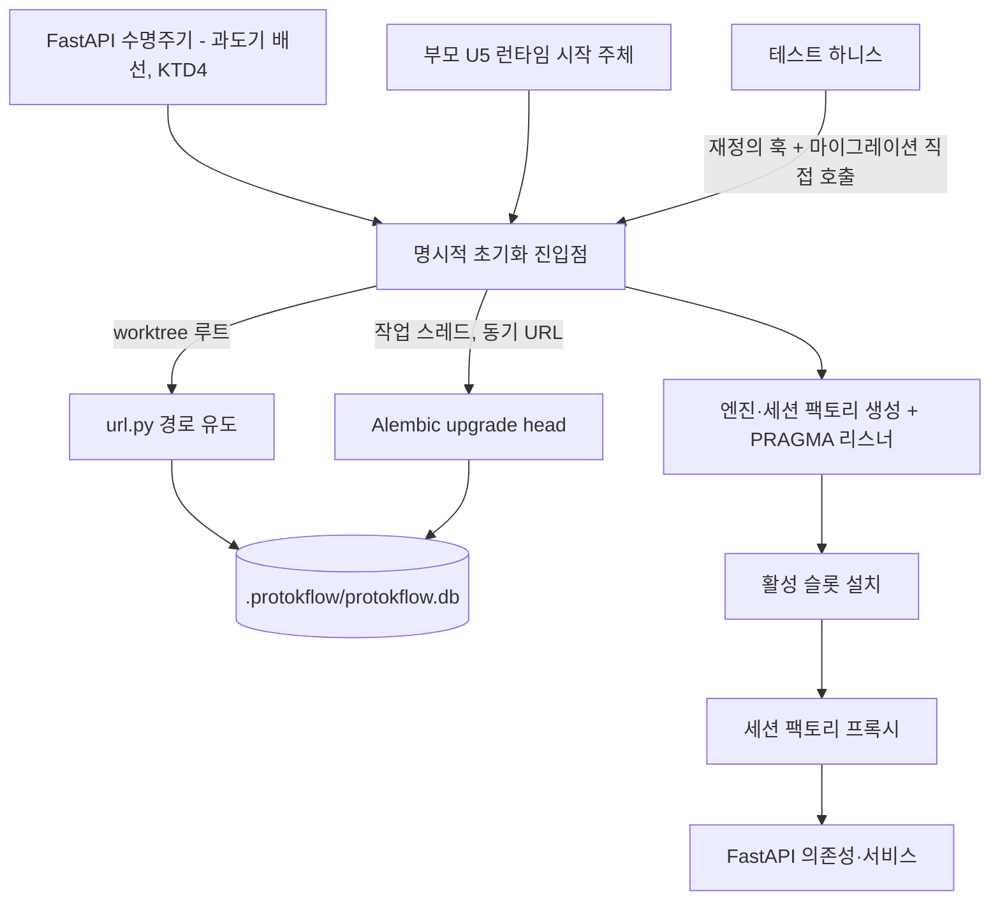

# U2 worktree 범위 영속화와 Alembic 마이그레이션 - Plan

> 원본: [리포지토리 런타임과 후보 리비전 - Plan](./2026-08-28-1453-feat-repository-runtime-plan.md). 본 문서는 원본 플랜의 Implementation Units 중 U2 스코프만을 추출해 구체화한 서브 플랜이다. 원본 플랜의 유닛은 `부모 U<N>`, 기술 결정은 `부모 KTD<N>`으로 인용하며, 본 문서의 U-ID와 KTD 번호는 서브 플랜 로컬 번호다.

## Goal Capsule

- **Objective**: 데이터베이스가 소멸 가능한 임시 작업 저장소에서 worktree 단위 영속 제품 데이터 저장소로 전환된다. 스키마 변경은 보존형 마이그레이션으로만 수행되고, 모든 데이터베이스 접근은 명시적으로 초기화된 worktree 결박 엔진을 경유한다.
- **Means**: Alembic 보존형 마이그레이션 도입 및 엔진·세션 팩토리의 명시적 초기화 진입점 구성.
- **Product Authority**: 부모 플랜의 Product Contract(R1~R29)를 상위 권위로 따른다. 본 플랜은 부모 U2 담당 범위인 R1, R2, R14의 기반 요소를 구현하며, 잔여 사양은 부모 플랜의 후속 유닛에서 이행한다.
- **Stop Conditions**: 모델·스키마 정의를 변경하지 않는다 (부모 U3, U4 담당). 런타임 프로세스 수명주기, 단일 소유권, `.protokflow/` 잠금 및 자격 증명을 구현하지 않는다 (부모 U5 담당). `docs/concepts/database-schema.md`를 갱신하지 않는다 (부모 U13 담당). Git 어댑터를 변경하지 않는다 (부모 U1 기이행).
- **Open Blockers**: 없음.

---

## Product Contract

### 요약

데이터베이스 경로를 worktree 루트 기준으로 유도하고, 엔진과 세션 팩토리를 명시적 초기화 시점에 생성하며, 스키마 변경을 Alembic 보존형 마이그레이션으로 전환한다.

### 문제 정의

현재 `backend/database/db.py`는 모듈 import 시점에 전역 엔진을 생성하여 프로세스 CWD에 결속된다. 이 구조는 형제 worktree 간 격리를 보장할 수 없으며, 테스트 시 엔진 생성 전에 환경 변수를 주입하는 사전 조치에 의존한다. 스키마 검증은 `PRAGMA user_version` 게이트와 "데이터베이스 삭제 후 재인덱싱" 복구 경로에 의존하고 있으나, 이는 데이터베이스를 소멸 가능한 임시 작업 저장소로 간주하는 구조다. 후보 이력이 파일로부터 복원 불가능한 영속 제품 데이터로 전환됨에 따라 보존형 마이그레이션 체계로의 전환이 요구된다.

### 핵심 설계 결정

- **데이터 종류별 기준 저장소 분리**: Git이 추적하는 루트 `DESIGN.md`는 정본 설계의 기준 저장소이며, SQLite는 후보 및 작업 이력의 영속 기준 저장소로 기능한다. (Governs R14)
- **Git worktree 단위 런타임 격리**: 런타임, watcher, SQLite, 탐색 레코드, 자격 증명은 worktree별로 격리 관리한다. (Governs R1, R2)

### 요구사항

부모 플랜에서 상속된 요구사항이다. 정본 사양은 부모 플랜의 해당 R-ID를 따른다.

- R1. 하나의 `worktree_id`는 동시에 하나의 리포지토리 런타임만 소유해야 하고, 같은 `repository_id`의 형제 worktree는 각각 독립 런타임과 SQLite를 사용해야 한다. — 본 플랜 구현: 데이터베이스 위치의 worktree별 유도 (소유권 강제 및 런타임 수명주기는 부모 U5에서 이행).
- R2. 클라이언트는 스키마 검증, worktree 신원 확인, 시작 동기화가 모두 성공한 뒤에만 저장소 요청을 보낼 수 있다. — 본 플랜 구현: 스키마 검증을 마이그레이션 버전 검증으로 대체하는 기반 마련 (런타임 준비 상태 검증은 부모 U5에서 이행).
- R14. SQLite는 프로토타입 실행, 후보 시리즈, 불변 후보 리비전, 정규화 후보 토큰, 비교 데이터, 선택 기록, 내보내기 작업 이력의 기준 저장소여야 한다. — 본 플랜 구현: SQLite를 영속 제품 데이터로 다루는 보존형 스키마 마이그레이션 체계 구축 (후보 이력 모델 정의는 부모 U3, U4에서 이행).

### 범위

**본 플랜 범위**

- Alembic 기반 마이그레이션 인프라 도입 및 현재 모델 메타데이터 기준선 리비전 생성.
- worktree 루트 기반 데이터베이스 경로 유도 및 엔진·세션 팩토리 명시적 초기화 진입점 구현.
- `user_version` 게이트 제거 및 테스트 하니스의 마이그레이션 수명주기 전환.

**제외 및 후속 유닛 이행 항목**

- 정본 세대·checkout 세대·후보·내보내기 작업 스키마 정의 및 `design_systems` 계열 테이블 정리 (부모 U3, U4 담당).
- 런타임 수명주기, 단일 소유권, `.protokflow/` 배타 잠금 및 자격 증명 관리 (부모 U5 담당).
- watcher, mutation fence, 서비스 계층, Git 내보내기, 프로토콜, 클라이언트 어댑터 (부모 U6~U12 담당).
- `docs/concepts/database-schema.md` 문서 정비 (부모 U13 담당).

**사전 릴리스 마이그레이션 기준선 정책**

- 기존 개발 데이터베이스 파일은 보존 대상에서 제외한다. 기준선 리비전은 계획 시점의 현재 모델 메타데이터를 기준으로 생성하며, 기존 데이터베이스 파일은 삭제 후 재생성한다. 이후 발생하는 모든 스키마 변경부터 보존형 마이그레이션을 엄격히 적용한다.

---

## Planning Contract

### Key Technical Decisions

- KTD1. **스키마 변경을 Alembic 보존형 마이그레이션으로 전환하고 `PRAGMA user_version` 게이트 및 삭제 복구 경로를 폐기한다.** 마이그레이션은 worktree별 데이터베이스 경로에 대해 동기 SQLite URL로 실행한다. 리비전 그래프 관리 및 자동 생성 검증을 제공하는 표준 도구인 Alembic을 채택한다. (Governs R14)
- KTD2. **데이터베이스를 worktree 루트의 `.protokflow/protokflow.db`로 단일화하고, 엔진과 세션 팩토리는 명시적 초기화 진입점을 통해 생성한다.** 모듈 import 시점의 전역 엔진 생성을 제거한다. 테스트용 세션 팩토리 프록시 및 재정의 훅은 유지한다. 저장 계층 전체(본체, WAL/SHM, journal, 임시 파일)는 소유자 전용 접근 권한을 적용한다. (Governs R1, R2)
- KTD3. **테스트 하니스의 스키마 수명주기를 메타데이터 DDL(`create_tables`/`drop_tables`)에서 마이그레이션 진입점(`downgrade base` → `upgrade head`)으로 전환한다.** 테스트 하니스가 실제 마이그레이션 경로를 지속 검증하며, 테스트 경로 검증 규약(`tests/support/db.py`)을 통해 임의 경로 접근을 차단한다. 테스트 격리 불변식 중 수명주기 순서, 비간섭 검증, AST 규율을 유지하고, 사전 임포트 환경 주입 방식은 엔진 지연 생성을 통해 해소한다.
- KTD4. **부모 U5 구현 전까지 FastAPI 수명주기에서 명시적 초기화 진입점을 호출하는 연계 배선을 구성한다.** 개발 서버(`backend/run.py`)의 정상 기동을 위해 `register_init`이 worktree 루트(CWD 기준)로 초기화 진입점을 호출하도록 구성하며, 부모 U5의 런타임 기동 경로 도입 시 해당 배선을 제거한다.

### High-Level Technical Design

초기화 시퀀스와 호출 주체:

### Assumptions

- 부모 U1(Git 어댑터)은 메인 브랜치에 병합 완료되었다. 부모 U2는 U1에 대한 코드 의존성이 없으므로 실행 순서에 영향을 주지 않는다.
- **테스트 하니스 변경 반경 명시**: `tests/conftest.py`, `tests/meta/test_xdist_isolation.py`, `tests/database/test_fixtures.py`, `tests/app/protokflow/service/test_indexing.py`는 import 시점 엔진 바인딩·`user_version`·`create_tables` 호출 규약과 직접 결속되어 있으므로, "기존 테스트 스위트의 `create_tables` 호출 없는 통과" 검증 게이트를 충족하기 위해 본 플랜 범위에 포함한다.
- `alembic` 패키지 버전은 의존성 추가 시점의 최신 안정 버전을 적용한다.
- 파일 및 디렉터리 권한 적용 방식은 구현 단계에서 확정한다.

### Sequencing

U1(Alembic 인프라 구축)을 선행 완료한 후 U2(엔진 경계 및 테스트 하니스 전환)를 원자적으로 적용한다. U1은 추가적 기능 구성으로 기존 테스트 통과 상태를 유지하며, U2는 엔진 경계 제거와 테스트 하니스 전환을 단일 원자적 커밋으로 반영하여 중간 상태의 테스트 실패를 방지한다.

### System-Wide Impact

- **데이터베이스 영속성 위상 확립**: 데이터베이스가 임시 작업 저장소에서 영속 제품 데이터 저장소로 전환된다. `docs/concepts/database-schema.md`에 기술된 기존 저장소 위상 및 `user_version` 관련 내용은 본 플랜 구현 후 부모 U13에서 일괄 갱신한다.
- **런타임 의존성 추가**: `alembic` 순수 Python 패키지가 런타임 의존성에 추가된다.

### Risks & Dependencies

- **Alembic과 worktree별 데이터베이스 결합 위험**: 마이그레이션 실행 경로가 애플리케이션 부팅이 아닌 런타임 시작 수명주기에 결합되므로, 마이그레이션 실패 시 런타임이 failed 상태로 전이된다. 완화책: 마이그레이션 실패 원인 및 상태를 명시적으로 기록하고, 모델 메타데이터와 마이그레이션 결과의 일치성을 검증하는 회귀 테스트를 구축한다 (U1 도입).
- **마이그레이션 기반 테스트 수명주기 실행 비용**: 테스트 케이스별 `downgrade`/`upgrade` 반복에 따른 성능 영향을 모니터링한다. 완화책: 세션 스코프 엔진을 유지하고 테스트별 스키마 리셋 로직만 최적화하여 실행 오버헤드를 제어한다.
- **초기화 연계 배선의 잔류 가능성 (KTD4)**: FastAPI 수명주기의 임시 초기화 호출이 부모 U5 이후에 잔존할 경우 이중 초기화 경쟁이 발생할 수 있다. 완화책: 호출 지점을 `register_init` 단일 위치로 격리하여 부모 U5 구현 시 용이하게 제거되도록 구성한다.

### Sources & Research

- 부모 플랜(`docs/plans/2026-08-28-1453-feat-repository-runtime-plan.md`) U2·KTD9·KTD16·Assumptions·Verification Contract·Definition of Done.
- `docs/research/2026-08-22-mcp-http-hybrid-db-schema-research.md` — F10(스키마·데이터 마이그레이션 분리), F4(정수 키 rowid 재사용 차단), F5(제약 명시 네이밍).
- `backend/database/db.py`, `backend/database/url.py`, `backend/core/registrar.py` — import 시점 엔진, `user_version` 게이트, 세션 프록시, 부팅 시 `create_tables` 구현체.
- `tests/conftest.py`, `tests/fixtures/db.py`, `tests/support/db.py`, `tests/meta/test_xdist_isolation.py` — 테스트 격리 불변식 및 데이터베이스 픽스처.
- `docs/solutions/architecture-patterns/test-db-isolation-harness.md` — 병렬 실행 격리의 4불변식 준수 근거.
- `backend/common/model.py` — `naming_convention` 제약 네이밍 컨벤션.
- `docs/concepts/database-schema.md` §1-1, §5.1, §9 — 폐기 대상인 `user_version` 게이트 및 재인덱싱 복구 경로의 기존 명세.

---

## Implementation Units

| U-ID | 제목 | 주요 파일 | 의존 |
|---|---|---|---|
| U1 | Alembic 기반과 기준선 리비전 | `pyproject.toml`, `alembic.ini`, `backend/database/migrations/` | — |
| U2 | worktree 결박 엔진 경계와 테스트 하니스 전환 | `backend/database/`, `backend/core/registrar.py`, `tests/` | U1 |

### U1. Alembic 기반과 기준선 리비전

**Goal**: Alembic 마이그레이션 인프라를 구축하고 현재 모델 메타데이터를 기준선 리비전으로 확정하며, 마이그레이션 결과와 메타데이터의 일치성을 검증하는 회귀 감지기를 구현한다.

**Requirements**: R14 기반 / KTD1

**Dependencies**: 없음

**Files**
- `pyproject.toml` (수정 — `alembic` 의존성 추가)
- `alembic.ini` (신규)
- `backend/database/migrations/env.py` (신규)
- `backend/database/migrations/script.py.mako` (신규)
- `backend/database/migrations/versions/` (신규)
- `backend/database/migrate.py` (신규 — 프로그래밍 방식 마이그레이션 진입점)
- `tests/database/test_migrations.py` (신규)

**Approach**
1. `alembic` 패키지 의존성을 추가하고 lockfile을 갱신한다.
2. `alembic.ini`는 스크립트 위치 및 공통 설정만 정의하고, 연결 URL은 실행 시점에 동적으로 주입한다.
3. `env.py`에 `MappedBase.metadata`(`naming_convention` 포함)를 대상 메타데이터로 등록하고, 동기 SQLite URL 기반으로 동작하며 SQLite 컬럼 수정을 위한 배치 모드(batch mode)를 활성화한다.
4. `backend/database/migrate.py`에 동기 마이그레이션 진입점을 구현하여 지정 URL에 대해 `upgrade`/`downgrade`를 실행한다. (비동기 컨텍스트의 작업 스레드 위임은 U2 초기화 진입점에서 처리).
5. 현재 모델 메타데이터(`design_systems` 등 현행 테이블 전체)를 기준으로 기준선 리비전을 생성한다.

**Execution note**: 마이그레이션 결과와 모델 메타데이터의 일치성을 검증하는 회귀 테스트를 우선 작성한 후 마이그레이션 스크립트를 구현한다. 이 테스트는 이후 모든 스키마 변경 유닛의 회귀 감지기로 활용된다.

**Patterns to follow**: `backend/common/model.py`의 `naming_convention` 명시적 제약 네이밍 컨벤션. `tests/support/db.py`의 테스트 경로 검증 규약.

**Test scenarios**
- 신규 데이터베이스에서 마이그레이션 실행 시 스키마가 정상 생성되고 최신 리비전으로 기록된다.
- 최신 리비전 상태의 데이터베이스에 재실행 시 스키마 변경 없이 정상 통과한다.
- 마이그레이션 적용 스키마와 모델 메타데이터 직접 생성 스키마 간 테이블·컬럼·제약조건·인덱스가 완전히 일치한다.
- 미등록 상위 리비전이 기록된 데이터베이스 연결 시 명시적 오류로 거부한다.
- 기준선 이전 상태(`base`)로 되돌릴 경우 마이그레이션 버전 테이블을 포함한 모든 스키마 요소가 정리된다.

**Verification**: 마이그레이션 및 메타데이터 일치성 테스트 통과, 의존성 잠금(`uv lock --check`) 검증.

### U2. worktree 결박 엔진 경계와 테스트 하니스 전환

**Goal**: 데이터베이스 경로를 worktree 루트에서 유도하고 엔진 및 세션 팩토리를 명시적 초기화 방식으로 전환하며, `user_version` 게이트와 import 시점 엔진을 제거하고 테스트 하니스를 마이그레이션 수명주기로 이관한다.

**Requirements**: R1, R2, R14 기반 / KTD1, KTD2, KTD3, KTD4

**Dependencies**: U1

**Files**
- `backend/database/url.py` (수정)
- `backend/database/db.py` (수정)
- `backend/core/registrar.py` (수정)
- `tests/conftest.py` (수정)
- `tests/fixtures/db.py` (수정)
- `tests/database/test_engine_boundary.py` (수정)
- `tests/database/test_fixtures.py` (수정)
- `tests/meta/test_xdist_isolation.py` (수정)
- `tests/app/protokflow/service/test_indexing.py` (수정)

**Approach**
1. `url.py`가 worktree 루트 경로를 전달받아 `.protokflow/protokflow.db` 경로를 유도하도록 변경한다. 환경 변수 기반 재정의(`PROTOKFLOW_DATABASE_URL`, `PROTOKFLOW_HOME`)는 테스트 격리를 위해 유지한다.
2. `db.py`에서 모듈 import 시점의 전역 엔진 및 URL 상수를 제거하고, worktree 루트를 인자로 받아 엔진과 세션 팩토리를 생성하여 활성 슬롯에 등록하는 명시적 초기화 진입점을 구현한다. 초기화 진입점은 `backend/database/migrate.py`를 작업 스레드에서 호출하여 마이그레이션을 선행 적용한 후 PRAGMA 리스너(WAL, 외래 키, busy timeout)를 등록한다. 재초기화 시에는 기존 엔진을 dispose한 후 교체한다.
3. `EXPECTED_SCHEMA_VERSION`, `SchemaVersionMismatch`, `read_schema_version`, `ensure_schema_version`, `create_tables`, `drop_tables`를 제거한다. 스키마 유효성 검증 책임은 Alembic 버전 관리 체계로 일원화한다.
4. 세션 팩토리 프록시와 테스트용 재정의 훅(`_set_engine_for_testing`, `_set_factory_for_testing`)은 유지한다. 엔진 초기화 전 프록시 접근 시 명시적 오류를 발생시킨다.
5. `registrar.py`의 애플리케이션 시작 시 `create_tables` 호출을 제거하고, 수명주기 핸들러에서 명시적 초기화 진입점을 호출하도록 구성한다. worktree 루트는 프로세스 CWD에서 유도한다.
6. 데이터베이스 본체, 저널, WAL/SHM 및 임시 파일을 포함한 저장 계층 전체에 소유자 전용 권한을 적용한다.
7. `tests/fixtures/db.py`의 스키마 수명주기를 `create_tables`/`drop_tables`에서 마이그레이션 진입점(`downgrade base` → `upgrade head`)으로 변경한다. `tests/conftest.py`는 import 시점 엔진 바인딩 전제를 제거하고 테스트 격리 환경 변수 설정만 유지한다.
8. `tests/meta/test_xdist_isolation.py` 및 `tests/database/test_fixtures.py`의 검증 로직을 Alembic 버전 관리 및 명시적 초기화 규약에 맞추어 갱신한다. `test_indexing.py`의 직접 스키마 호출을 마이그레이션 수명주기 호출로 전환한다.

**Execution note**: 엔진 경계 제거와 테스트 하니스 전환은 단일 원자적 커밋으로 반영하여 중간 상태의 테스트 스위트 실패를 방지한다.

**Patterns to follow**: `docs/solutions/architecture-patterns/test-db-isolation-harness.md`의 격리 불변식(수명주기 순서, 비간섭 검증, AST 규율 준수). `tests/support/db.py`의 경로 검증 규약.

**Test scenarios**
- 서로 다른 worktree 루트 전달 시 각각 격리된 데이터베이스 파일 경로가 유도된다.
- 데이터베이스 파일이 소유자 전용 권한으로 생성된다.
- 엔진 초기화 전에 세션 팩토리 접근 시 명시적 오류가 발생한다.
- 테스트 하니스가 지정한 격리 경로 외부의 데이터베이스에 대해 마이그레이션이 실행되지 않는다.
- 초기화 진입점 재호출 시 기존 엔진이 정상 정리(dispose)되고 새 엔진으로 교체된다.
- 초기화 진입점은 마이그레이션 적용이 완료된 이후에만 세션 팩토리를 활성 슬롯에 노출한다.
- 병렬 실행(`-n 4 --dist=loadscope`)과 직렬 실행(`-n 0`) 환경에서 동일한 테스트 결과가 도출된다.

**Verification**: 전체 테스트 스위트가 `create_tables` 호출 없이 정상 통과하며, 제거된 심볼에 대한 참조가 코드베이스에 잔존하지 않는다.

---

## Verification Contract

| 게이트 | 명령 | 적용 대상 |
|---|---|---|
| 린트 | `uv run ruff check` | 전 유닛 |
| 포맷 | `uv run ruff format` | 전 유닛 |
| 타입 | `uv run mypy backend tests --show-error-codes` | 전 유닛 |
| 의존성 잠금 | `uv lock --check` | U1 |
| 단위 테스트 | `uv run pytest` | 전 유닛 |
| 직렬 재현 확인 | `uv run pytest -n 0` | U2 |

추가 게이트:

- 마이그레이션과 모델 메타데이터 일치성 테스트 통과 (U1 도입, 향후 모든 스키마 유닛의 회귀 감지기).
- 병렬 실행 및 직렬 실행 결과 일치.

## Definition of Done

**전역 완료 조건**

- 마이그레이션이 최신까지 정상 적용되며 모델 메타데이터와 일치한다.
- 기존 테스트 스위트가 `create_tables` 호출 없이 정상 통과한다.
- `EXPECTED_SCHEMA_VERSION`, `SchemaVersionMismatch`, `user_version` 관련 로직 및 import 시점 전역 엔진이 코드와 테스트에서 완전히 제거된다.
- 실험용 임시 코드, 스크립트 및 폐기된 접근 방식의 잔재가 diff에 존재하지 않는다.

**유닛별 완료 신호**

| U-ID | 완료 신호 |
|---|---|
| U1 | 기준선 리비전이 현재 모델 메타데이터와 일치하고 일치성 테스트가 회귀 감지기로 정상 동작한다. |
| U2 | 모든 데이터베이스 접근이 명시적 초기화를 거치며 테스트 하니스가 마이그레이션 수명주기로 정상 동작한다. |
