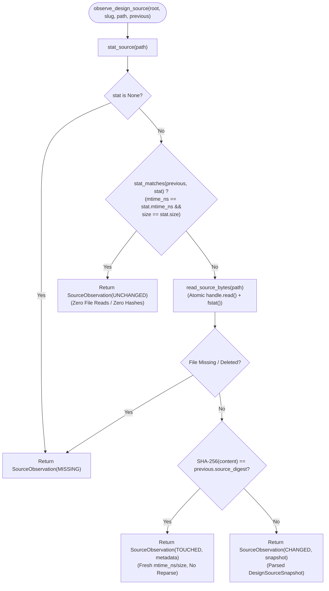
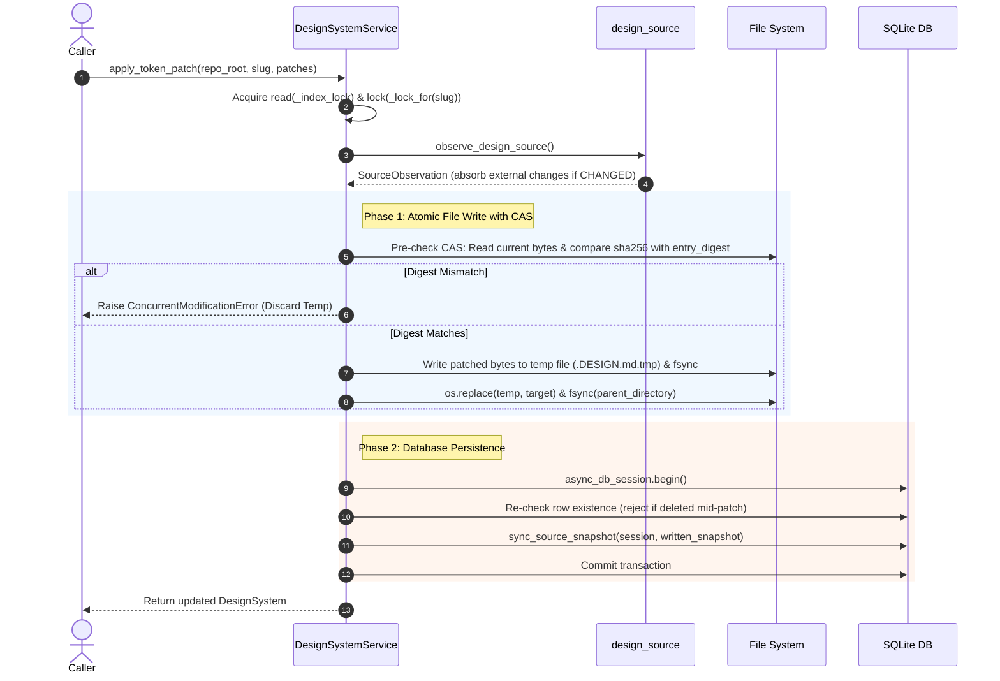

# External Change Reconciliation and Storage-Service Boundary Architecture

## Context

Protokflow operates on a dual-persistence model: human-readable `DESIGN.md` specification files stored in the repository filesystem (root `DESIGN.md` for the `default` system and `design/{slug}.md` for sibling systems) coexist with an application SQLite database (`.protokflow/protokflow.db`). The core architectural invariant is that **the filesystem is the immutable Single Source of Truth (SoT) for recovery**. If the SQLite database is deleted or corrupted, a complete re-index from disk reconstructs every design system and normalized token tree without data loss.

However, files in a developer workspace can be modified externally at any time through `git pull`, branch switching (`git checkout`), disk syncs, or manual IDE editing. Without a robust reconciliation mechanism and clear layer boundaries, the system suffers from critical failure modes:
1. **Stale Read / Overwrite Hazards**: External edits are silently ignored or overwritten by stale database states when patches occur.
2. **Re-parsing Performance Bottlenecks**: Computing cryptographic hashes and re-parsing YAML Front Matter on every read degrades preview and hot-reload latency below the sub-16ms budget.
3. **TOCTOU Race Conditions**: Concurrent file writes and reads between separate `stat()` and `read()` calls create inconsistent database states.
4. **Cascading Data Destruction**: Hard-deleting database records when a source file temporarily disappears (e.g., during branch switching) cascades through foreign keys (`ON DELETE CASCADE`), permanently destroying prototype runs, generated UI candidates, token patches, slot contents, and export history.
5. **Architectural Bleed**: Blending filesystem observation, transaction lifecycle, ORM mapping, and domain policy into monolithic service modules prevents isolated unit testing and violates clean separation of concerns.

To resolve these challenges, Protokflow establishes a decoupled 4-tier layer boundary, a neutral 4-state observation state machine, a nanosecond-precision `stat` precheck with SHA-256 fallback, an atomic write-through Compare-And-Swap (CAS) pipeline with a file-ahead recovery invariant, 2-tier concurrency controls, and a non-destructive orphan unbinding model.

---

## Guidance

### 1. 4-Tier Architectural Layer Boundaries

The system strictly divides responsibilities across four distinct layers without generic repository or Unit of Work abstractions:

```
┌─────────────────────────────────────────────────────────────────────────────┐
│ 1. Core Layer (Pure Python Domain Logic)                                    │
│    - backend/app/protokflow/core/{design_md,discovery}.py                                   │
│    - Pure serialization/deserialization, anchor checks, in-place patching   │
│    - Zero DB/ORM/SQLAlchemy/FastAPI imports                                 │
└──────────────────────────────────────┬──────────────────────────────────────┘
                                       │
┌──────────────────────────────────────▼──────────────────────────────────────┐
│ 2. Storage Adapters (Technical I/O & Persistence Adapters)                  │
│    ├─ backend/app/protokflow/storage/design_source.py: FS observation, descriptor read, hashing    │
│    └─ backend/app/protokflow/storage/design_system_store.py: ORM building, multi-DAO coordination  │
│    - Caller-owned sessions only; never creates, begins, commits, or rolls back│
└──────────────────────────────────────┬──────────────────────────────────────┘
                                       │
┌──────────────────────────────────────▼──────────────────────────────────────┐
│ 3. Service Layer (Use-Case Policies, Locks, & Transaction Lifecycle)        │
│    - backend/app/protokflow/service/design_system_service.py                                       │
│    - Owns AsyncReadWriteLock & per-slug mutexes                             │
│    - Owns async_db_session.begin() transaction boundaries & row re-checks   │
│    - Interprets neutral observations into query (stale) vs patch (reject)   │
└──────────────────────────────────────┬──────────────────────────────────────┘
                                       │
┌──────────────────────────────────────▼──────────────────────────────────────┐
│ 4. CRUD Layer (Pure SQLAlchemy Statement Execution)                         │
│    - backend/app/protokflow/crud/{crud_design_system,crud_design_token}.py                  │
│    - Executes raw SELECT/INSERT/UPDATE/DELETE queries                       │
│    - Flushes changes; never commits transactions                            │
└─────────────────────────────────────────────────────────────────────────────┘
```

#### Layer Responsibilities
- **Core Layer** ([`backend/app/protokflow/core/design_md.py`](file:///Users/xedoc/VscodeProjects/protokflow/backend/app/protokflow/core/design_md.py), [`backend/app/protokflow/core/discovery.py`](file:///Users/xedoc/VscodeProjects/protokflow/backend/app/protokflow/core/discovery.py)): Pure Python module implementing round-trip YAML parsing via `ruamel.yaml` (`typ="rt"`). Enforces strict specification compliance by rejecting YAML anchors (`&anchor`) and fenced body YAML blocks. Flattens design tokens into dot-notated paths and performs single-line in-place patch serialization without touching database or async primitives.
- **Storage Adapters** ([`backend/app/protokflow/storage/design_source.py`](file:///Users/xedoc/VscodeProjects/protokflow/backend/app/protokflow/storage/design_source.py), [`backend/app/protokflow/storage/design_system_store.py`](file:///Users/xedoc/VscodeProjects/protokflow/backend/app/protokflow/storage/design_system_store.py)):
  - `design_source.py`: Inspects filesystem status, executes single-descriptor atomic byte reads, computes SHA-256 digests, and triggers core parsing. It also owns the write side of the adapter — atomic write-through of token patches ([`atomic_write_bytes`](file:///Users/xedoc/VscodeProjects/protokflow/backend/app/protokflow/storage/design_source.py#L214-L295), [`write_token_patch`](file:///Users/xedoc/VscodeProjects/protokflow/backend/app/protokflow/storage/design_source.py#L298-L331)). Contains no database or ORM imports.
  - `design_system_store.py`: Maps domain snapshots to ORM models ([`build_design_system`](file:///Users/xedoc/VscodeProjects/protokflow/backend/app/protokflow/storage/design_system_store.py#L16-L34), [`build_design_tokens`](file:///Users/xedoc/VscodeProjects/protokflow/backend/app/protokflow/storage/design_system_store.py#L36-L54)) and coordinates multi-DAO persistence ([`sync_source_snapshot`](file:///Users/xedoc/VscodeProjects/protokflow/backend/app/protokflow/storage/design_system_store.py#L56-L72), [`refresh_source_metadata`](file:///Users/xedoc/VscodeProjects/protokflow/backend/app/protokflow/storage/design_system_store.py#L74-L86)) using a caller-provided `AsyncSession`. It never calls `begin()`, `commit()`, or `rollback()`.
- **Service Layer** ([`backend/app/protokflow/service/design_system_service.py`](file:///Users/xedoc/VscodeProjects/protokflow/backend/app/protokflow/service/design_system_service.py)): Coordinates end-to-end workflows (`index_all`, `get`, `apply_token_patch`). Owns session creation (`async_db_session.begin()`), concurrency locks, repo-root path validations, row existence re-checks, and policy mapping.
- **CRUD Layer** ([`backend/app/protokflow/crud/crud_design_system.py`](file:///Users/xedoc/VscodeProjects/protokflow/backend/app/protokflow/crud/crud_design_system.py), [`backend/app/protokflow/crud/crud_design_token.py`](file:///Users/xedoc/VscodeProjects/protokflow/backend/app/protokflow/crud/crud_design_token.py)): Houses raw SQLAlchemy statements. Enforces table-level constraints (e.g., verifying that all tokens in a replacement set match the target `design_system_id` to prevent silent reparenting via [`TokenReparentingError`](file:///Users/xedoc/VscodeProjects/protokflow/backend/app/protokflow/crud/crud_design_token.py#L31-L67)).

---

### 2. Observation State Machine

Source observation is encapsulated in [`observe_design_source`](file:///Users/xedoc/VscodeProjects/protokflow/backend/app/protokflow/storage/design_source.py#L148-L193), which returns a total enum classification ([`SourceChange`](file:///Users/xedoc/VscodeProjects/protokflow/backend/app/protokflow/storage/design_source.py#L58-L64)):



#### Observation States and Service Action Matrix

| Observation State | Trigger Condition | Storage Action | Service `get()` Behavior | Service `apply_token_patch()` Behavior |
|---|---|---|---|---|
| **`UNCHANGED`** | `(mtime_ns, size)` identical to DB values | None (no file read, no SHA computation) | Return existing DB record (`stale=False`) | Use baseline snapshot or read once for CAS |
| **`TOUCHED`** | `stat` changed, but SHA-256 digest identical | Returns updated `SourceMetadata` | Update `source_mtime_ns` and `source_size` in DB; return record | Update metadata; apply patch on current parsed baseline |
| **`CHANGED`** | SHA-256 digest differs from DB value | Reads bytes, computes SHA, parses YAML Front Matter into `DesignSourceSnapshot` | Open transaction, recheck row, sync snapshot via [`sync_source_snapshot`](file:///Users/xedoc/VscodeProjects/protokflow/backend/app/protokflow/storage/design_system_store.py#L56-L72), replace token tree | Absorb external changes into DB, then apply patch directly on top of new snapshot |
| **`MISSING`** | File missing at `stat` or deleted during `stat`-to-`read` | Returns `SourceObservation(change=MISSING)` without raising | Return persisted DB record with derived **`stale=True`** | Raise **`MissingSourceFileError`** and abort without mutating DB or FS |

---

### 3. High-Precision Stat Precheck and Single-Descriptor TOCTOU Defense

#### Integer Nanosecond Precision
File modification timestamps are stored as integer nanoseconds ([`DesignSystem.source_mtime_ns`](file:///Users/xedoc/VscodeProjects/protokflow/backend/app/protokflow/model/design_system.py#L75-L77), `BigInteger` / `int`) rather than floating-point seconds. 

> [!IMPORTANT]
> Modern operating systems (macOS APFS, Linux ext4) record filesystem timestamps with 1-nanosecond resolution. Storing mtime as a standard 64-bit float (`REAL`) results in a Unit in the Last Place (ULP) resolution of ~238 nanoseconds at current epoch values (`> 1.7e9`). Float conversions discard timestamp deltas smaller than 238ns, causing rapid successive edits (e.g., scripted tests or automated generators) to be falsely classified as `UNCHANGED`. Integer nanoseconds eliminate all precision loss.

#### Single-Descriptor Read Invariant
To eliminate Time-Of-Check to Time-Of-Use (TOCTOU) race conditions during file ingestion, [`read_source_bytes`](file:///Users/xedoc/VscodeProjects/protokflow/backend/app/protokflow/storage/design_source.py#L85-L103) binds byte reading and metadata capture to a single open file descriptor:
```python
with path.open("rb") as handle:
    content = handle.read()
    stat = os.fstat(handle.fileno())
```
This guarantees that `source_digest`, `source_size`, and `source_mtime_ns` describe the exact same file version without risk of an intervening external write between `read()` and `stat()`.

---

### 4. Write-Through Compare-And-Swap (CAS) and File-Ahead Recovery Invariant

Modifying tokens via [`apply_token_patch`](file:///Users/xedoc/VscodeProjects/protokflow/backend/app/protokflow/service/design_system_service.py#L219-L293) executes a multi-step write-through protocol that coordinates filesystem mutation with database persistence.



#### Atomic File Writing and Link Safety ([`atomic_write_bytes`](file:///Users/xedoc/VscodeProjects/protokflow/backend/app/protokflow/storage/design_source.py#L214-L295))

Atomic writing lives in the storage adapter and is invoked by the service through [`write_token_patch`](file:///Users/xedoc/VscodeProjects/protokflow/backend/app/protokflow/storage/design_source.py#L298-L331), which serializes the patched document and hands the resulting bytes to `atomic_write_bytes`.

1. **Link Rejection**: Symlinks (`os.path.islink`) and hard links (`stat.st_nlink > 1`) are explicitly rejected with [`UnsupportedSourceLinkError`](file:///Users/xedoc/VscodeProjects/protokflow/backend/app/protokflow/error/storage.py#L40-L45) because `os.replace` overwrites directory inodes directly, which would destroy symlinks or break hard link alias chains.
2. **CAS Verification**: If `expected_digest` is supplied, the file is re-read immediately prior to creating the temporary file. If the digest has diverged from the entry observation digest, [`ConcurrentModificationError`](file:///Users/xedoc/VscodeProjects/protokflow/backend/app/protokflow/error/storage.py#L36-L37) is raised, preventing lost updates from external writers.
3. **Same-Directory Temporary File**: A temporary file (`tempfile.mkstemp(dir=path.parent, prefix=f".{path.name}.", suffix=".tmp")`) is created in the same directory to guarantee atomic rename semantics on POSIX filesystems.
4. **Fsync Flushing**: Both file content (`os.fsync(handle.fileno())`) and directory entries ([`_fsync_directory`](file:///Users/xedoc/VscodeProjects/protokflow/backend/app/protokflow/storage/design_source.py#L196-L211)) are explicitly flushed to disk around `os.replace()`, preventing corrupt partial writes or lost directory pointer entries during system crashes.

#### File-Ahead Recovery Invariant
Distributed 2-phase commit between disk and SQLite is impossible. Therefore, Protokflow strictly sequences write-through operations:
1. **File is written first.**
2. **Database transaction is committed second.**

- **If file write fails**: The database transaction is never opened; database state remains unaltered.
- **If DB commit fails after file write**: The file is left ahead of the database. Because the file is the recovery source of truth, **the very next service invocation (`get`, `apply_token_patch`, or `index_all`) observes the `(mtime_ns, size)` discrepancy, hashes the file, detects the change, and automatically syncs the newer file contents into SQLite.**

---

### 5. 2-Tier Concurrency Architecture

Concurrency control in [`DesignSystemService`](file:///Users/xedoc/VscodeProjects/protokflow/backend/app/protokflow/service/design_system_service.py#L43-L62) combines global reader-writer exclusion with fine-grained per-entity synchronization:

```
                                  AsyncReadWriteLock (_index_lock)
                                 /                                \
                 Write Side (Exclusive)                      Read Side (Shared)
                          │                                           │
                 ┌─────────────────┐                     ┌─────────────────────────┐
                 │    index_all    │                     │  get, apply_token_patch │
                 └─────────────────┘                     └────────────┬────────────┘
                                                                      │
                                                        Per-Slug Mutexes (_locks[slug])
                                                       /              │                \
                                             ┌───────────┐      ┌───────────┐    ┌───────────┐
                                             │  default  │      │   admin   │    │   dark    │
                                             └───────────┘      └───────────┘    └───────────┘
```

1. **Global Read-Writer Lock ([`AsyncReadWriteLock`](file:///Users/xedoc/VscodeProjects/protokflow/backend/common/rwlock.py#L10-L70))**:
   - `index_all` acquires the **exclusive write lock**, blocking all concurrent queries and patches across all slugs while batch discovery and orphan unbinding execute.
   - `get` and `apply_token_patch` acquire the **shared read lock**, allowing high-throughput concurrent processing across distinct design systems.
   - The lock is writer-preferring: waiting writers block incoming readers to prevent writer starvation.
2. **Per-Slug Mutexes ([`_lock_for(slug)`](file:///Users/xedoc/VscodeProjects/protokflow/backend/app/protokflow/service/design_system_service.py#L50-L55))**:
   - Coroutines operating on the same slug (e.g., concurrent patches or interleaved query/patch operations) acquire a slug-specific `asyncio.Lock()`.
   - **Memory Exhaustion Guard**: To prevent arbitrary key pollution in `self._locks`, [`_require_known_slug(slug)`](file:///Users/xedoc/VscodeProjects/protokflow/backend/app/protokflow/service/design_system_service.py#L58-L62) validates that the slug exists in the database before allocating a lock instance.

---

### 6. Non-Destructive Orphan Unbinding and Hard Deletion Prevention

When source files are removed from disk (e.g., switching from a feature branch that introduced custom `design/{slug}.md` files back to `main`), [`index_all`](file:///Users/xedoc/VscodeProjects/protokflow/backend/app/protokflow/service/design_system_service.py#L132-L174) does **not** delete database rows.

#### Why Hard Deletions are Prohibited
The database schema links `design_systems.id` to execution artifacts:
- `prototype_runs` references `design_systems.id` with `ON DELETE CASCADE`.
- `candidates`, `slot_contents`, `token_patches`, and `exports` cascade from `prototype_runs`.
- `design_systems.derived_from_id` references parent design systems with `ON DELETE SET NULL`.
- Token IDs (`design_tokens.id`) are ephemeral ULIDs re-issued on each full sync; a deleted system loses its historical identity permanently.

Hard deleting an orphaned design system would destroy run histories, generated UI candidate assets, and provenance lineage across the workspace.

#### Non-Destructive Unbinding ([`unbind_orphan_sources`](file:///Users/xedoc/VscodeProjects/protokflow/backend/app/protokflow/crud/crud_design_system.py#L82-L133))
Instead of deletion, batch re-indexing executes a scoped unbinding query:
```python
statement = (
    sa.update(DesignSystem)
    .where(
        DesignSystem.source_path.is_not(None),
        DesignSystem.source_root == source_root,
        DesignSystem.slug.not_in(keep_slugs),
    )
    .values(
        source_path=None,
        source_root=None,
        source_digest=None,
        source_mtime_ns=None,
        source_size=None,
        synced_at=None,
        unbound_at=utcnow(),
    )
)
```
1. **Preservation**: The row, its ULID `id`, its token tree, its prototype runs, and its `derived_from_id` links are preserved as a database-only design system.
2. **Re-binding**: When the branch returns or the file is recreated, `index_all` matches the slug during upsert ([`crud_design_system.upsert`](file:///Users/xedoc/VscodeProjects/protokflow/backend/app/protokflow/crud/crud_design_system.py#L43-L80)), repopulates `source_*` metadata, and clears `unbound_at = None` while preserving the existing primary key and history.
3. **Missing Root Guard**: If `repo_root` is not an existing directory, [`SourceRootNotFoundError`](file:///Users/xedoc/VscodeProjects/protokflow/backend/app/protokflow/error/storage.py#L22-L29) is raised immediately to prevent unmounted volumes or path typos from unbinding every file-backed system in the workspace.

---

## Why This Matters

- **Filesystem as the Sovereign Recovery Source**: If the database file `.protokflow/protokflow.db` is destroyed, executing `protokflow index` fully re-populates the SQLite database with zero data degradation.
- **Zero False Re-indexing Overhead**: By verifying `(source_mtime_ns, source_size)` in a single `fstat` check, unchanged files bypass cryptographic hashing, disk I/O, and YAML parsing entirely, sustaining sub-16ms preview hot-reloads.
- **Resilience Against Failed Transactions**: In-place write-through writes files prior to database commits; failed database transactions leave the filesystem ahead, allowing subsequent read or patch entry points to self-heal the database.
- **Concurrency without Serialization**: The 2-tier concurrency model enables parallel reads and patches across distinct design systems while preventing race conditions on the same slug and serializing batch indexing operations.
- **Zero Loss of Prototype History**: Orphan unbinding decouples filesystem lifecycle from database storage, ensuring Git branch switching never cascades into loss of generated candidate UI history or token provenance.

---

## When to Apply

- **Dual-Storage Architectures**: Whenever building tools where human-editable files (Markdown, YAML, JSON) serve as the primary source of truth while an embedded relational database (SQLite, DuckDB) serves as a query cache or indexing engine.
- **External Modification Tracking**: When external tools (Git, editors, external scripts) modify persisted data outside the application runtime loop.
- **Transactional Write-Through**: When updating file-backed data via an API, ensuring byte-level preservation of comments, formatting, and custom metadata.
- **High-Concurrency File Stores**: When multiple background workers or user sessions read and modify file-backed models concurrently.

---

## Examples

### 1. Observing Source Changes Without Database Coupling

The source observation adapter ([`backend/app/protokflow/storage/design_source.py:148-193`](file:///Users/xedoc/VscodeProjects/protokflow/backend/app/protokflow/storage/design_source.py#L148-L193)) classifies changes into pure, neutral outcomes:

```python
from pathlib import Path
from backend.app.protokflow.storage.design_source import (
    SourceMetadata,
    SourceChange,
    observe_design_source,
)

root = Path("/workspace/repo")
previous_meta = SourceMetadata(
    source_digest="e3b0c44298fc1c149afbf4c8996fb92427ae41e4649b934ca495991b7852b855",
    source_mtime_ns=1724800000000000000,
    source_size=1024,
)

observation = observe_design_source(
    root,
    slug="default",
    source_path="DESIGN.md",
    previous=previous_meta,
)

if observation.change is SourceChange.UNCHANGED:
    # Fast path: Stat matched, zero file reads or hashes performed
    pass
elif observation.change is SourceChange.TOUCHED:
    # Metadata touched only: content hash identical, metadata refreshed
    new_mtime = observation.metadata.source_mtime_ns
elif observation.change is SourceChange.CHANGED:
    # Content changed: contains fully parsed DesignSourceSnapshot
    new_tokens = observation.snapshot.parsed.tokens
elif observation.change is SourceChange.MISSING:
    # File disappeared from disk
    pass
```

### 2. Caller-Owned Transaction Persistence in Store Adapter

The store adapter ([`backend/app/protokflow/storage/design_system_store.py:56-86`](file:///Users/xedoc/VscodeProjects/protokflow/backend/app/protokflow/storage/design_system_store.py#L56-L86)) operates exclusively on the caller's session without initiating transaction commits:

```python
from sqlalchemy.ext.asyncio import AsyncSession
from backend.app.protokflow.storage.design_system_store import sync_source_snapshot
from backend.app.protokflow.storage.design_source import DesignSourceSnapshot

async def persist_example(session: AsyncSession, snapshot: DesignSourceSnapshot):
    # Upserts design system and completely replaces token set within caller's transaction
    design_system = await sync_source_snapshot(session, snapshot)
    
    # Caller owns the transaction lifecycle:
    # await session.commit() or await session.rollback()
    return design_system
```

### 3. End-to-End Service Reconciliation

The service reconciliation orchestrator ([`backend/app/protokflow/service/design_system_service.py:64-112`](file:///Users/xedoc/VscodeProjects/protokflow/backend/app/protokflow/service/design_system_service.py#L64-L112)) handles session creation, row existence re-checks, and error surfacing:

```python
async def _reconcile_source(
    self, root: Path, system: DesignSystem
) -> ReconciledSystem:
    if system.source_path is None:
        return ReconciledSystem(system=system)

    observation = await asyncio.to_thread(
        observe_design_source,
        root,
        slug=system.slug,
        source_path=system.source_path,
        previous=SourceMetadata(
            source_digest=system.source_digest,
            source_mtime_ns=system.source_mtime_ns,
            source_size=system.source_size,
        ),
    )
    if observation.change is SourceChange.MISSING:
        return ReconciledSystem(system=system, missing=True)
    if observation.change is SourceChange.UNCHANGED:
        return ReconciledSystem(system=system)
    if observation.change is SourceChange.TOUCHED:
        async with db.async_db_session.begin() as session:
            refreshed = await refresh_source_metadata(
                session, system.slug, observation.metadata
            )
        return ReconciledSystem(system=refreshed)

    # Source CHANGED: reload row and synchronize snapshot
    async with db.async_db_session.begin() as session:
        existing = await design_system_dao.get_by_slug(session, system.slug)
        if existing is None:
            raise UnknownDesignSystemError(
                f"design system '{system.slug}' was deleted while its source "
                f"was being reconciled"
            )
        refreshed = await sync_source_snapshot(
            session, observation.snapshot, existing=existing
        )
    return ReconciledSystem(system=refreshed, snapshot=observation.snapshot)
```

---

## Related

- [Database Schema Design](../../concepts/database-schema.md) — Authoritative schema definitions for `design_systems`, `design_tokens`, `prototype_runs`, and `PRAGMA user_version`.
- [Test Database Isolation Harness Architecture](test-db-isolation-harness.md) — Isolated async SQLite test execution harness under `pytest-xdist`.
- [DESIGN.md Storage Layer Plan](../../plans/2026-08-24-1252-feat-designmd-storage-layer-plan.md) — Implementation specification for the storage layer.
